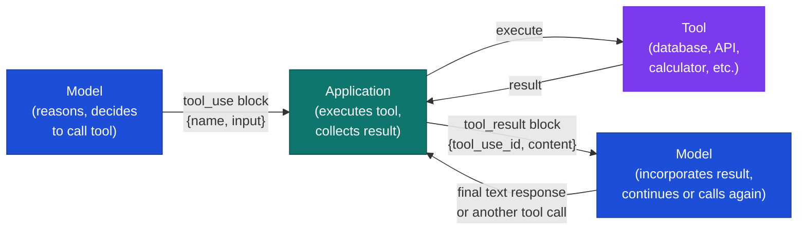

# Function Calling / Tool Use

## What it is

Function calling (also called tool use) is a protocol that lets a model request the execution of specific functions during a conversation. The model doesn't execute the function itself — it outputs a structured request describing which function to call and with what arguments. The caller executes the function and returns the result. The model then continues, incorporating the result into its next response.

This turns a model from a text transformer into an actor: something that can retrieve data, perform calculations, write files, send messages, query databases, and interact with external systems — by asking the host environment to do those things on its behalf.

## The problem it solves

Language models have a hard knowledge cutoff: they can't know what the weather is right now, what your database contains, or what happened yesterday. They also can't perform computations reliably (arithmetic on large numbers breaks), create side effects (sending an email, writing a file), or access private data (your organization's documents, a user's account state).

Tool use solves all of these: the model describes what it needs, the application executes the action, and the model incorporates the result. The model contributes reasoning and language; the tools contribute accuracy, freshness, and capability.

## How it works under the hood

The execution loop has four steps that repeat until the model produces a final text response:



### Tool schemas

Tools are defined as JSON Schema objects. The model uses the `name` and `description` to decide when to call the tool; the `input_schema` tells it what arguments are valid. Description quality matters more than most people expect — a poorly described tool gets called with wrong arguments or not called when it should be.

**Good vs. bad description:**

```
# Bad — ambiguous, no boundary conditions
"name": "get_data",
"description": "Gets data."

# Good — specific, explains when to use vs. when not to
"name": "get_stock_price",
"description": "Get the current market price for a US-listed equity by ticker symbol.
  Use for real-time price lookups. Do not use for historical prices or non-US exchanges
  — those require get_historical_price or get_international_quote instead."
```

```python
TOOLS = [
    {
        "name": "get_stock_price",
        "description": "Get the current stock price for a ticker symbol. Only use for US-listed equities.",
        "input_schema": {
            "type": "object",
            "properties": {
                "ticker": {
                    "type": "string",
                    "description": "The stock ticker symbol, e.g. 'AAPL', 'MSFT'"
                }
            },
            "required": ["ticker"]
        }
    },
    {
        "name": "calculate",
        "description": "Evaluate a mathematical expression. Use for any arithmetic, percentages, or financial calculations.",
        "input_schema": {
            "type": "object",
            "properties": {
                "expression": {
                    "type": "string",
                    "description": "A Python-evaluable math expression, e.g. '(125.50 - 98.20) / 98.20 * 100'"
                }
            },
            "required": ["expression"]
        }
    }
]
```

### The execution loop

```python
import anthropic
import json

client = anthropic.Anthropic()

def get_stock_price(ticker: str) -> dict:
    # In production: call a real market data API
    prices = {"AAPL": 189.50, "MSFT": 415.20, "GOOGL": 172.30}
    return {"ticker": ticker, "price": prices.get(ticker, 0), "currency": "USD"}

def calculate(expression: str) -> dict:
    # Never use eval() with model-generated expressions in production —
    # restricted builtins can be escaped. Use asteval or sympy instead:
    #   from asteval import Interpreter; aeval = Interpreter(); result = aeval(expression)
    try:
        import ast
        tree = ast.parse(expression, mode="eval")
        # Restrict to safe node types (literals, operators, names)
        allowed = {ast.Expression, ast.BinOp, ast.UnaryOp, ast.Num, ast.Constant,
                   ast.Add, ast.Sub, ast.Mult, ast.Div, ast.Pow, ast.USub}
        if not all(type(node) in allowed for node in ast.walk(tree)):
            return {"error": "Expression contains disallowed operations"}
        result = eval(compile(tree, "<string>", "eval"))  # noqa: S307
        return {"result": result}
    except Exception as e:
        return {"error": str(e)}

TOOL_HANDLERS = {
    "get_stock_price": get_stock_price,
    "calculate": calculate,
}

def run_agent(user_message: str) -> str:
    messages = [{"role": "user", "content": user_message}]

    while True:
        response = client.messages.create(
            model="claude-sonnet-4-6",
            max_tokens=1024,
            tools=TOOLS,
            messages=messages
        )

        # If the model is done, return its text response
        if response.stop_reason == "end_turn":
            return response.content[0].text

        # Process tool calls
        tool_results = []
        for block in response.content:
            if block.type == "tool_use":
                handler = TOOL_HANDLERS.get(block.name)
                if handler is None:
                    # Unknown tool name — return an error rather than raising KeyError
                    tool_results.append({
                        "type": "tool_result",
                        "tool_use_id": block.id,
                        "content": json.dumps({"error": f"Unknown tool: {block.name}"}),
                        "is_error": True,
                    })
                    continue
                result = handler(**block.input)
                tool_results.append({
                    "type": "tool_result",
                    "tool_use_id": block.id,
                    "content": json.dumps(result)
                })

        # Append model response and tool results, continue the loop
        messages.append({"role": "assistant", "content": response.content})
        messages.append({"role": "user", "content": tool_results})

answer = run_agent("What's Apple's stock price, and what percentage gain would I get if I bought at $150?")
print(answer)
# "Apple (AAPL) is currently at $189.50. If you bought at $150, your gain would be
#  approximately 26.3% ((189.50 - 150) / 150 × 100)."
```

:::caution[eval() in tool handlers is a security vulnerability]

The `calculate` function above uses `eval()` with AST node-type filtering. This is **not safe for production**: AST-level checks can be bypassed by resource-exhaustion inputs (e.g., `10**10**10**10`) and infinite loops that don't trigger node-type guards. In production, use a sandboxed evaluator:

```python
from asteval import Interpreter
aeval = Interpreter()
result = aeval(expression)        # safe: no subprocess, no builtins, timeout-able
```

Or use `sympy.sympify(expression).evalf()` for mathematical expressions. Never pass model-generated strings to `eval()`, `exec()`, `subprocess.run()`, or raw SQL without sandboxing.

:::

### Parallel tool calls

When a model can answer parts of a question independently, it may issue multiple tool calls in the same response. The application should execute them in parallel:

```python
import asyncio

async def execute_tool_calls_parallel(tool_blocks, handlers):
    async def execute_one(block):
        handler = handlers[block.name]
        result = await asyncio.to_thread(handler, **block.input)
        return {
            "type": "tool_result",
            "tool_use_id": block.id,
            "content": json.dumps(result)
        }
    return await asyncio.gather(*[execute_one(b) for b in tool_blocks])
```

A query like "Compare Apple and Microsoft stock prices" can trigger two `get_stock_price` calls simultaneously rather than sequentially — roughly 2× faster.

### Tool choice control

You can control whether the model uses tools:

```python
# Let the model decide
tool_choice={"type": "auto"}

# Force a specific tool (useful for structured extraction — see Structured Outputs)
tool_choice={"type": "tool", "name": "extract_product"}

# Prevent tool use (final response pass)
tool_choice={"type": "none"}
```

## Concrete example

A research assistant that fetches web content and searches a knowledge base:

```python
import anthropic
import json
import httpx

client = anthropic.Anthropic()

TOOLS = [
    {
        "name": "fetch_url",
        "description": "Fetch the text content of a URL. Use for retrieving articles, documentation, or web pages.",
        "input_schema": {
            "type": "object",
            "properties": {
                "url": {"type": "string", "description": "The full URL to fetch"},
                "max_chars": {"type": "integer", "description": "Maximum characters to return (default 2000)"}
            },
            "required": ["url"]
        }
    },
    {
        "name": "search_knowledge_base",
        "description": "Search the internal knowledge base for relevant documents.",
        "input_schema": {
            "type": "object",
            "properties": {
                "query": {"type": "string"},
                "top_k": {"type": "integer", "default": 3}
            },
            "required": ["query"]
        }
    }
]

def fetch_url(url: str, max_chars: int = 2000) -> dict:
    try:
        r = httpx.get(url, timeout=10, follow_redirects=True)
        return {"content": r.text[:max_chars], "status": r.status_code}
    except Exception as e:
        return {"error": str(e)}

def search_knowledge_base(query: str, top_k: int = 3) -> dict:
    # Stub — replace with actual vector search
    return {"results": [{"title": "Example doc", "content": "Relevant content..."}]}
```

## When to use it / when not to

#### Use tool use when

- The model needs information that changes (stock prices, weather, database state, time)
- The model needs to perform reliable computation (arithmetic, formatting, data transformation)
- The task requires side effects (sending messages, writing files, calling APIs)
- You need the model to ground its answers in specific external sources

#### Consider alternatives when

- The information is stable and common enough to be in the model's weights — prompting is faster and cheaper
- The number of round-trips makes latency unacceptable (each tool call adds at least one network round-trip)
- The tool call is purely for retrieval — RAG may be cleaner (retrieval happens before the model call, not interleaved with it)

#### The practical question

Is the model reasoning about when to use this capability, or just always using it? If the answer is always, you probably want RAG (pre-retrieval) or a preprocessing step, not a tool.

:::tip[My take]

Tool descriptions are more important than function signatures. The model decides when and how to call a tool based entirely on the natural language description — the JSON Schema enforces the structure, but the description governs the decision. Spending 20 minutes writing a precise tool description ("only use for X, not for Y, the return value is Z") is worth more than any amount of prompt engineering on the surrounding context.

Error handling in tools is usually an afterthought and shouldn't be. When a tool fails, what does the model do? If your handler returns `{"error": "API timeout"}` without a clear recovery path, the model will often apologize and stop rather than retry or route around the failure. Design your tool responses for failure cases as carefully as for success cases.

:::

## Main tools and libraries

| Tool | Use for |
|---|---|
| Anthropic API `tools` parameter | Native tool use; parallel calls; `tool_choice` control |
| OpenAI `functions` / `tools` parameter | Similar interface; function calling with JSON Schema |
| LangChain `Tool` / `BaseTool` | Tool abstraction with built-in error handling and logging |
| LangGraph | Stateful agent graphs with tool use and conditional branching |
| `pydantic` + `instructor` | When tools are used for structured extraction (see Structured Outputs) |

## Common failure modes and gotchas

**1. Wrong tool called.** The model calls `search_knowledge_base` when it should call `fetch_url`, because the descriptions overlap. Fix: make descriptions mutually exclusive. Start each with what the tool does AND when not to use it: "Use for X. Do not use for Y — use [other_tool] instead."

**2. Hallucinated arguments.** The model calls a tool with plausible-sounding but wrong arguments — e.g., `ticker: "APPLE"` instead of `"AAPL"`. Validate inputs server-side and return an error with clear guidance: `{"error": "Unknown ticker 'APPLE'. Use the standard NYSE/NASDAQ symbol, e.g. 'AAPL'."}`.

**3. Infinite tool loops.** If a tool consistently returns errors or ambiguous results, the model may call it repeatedly without making progress. Implement a maximum number of turns (10 is a safe default) and break the loop with a user-facing error rather than burning tokens indefinitely.

**4. Parallel call race conditions.** When the model issues multiple tool calls, executing them in the wrong order or failing to collect all results before continuing produces inconsistent behavior. Always wait for all parallel calls to complete before appending results to the conversation.

**5. Context window inflation.** Tool results are injected into the conversation as messages. Long tool results (full web pages, large database dumps) accumulate quickly. Truncate tool outputs to the minimum needed: return the first 2,000 characters of a web page, not the full HTML.

**6. Unsafe tool execution.** `eval()` in the calculate example above is a security hazard in production. Use a sandboxed evaluator (e.g., `asteval`, `sympy`, or a subprocess with resource limits). Never pass model-generated strings directly to `eval`, `exec`, `subprocess.run`, or SQL queries without sanitization.

## Project ideas

**1. Stock portfolio analyzer** — Build an agent with three tools: `get_stock_price`, `calculate`, and `get_company_info`. Ask it "Should I rebalance my portfolio? I have $10K in AAPL and $5K in MSFT." Observe how the model sequences tool calls, whether it uses parallel calls, and how it handles ambiguous questions (define "rebalance" — it will probably ask).

**2. Tool description ablation** — Take a two-tool agent (e.g., calculator + unit converter). Write three versions of each tool description: (a) minimal (one sentence), (b) detailed (includes when NOT to use it), (c) intentionally ambiguous (overlapping with the other tool). Measure how often the model calls the right tool on 20 test queries.

**3. Error recovery agent** — Build an agent where one tool randomly fails 30% of the time with a clear error message and 20% of the time with a silent timeout. Observe how the model handles each case. Add a `max_retries` parameter to your loop and log recovery behavior.

**4. Long-running research agent** — Give the model `fetch_url` and `write_file` tools. Ask it to research a topic, fetch 3 relevant URLs, synthesize a summary, and write it to a file. Observe context window growth, tool sequencing, and whether the model correctly chains fetch → synthesize → write rather than making redundant calls.

## Going deeper

#### Foundational reading

- Anthropic tool use documentation — the authoritative reference for the Anthropic API's tool use format, including parallel calls and `tool_choice`.
- Schick et al., "Toolformer: Language Models Can Teach Themselves to Use Tools" (2023) — the foundational paper showing models can learn tool use from self-generated examples.
- Yao et al., "ReAct: Synergizing Reasoning and Acting in Language Models" (NeurIPS 2022) — the Reason + Act paradigm that underpins modern agent architectures.

#### Libraries and frameworks

- LangChain Tools documentation — broad catalog of pre-built tools (web search, Python REPL, calculator, SQL) with the standard interface.
- LangGraph (GitHub: `langchain-ai/langgraph`) — stateful agent graphs; the right abstraction when your tool-use loop has branching conditions and needs to persist state across steps.
