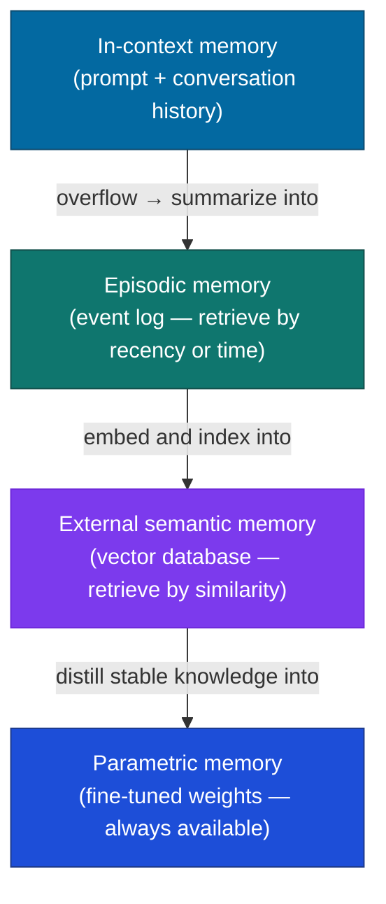

# Memory Architectures

## What it is

Memory architecture is how you give an agent access to information that doesn't fit in a single context window — the block of text the model can see and use in one call — persists across conversation turns, or needs to be retrieved selectively from a large store.

A language model is stateless by default: it remembers nothing from one call to the next. Each API call is independent, the context window is the only working memory, and nothing persists between sessions unless you engineer it. Memory architectures are the engineering solutions to that constraint.

## The problem it solves

Four distinct problems appear as agents grow in complexity:

**Within-context overflow.** A long conversation exceeds the context window limit. Older turns get truncated; the model loses track of earlier context.

**Cross-session continuity.** A user returns tomorrow expecting the agent to remember their preferences, prior decisions, and conversation history. Without external storage, every session starts from scratch.

**Knowledge at scale.** The information the agent needs (thousands of documents, a company's entire knowledge base) is far too large to fit in any context window. It needs to retrieve relevant fragments on demand.

**Parametric staleness.** The model's weights (the internal numbers it learned during training) encode knowledge as of its training cutoff. Anything newer — your product docs, today's prices, a user's updated preferences — can't be in the weights.

Different memory types solve different problems in this list.

## How it works under the hood

### The four memory types



#### In-context memory

The simplest form: put everything the agent needs in the current prompt. This is not a naive approach — for many tasks it is exactly correct.

```python
# Conversation history as in-context memory
messages = [
    {"role": "user", "content": "My name is Alex and I prefer metric units."},
    {"role": "assistant", "content": "Got it, Alex — I'll use metric units."},
    {"role": "user", "content": "What's 5 miles in km?"},
    # The model has access to the preference stated two turns ago
]
```

**Limits:** grows in direct proportion to conversation length — double the conversation, double the tokens you pay for on every subsequent call; truncated at the context window boundary; not shared across sessions.

**When to use:** fewer than ~20 turns of relevant history, or when the full history always matters (coding sessions, document editing).

#### External semantic memory (vector database)

Think of it as a searchable library rather than a stack of sticky notes: instead of keeping everything in the prompt, you store it externally and pull back only what's relevant to the current question. Relevant past interactions, facts, and documents are converted into vectors — lists of numbers that capture meaning, so similar ideas end up with similar numbers ("embedded") — and stored in a vector database. At query time, the current turn is embedded the same way, and the most similar stored memories are retrieved and injected into the prompt.

```python
from sentence_transformers import SentenceTransformer
import chromadb

embed_model = SentenceTransformer("BAAI/bge-small-en-v1.5")
chroma = chromadb.Client()
collection = chroma.create_collection("user_memories")

def store_memory(user_id: str, content: str):
    embedding = embed_model.encode([content])[0].tolist()
    collection.add(
        ids=[f"{user_id}_{hash(content)}"],
        embeddings=[embedding],
        documents=[content],
        metadatas=[{"user_id": user_id}]
    )

def retrieve_memories(user_id: str, query: str, k: int = 5) -> list[str]:
    query_emb = embed_model.encode([query])[0].tolist()
    results = collection.query(
        query_embeddings=[query_emb],
        n_results=k,
        where={"user_id": user_id}
    )
    return results["documents"][0]

# Store a preference
store_memory("user_123", "Alex prefers metric units and concise answers under 3 sentences.")

# Later: retrieve relevant memories for a new query
memories = retrieve_memories("user_123", "unit conversion preferences")
# ["Alex prefers metric units and concise answers under 3 sentences."]
```

**Limits:** retrieval is approximate — you get semantically similar memories, not necessarily the most recent or most important ones. Stale memories are retrieved with equal weight to fresh ones unless you add recency scoring.

**When to use:** large memory stores (hundreds to thousands of past interactions per user), long-term user personalization, knowledge base retrieval.

#### Episodic memory (event log)

A timestamped log of what happened, in order. Retrieved by recency or time range rather than semantic similarity. More like a diary than a knowledge base.

```python
import sqlite3
from datetime import datetime

conn = sqlite3.connect("episodic_memory.db")
conn.execute("""
    CREATE TABLE IF NOT EXISTS episodes (
        id INTEGER PRIMARY KEY AUTOINCREMENT,
        user_id TEXT,
        timestamp TEXT,
        event_type TEXT,
        content TEXT
    )
""")

def log_event(user_id: str, event_type: str, content: str):
    conn.execute(
        "INSERT INTO episodes (user_id, timestamp, event_type, content) VALUES (?, ?, ?, ?)",
        (user_id, datetime.utcnow().isoformat(), event_type, content)
    )
    conn.commit()

def get_recent_events(user_id: str, limit: int = 10) -> list[dict]:
    cursor = conn.execute(
        "SELECT timestamp, event_type, content FROM episodes WHERE user_id = ? ORDER BY timestamp DESC LIMIT ?",
        (user_id, limit)
    )
    return [{"timestamp": r[0], "type": r[1], "content": r[2]} for r in cursor]
```

**Limits:** retrieval by recency misses relevant older events; the log grows indefinitely without pruning; useful for audit trails but noisy for context injection.

**When to use:** multi-session agents that need to know what happened last time ("last week you asked me to..."), workflow agents tracking task state across sessions.

#### Parametric memory (fine-tuned weights)

Knowledge baked into the model's weights via fine-tuning (continuing to train the model on your own data) or continued pretraining. Always available without retrieval; zero latency; no retrieval errors.

**Limits:** expensive to update; introduces training/serving overhead; knowledge is frozen until the next fine-tuning run. Not suitable for frequently-changing information.

**When to use:** stable domain knowledge that never changes and is queried constantly (e.g., a specialized medical model that always needs to know drug interaction rules). Rarely the right choice for dynamic information — use RAG (retrieval-augmented generation: searching a document store and pasting the relevant results into the prompt at query time, rather than baking facts into the weights) instead.

### Combining memory types

Most production agents use two layers: in-context for current state and external semantic for long-term retrieval.

```python
import anthropic
from typing import Optional

client = anthropic.Anthropic()

def build_prompt_with_memory(
    user_id: str,
    current_message: str,
    conversation_history: list[dict],
    retrieved_memories: list[str],
) -> list[dict]:
    memory_block = ""
    if retrieved_memories:
        memory_block = "Relevant context from past interactions:\n" + \
                       "\n".join(f"- {m}" for m in retrieved_memories) + "\n\n"

    system = f"""You are a helpful assistant with memory of past interactions.
{memory_block}Use the above context to personalize your responses where relevant.
Do not mention that you retrieved memories unless directly asked."""

    return conversation_history + [{"role": "user", "content": current_message}]

def chat(user_id: str, message: str, history: list[dict]) -> str:
    # Retrieve relevant memories
    memories = retrieve_memories(user_id, message, k=3)

    messages = build_prompt_with_memory(user_id, message, history, memories)

    response = client.messages.create(
        model="claude-sonnet-4-6",
        max_tokens=512,
        system=f"Relevant past context:\n{chr(10).join(memories)}" if memories else "You are a helpful assistant.",
        messages=messages
    )

    reply = response.content[0].text

    # Store new interaction as a memory
    store_memory(user_id, f"User asked: {message}. Assistant replied: {reply[:200]}")

    return reply
```

### Conversation summarization (context compression)

When conversation history grows long, summarize older turns to compress them:

```python
def summarize_history(history: list[dict]) -> str:
    summary_prompt = "Summarize this conversation, preserving key facts, decisions, and user preferences:\n\n"
    for msg in history:
        summary_prompt += f"{msg['role'].upper()}: {msg['content']}\n"

    response = client.messages.create(
        model="claude-haiku-4-5-20251001",  # cheap model for summarization
        max_tokens=256,
        messages=[{"role": "user", "content": summary_prompt}]
    )
    return response.content[0].text

def trim_history(history: list[dict], max_turns: int = 20) -> list[dict]:
    if len(history) <= max_turns:
        return history
    # Summarize everything except the last 10 turns
    old = history[:-10]
    recent = history[-10:]
    summary = summarize_history(old)
    return [
        {"role": "user", "content": f"[Conversation summary: {summary}]"},
        {"role": "assistant", "content": "Understood, I have context from our prior conversation."},
        *recent
    ]
```

## Concrete example

A persistent personal assistant that remembers user preferences across sessions:

```python
import anthropic
import chromadb
from sentence_transformers import SentenceTransformer
from datetime import datetime

client = anthropic.Anthropic()
embed_model = SentenceTransformer("BAAI/bge-small-en-v1.5")
chroma = chromadb.Client()
memories = chroma.get_or_create_collection("assistant_memories")

class PersonalAssistant:
    def __init__(self, user_id: str):
        self.user_id = user_id
        self.session_history = []

    def _store(self, content: str):
        emb = embed_model.encode([content])[0].tolist()
        memories.add(
            ids=[f"{self.user_id}_{datetime.utcnow().isoformat()}"],
            embeddings=[emb],
            documents=[content],
            metadatas=[{"user_id": self.user_id, "ts": datetime.utcnow().isoformat()}]
        )

    def _recall(self, query: str, k: int = 4) -> list[str]:
        emb = embed_model.encode([query])[0].tolist()
        results = memories.query(
            query_embeddings=[emb],
            n_results=k,
            where={"user_id": self.user_id}
        )
        return results["documents"][0] if results["documents"] else []

    def chat(self, message: str) -> str:
        recalled = self._recall(message)
        memory_context = "\n".join(f"- {m}" for m in recalled)

        system = f"""You are a personal assistant with memory of past interactions.
Known context about this user:
{memory_context if memory_context else "(no prior context yet)"}"""

        self.session_history.append({"role": "user", "content": message})
        self.session_history = self.session_history[-20:]  # keep last 20 turns

        response = client.messages.create(
            model="claude-sonnet-4-6",
            max_tokens=512,
            system=system,
            messages=self.session_history
        )
        reply = response.content[0].text
        self.session_history.append({"role": "assistant", "content": reply})

        # Extract and store memorable facts
        self._store(f"[{datetime.utcnow().date()}] User: {message[:150]} | Assistant: {reply[:150]}")

        return reply

# Usage across sessions
assistant = PersonalAssistant("user_123")
print(assistant.chat("I prefer bullet points over paragraphs."))
print(assistant.chat("Summarize the key ideas in agile development."))

# New session — memory persists
assistant2 = PersonalAssistant("user_123")
print(assistant2.chat("How do you usually format your responses for me?"))
# Recalls the bullet point preference from the previous session
```

## When to use it / when not to

#### Memory type decision guide

| Situation | Memory type |
|---|---|
| Conversation < 20 turns, single session | In-context only |
| User preferences, long-term personalization | External semantic (vector DB) |
| Tracking what happened and when | Episodic (event log) |
| Stable domain knowledge, high query frequency | Parametric (fine-tuning) |
| Large knowledge base, document retrieval | External semantic + RAG (see RAG page) |

#### Don't over-engineer memory

Most agents don't need all four types. An agent that handles short, focused tasks (answering questions about a document) needs only in-context memory. An agent serving the same user across weeks needs external semantic memory. An agent auditing a workflow needs episodic memory. Add each type when you have a specific problem it solves, not speculatively.

:::tip[My take]

Most production agents need exactly two memory layers: in-context for the current session and a vector store for long-term recall. Episodic memory is useful when you need auditability or time-ordered retrieval; parametric memory is rarely the right choice for anything that changes more often than monthly.

The hardest part of memory architecture isn't the retrieval — it's deciding what to store. Storing everything degrades retrieval quality (noisy memories return alongside relevant ones) and increases cost. The discipline is being selective: store decisions, preferences, and outcomes; skip routine acknowledgments and filler. Writing an explicit "memory extraction" step that classifies what's worth storing is usually more effective than storing raw conversation turns.

:::

## Main tools and libraries

| Tool | Use for |
|---|---|
| Chroma | Embedded vector database; best for local development and small-to-medium stores |
| Pinecone | Managed vector database; production-grade with easy scaling |
| Weaviate | Vector database with hybrid search and built-in schema support |
| Redis | Fast key-value store for session state and episodic logs |
| Zep | Purpose-built memory layer for LLM agents; handles summarization and extraction |
| Mem0 | Managed memory API for agents; stores, retrieves, and deduplicates automatically |
| LangChain Memory modules | Conversation buffer, summary memory, and vector store memory integrations |
| `sentence-transformers` | Embedding model for semantic memory indexing |

## Common failure modes and gotchas

**1. Stale memory retrieval.** A preference stored six months ago ("I prefer Python 2") is retrieved with the same weight as a fresh one. Fix: add recency scoring to your retrieval (weight by age), or periodically expire old memories by deleting or archiving entries older than N days.

**2. Memory poisoning.** A bad interaction or incorrect fact is stored and retrieved faithfully in future sessions, propagating the error. Fix: add a confidence or source field to memories; don't store unverified user-stated facts as ground truth; make it easy to delete specific memories.

**3. Namespace collision.** Memories from one user are retrieved for another because you forgot to filter by user ID. Fix: always filter by user_id (and any other relevant namespace) at retrieval time. Test this explicitly — it's a silent failure that only shows up when your user base grows.

**4. Memory injection prompt contamination.** Injecting retrieved memories into the system prompt without delimiters lets the model confuse memories for instructions. Fix: use clear delimiters ("Relevant past context: [START] ... [END]") and explicitly label memories as context, not instructions.

**5. In-context history bloat.** Passing the full conversation history on every call costs tokens (roughly, words or word-fragments — the unit a model bills and measures length by) proportionally. Fix: implement history trimming (keep last N turns) or summarization (compress old turns into a summary) before the context limit is reached — not after.

**6. Embedding model mismatch.** You change embedding models mid-deployment. Old entries in the vector store become incompatible. Fix: tag each stored embedding with the model name and version; re-embed on model change rather than mixing.

## Project ideas

**1. Persistent preference assistant** — Build the personal assistant above. Run three conversation sessions: session 1 (establish preferences), session 2 (verify preferences are recalled), session 3 (update a preference and verify the old one is no longer dominant). This makes cross-session memory concrete. Also test the "namespace collision" failure mode by creating a second user and verifying memories don't bleed across.

**2. Memory quality experiment** — Build an agent that stores all conversation turns verbatim vs. one that extracts only "memorable facts" (preferences, decisions, outcomes) using a second LLM call. After 50 turns, query both systems with 20 test questions. Compare retrieval precision — the selective storage system usually wins on clean retrieval at the cost of occasionally missing context.

**3. Summarization compression benchmark** — Implement three context management strategies: (a) truncate old turns, (b) summarize and prepend, (c) full in-context (within window limit). Measure how well the model answers questions about early conversation turns under each strategy. Summarization usually outperforms truncation significantly; it approaches full in-context on most queries.

**4. Memory expiry and freshness** — Build a memory system where each stored memory has a timestamp and a TTL. Implement recency-weighted retrieval (recent memories score higher). Test how the system behaves when preferences change — does the new preference override the old one? Tune the decay rate until the system reflects recent preferences while not completely forgetting long-standing ones.

## Going deeper

#### Foundational papers

- Packer et al., "MemGPT: Towards LLMs as Operating Systems" (2023) — the paper that introduced the OS memory hierarchy analogy for LLM agents: in-context as RAM, external storage as disk.
- Lewis et al., "Retrieval-Augmented Generation for Knowledge-Intensive NLP Tasks" (NeurIPS 2020) — the RAG paper; external semantic memory for factual grounding.
- Park et al., "Generative Agents: Interactive Simulacra of Human Behavior" (UIST 2023) — implements episodic + semantic memory for simulated social agents; the reflection and retrieval mechanisms are directly applicable.

#### Libraries

- Zep (getzep.com) — purpose-built LLM memory layer; handles conversation summarization, fact extraction, and retrieval automatically.
- Mem0 (mem0.ai) — managed memory API; good for adding cross-session memory to existing agents without building your own storage layer.
- LangChain memory documentation — covers `ConversationBufferMemory`, `ConversationSummaryMemory`, and vector store-backed memory with code examples.
