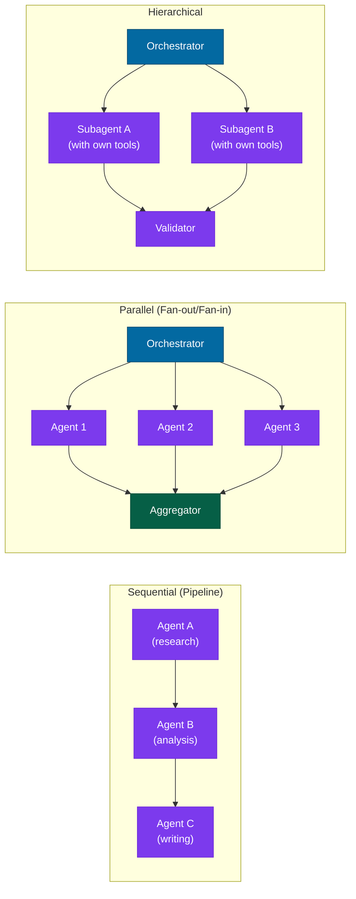

# Multi-Agent Systems

## What it is

A multi-agent system is an architecture where multiple model calls — often with different prompts, tools, or models — work together to solve a task. Rather than asking one model to do everything, you decompose the task and delegate each part to an agent specialized for it.

"Agent" here means: a model with a prompt, access to tools, and the ability to decide what to do next based on its context. In practice this is usually implemented as a loop (see [Function Calling / Tool Use](./function-calling)), but the multi-agent pattern adds coordination between multiple such loops.

## The problem it solves

Single LLM calls have hard limits:

**Context window.** Even at 200K tokens (roughly ¾ of a word each — 200K tokens is on the order of a 150,000-word book), there are tasks — processing a full codebase, synthesizing a book-length corpus, running a week-long research project — that exceed what fits in one context.

**Quality through specialization.** A single model doing everything (research + analysis + writing + code review + validation) does each step worse than a model given a focused role and only the context it needs.

**Parallelism.** Sequential tasks are slow. When subtasks are independent, running them in parallel cuts wall-clock time proportionally.

**Fault isolation.** If one step fails, a well-designed multi-agent system can retry or reroute that step without restarting everything.

## How it works under the hood

### Topologies



**Sequential (pipeline):** Output of Agent A becomes input to Agent B. Each agent transforms the result before passing it on. Use when each step genuinely depends on the previous step's output.

**Parallel (fan-out/fan-in):** An orchestrator splits a task into independent subtasks, delegates to specialized agents in parallel, and aggregates the results. Use when subtasks are independent. Wall-clock time scales as the slowest subtask, not their sum.

**Hierarchical:** An orchestrator delegates to subagents that each have their own tools and decision loops. Subagents can in turn delegate. Use for complex multi-step tasks where intermediate judgment is needed, not just transformation.

**Router:** A classifier — something that automatically sorts an input into one of several categories — routes incoming tasks to the appropriate specialist agent rather than broadcasting to all. Use when input types are heterogeneous and different handlers are clearly better for different categories.

### Coordination patterns

**Handoff via context.** The simplest form: the output of one agent is concatenated (joined end-to-end as text) into the next agent's prompt. No shared state, no coordination infrastructure. Works for simple pipelines; breaks for complex dependencies.

**Shared message store.** Think of it as a shared whiteboard the agents all read from and write to, rather than each one only seeing what was handed to it directly. Agents read and write to a shared conversation log or structured state object. Each agent sees only the history relevant to it. LangGraph — a Python library for building stateful multi-step agent workflows as a directed graph, where nodes are agent functions and edges define the flow of control between them — implements this as a graph with a typed state dictionary (a shared record with a fixed, named set of fields, so every node agrees on what's in it):

```python
from langgraph.graph import StateGraph
from typing import TypedDict, list

class ResearchState(TypedDict):
    question: str
    search_results: list[str]
    analysis: str
    final_report: str

graph = StateGraph(ResearchState)
graph.add_node("researcher", researcher_agent)
graph.add_node("analyst", analyst_agent)
graph.add_node("writer", writer_agent)
graph.add_edge("researcher", "analyst")
graph.add_edge("analyst", "writer")
```

This defines the shared state's shape once (`ResearchState`), then chains three agent functions together as nodes in a graph, with each edge saying "run this node next" — the researcher's output becomes part of the shared state the analyst reads, and so on.

**Human in the loop.** An agent pauses and asks for human confirmation before taking an irreversible action (sending an email, executing code, making a purchase). Essential for high-stakes agents; the pause point should be explicit in the graph design.

### Trust and verification

In a multi-agent system, one agent's output is another agent's input. Errors compound: if Agent A produces a subtly wrong intermediate result, Agents B and C build on that error. This is the central reliability problem of multi-agent systems.

Mitigation patterns:
- **Validator agent**: a separate agent that checks each intermediate output against a rubric before passing it on
- **Critic-revise loop**: the producing agent and a critic iterate until the critic approves
- **Structured handoffs**: use typed schemas — a fixed, named shape a message must match, checked automatically (Pydantic is the standard Python library for this) — for inter-agent communication rather than free text, so a message with a missing or wrong-shaped field is rejected immediately (a "type error") rather than silently passed along to break something downstream

## Concrete example

A parallel research system using LangGraph — a Python library for building stateful multi-step agent workflows as a directed graph, where nodes are agent functions and edges define the flow of control between them:

```python
import asyncio
import anthropic
from langgraph.graph import StateGraph, END
from typing import TypedDict

client = anthropic.Anthropic()

class ResearchState(TypedDict):
    question: str
    web_results: str
    kb_results: str
    synthesis: str

def web_researcher(state: ResearchState) -> dict:
    response = client.messages.create(
        model="claude-haiku-4-5-20251001",  # cheaper model for sub-tasks
        max_tokens=512,
        system="You are a web research specialist. Summarize what you know about the topic from general knowledge.",
        messages=[{"role": "user", "content": state["question"]}]
    )
    return {"web_results": response.content[0].text}

def kb_researcher(state: ResearchState) -> dict:
    # In production: query your actual knowledge base
    response = client.messages.create(
        model="claude-haiku-4-5-20251001",
        max_tokens=512,
        system="You are an internal knowledge base specialist. Summarize relevant internal documentation.",
        messages=[{"role": "user", "content": state["question"]}]
    )
    return {"kb_results": response.content[0].text}

def synthesizer(state: ResearchState) -> dict:
    response = client.messages.create(
        model="claude-sonnet-4-6",  # stronger model for synthesis
        max_tokens=1024,
        system="Synthesize research findings into a clear, concise answer.",
        messages=[{"role": "user", "content": f"""
Question: {state['question']}

Web research: {state['web_results']}

Internal KB: {state['kb_results']}

Synthesize these into a final answer.
"""}]
    )
    return {"synthesis": response.content[0].text}

# Build the graph
from langgraph.graph import START

builder = StateGraph(ResearchState)
builder.add_node("web_research", web_researcher)
builder.add_node("kb_research", kb_researcher)
builder.add_node("synthesize", synthesizer)

# Fan-out from START to both research nodes (true parallel execution)
builder.add_edge(START, "web_research")
builder.add_edge(START, "kb_research")
# Both feed into synthesize; LangGraph waits for both before running it
builder.add_edge("web_research", "synthesize")
builder.add_edge("kb_research", "synthesize")
builder.add_edge("synthesize", END)

graph = builder.compile()

result = graph.invoke({
    "question": "What is our policy on remote work expenses?",
    "web_results": "",
    "kb_results": "",
    "synthesis": ""
})
print(result["synthesis"])
```

## When to use it / when not to

#### Use multi-agent systems when

- The task has clearly separable subtasks with different requirements (different prompts, tools, models, or latency budgets)
- Subtasks can run in parallel and you need wall-clock time reduction
- Context window size is genuinely the constraint — not just "this feels complex"
- You need specialized behavior (a critic, a validator, a domain-specific researcher) that would conflict in a single prompt

#### Avoid when

- A single well-crafted prompt solves the task — multi-agent adds coordination overhead for no benefit
- Subtasks are tightly coupled and share most of the same context — you'll duplicate tokens and add latency
- Your error handling isn't designed for compound failures — a three-agent pipeline with no validation can silently produce subtly wrong output that passes superficial checks
- Latency (the delay before a response comes back) matters — each additional agent adds at least one round-trip; a three-agent pipeline is 3× the minimum latency of a single call

#### The practical question

Can you decompose the task into subtasks that are both independent (parallelizable or clearly sequential) and where each subtask benefits from specialized handling? If the answer is no — if the subtasks need to reference each other's outputs constantly or if a single agent performs equally well — you're adding complexity without benefit.

:::tip[My take]

The most common mistake I see with multi-agent systems is over-engineering for complexity when a single well-prompted call would suffice. Start with one model. If you can articulate a clear reason it fails that specialization or parallelism would fix — not "it feels like a lot" but "this specific step needs different context / a different model / can run in parallel" — then add agents. Otherwise you're building a distributed system where a function call would do.

When you do build multi-agent, design the handoff contracts first. What does Agent A promise to deliver? What does Agent B assume it will receive? If you can't write those contracts as typed schemas, the system will fail at integration in ways that are hard to debug. The types aren't bureaucracy — they're the specification.

:::

## Main tools and libraries

| Tool | Use for |
|---|---|
| LangGraph | Stateful agent graphs; best for complex workflows with conditional branching |
| CrewAI | Higher-level multi-agent framework; role-based agent definition |
| AutoGen (Microsoft) | Conversational multi-agent; agents that talk to each other |
| Anthropic Claude API | Underlying model; `claude-haiku-4-5-20251001` for subagents, `claude-sonnet-4-6` for orchestration |
| LangChain | Agent toolkits and tool catalog; often used alongside LangGraph |
| Prefect / Temporal | Workflow orchestration for durable multi-agent pipelines with retries |

## Common failure modes and gotchas

**1. Error propagation.** Agent A produces a slightly wrong result; Agents B and C amplify the error rather than catching it. Fix: add a validation step between agents that checks intermediate output quality before passing it on. Log intermediate outputs — silent failures are the hardest to debug.

**2. Context explosion.** Each agent receives the accumulated outputs of all previous agents, causing context windows to fill rapidly. Fix: pass summarized or structured intermediate outputs, not raw text. Use typed state schemas so each agent receives only the fields it needs.

**3. Coordination overhead eating the parallelism benefit.** Fan-out is only faster if agents actually run in parallel and the aggregation step is cheap. If your orchestrator is sequential, you get the complexity of multi-agent with the latency of sequential.

**4. Prompt conflicts in shared context.** When multiple agents contribute to a shared conversation thread, their different instructions can conflict. Fix: use separate conversation threads per agent and merge at structured handoff points rather than sharing a single thread.

**5. Infinite loops.** An agent's output triggers a re-call of the same agent, which produces similar output, triggering another call. Fix: hard cap on iterations (10 is a safe starting maximum) and break with a user-visible error rather than continuing indefinitely.

**6. Cost amplification.** Three agents at $0.01/call becomes $0.03/call, times thousands of daily users. Multi-agent costs multiply. Use smaller/cheaper models for subagent work (Haiku for research, Sonnet for synthesis) and log per-agent token usage from the start.

## Project ideas

**1. Three-topology comparison** — Pick a multi-step task (e.g., "research a company and write an investment memo"). Implement it three ways: (a) single agent, (b) sequential pipeline (researcher → analyst → writer), (c) parallel fan-out (separate agents for financial, market, competitive research) → synthesis. Compare output quality, latency, and cost. The quality difference between (a) and (b) is usually smaller than expected.

**2. Critic-revise loop** — Build a two-agent system: a writer and a critic. The critic evaluates the writer's output against a rubric (clarity, accuracy, conciseness) and returns structured feedback. The writer revises. Run for 3 iterations. Log how quality changes across rounds and where it plateaus. Also log when the critic and writer disagree — this surfaces ambiguity in your rubric.

**3. Router agent** — Build a classifier that routes support tickets to one of three specialist agents (billing, technical, account). Measure routing accuracy on 50 tickets. Then add a fallback agent for "other" and an escalation path for high-urgency tickets. This makes the router topology concrete.

**4. Human-in-the-loop agent** — Build an agent that drafts emails on behalf of the user. Add a confirmation step before sending: the agent drafts the email, presents it to the user, and only sends after explicit approval. Implement the pause point explicitly in your graph and test what happens when the user edits the draft before approving.

## Going deeper

#### Foundational papers

- Yao et al., "ReAct: Synergizing Reasoning and Acting in Language Models" (NeurIPS 2022) — the foundational agent loop: reason, then act, observe the result, reason again.
- Park et al., "Generative Agents: Interactive Simulacra of Human Behavior" (UIST 2023) — multi-agent simulation; demonstrates emergent behavior from individual agent loops.
- Wu et al., "AutoGen: Enabling Next-Gen LLM Applications via Multi-Agent Conversation" (2023) — Microsoft's conversational multi-agent framework paper.

#### Libraries and frameworks

- LangGraph documentation (python.langchain.com/docs/langgraph) — the best practical reference for stateful agent graphs; tutorial section is particularly clear.
- CrewAI documentation (docs.crewai.com) — role-based multi-agent; good for task delegation patterns.
- Anthropic "Building effective agents" guide — the clearest public guidance on when and how to build agents, with concrete topology recommendations.
