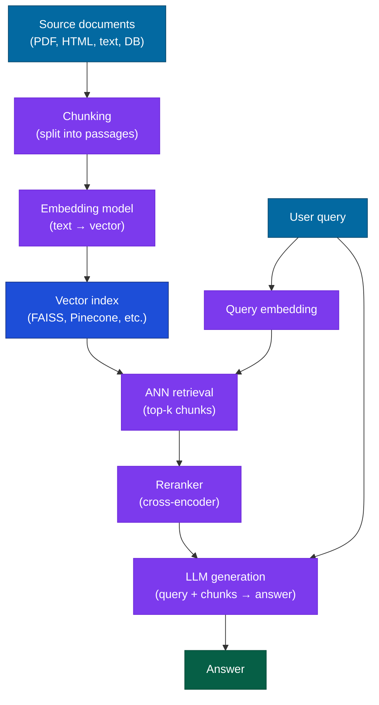

# RAG — Retrieval-Augmented Generation

## What it is

RAG is a pattern: retrieve first, then generate. Rather than relying on knowledge baked into model weights at training time, you retrieve relevant documents from an external store at query time and inject them into the context window as evidence. The model then generates its response grounded in those documents.

The two-stage structure is the key insight. Retrieval is a search problem — fast, deterministic, interpretable. Generation is a language problem — flexible, synthesizing, expressive. Combining them gives you an AI that can answer questions about your specific documents without the cost of training or fine-tuning.

## The problem it solves

Language models have two fundamental limitations for production knowledge tasks:

**Stale weights.** The model's knowledge has a training cutoff. It can't know what happened yesterday, what your current product docs say, or what's in the contract your user uploaded five minutes ago.

**Hallucination under uncertainty.** When the model doesn't know something, it doesn't reliably say "I don't know" — it generates a plausible-sounding continuation. For factual tasks (legal, medical, financial, technical documentation), confident hallucinations are worse than acknowledged uncertainty.

RAG addresses both: the retrieved documents are the ground truth the model should use, and the model is instructed to answer only from those documents.

## How it works under the hood

### The full pipeline



### Chunking

Documents must be split into chunks before embedding. The chunking strategy determines what the model can retrieve — a bad split cuts a relevant passage in half and makes it unretrievable.

**Fixed-size chunking**: split every N tokens with an overlap of M. Simple, predictable, language-agnostic. The overlap prevents context from being lost at boundaries.

```python
from langchain.text_splitter import RecursiveCharacterTextSplitter

splitter = RecursiveCharacterTextSplitter(
    chunk_size=512,       # characters per chunk (LangChain default unit — NOT tokens)
    chunk_overlap=64,     # character overlap to preserve boundary context
    separators=["\n\n", "\n", " ", ""]  # prefer splitting at paragraph breaks
)
# For token-based splitting, use RecursiveCharacterTextSplitter.from_hugging_face_tokenizer()
# or pass length_function=tiktoken_len. 512 chars ≈ 100–130 tokens for English text.
chunks = splitter.split_text(document_text)
```

**Semantic chunking**: split at natural section boundaries (paragraphs, headings, sentences). Preserves logical units. Requires more preprocessing but improves retrieval precision.

**Considerations:**
- Too small (< 128 tokens): chunks lose context; a retrieved chunk about "the fee" without the preceding "cancellation" is useless
- Too large (> 1K tokens): chunks contain multiple topics; retrieval precision drops
- 256–512 tokens is a reasonable default for general-purpose document retrieval

### Embedding and indexing

Each chunk is converted to a dense vector using an embedding model. Similar chunks end up close together in the vector space; a query embedding will be close to relevant chunks.

```python
from sentence_transformers import SentenceTransformer
import faiss
import numpy as np

embed_model = SentenceTransformer("BAAI/bge-small-en-v1.5")

# Index documents
embeddings = embed_model.encode(chunks, normalize_embeddings=True)
d = embeddings.shape[1]
index = faiss.IndexFlatIP(d)  # inner product = cosine similarity on normalized vectors
index.add(embeddings.astype("float32"))
```

### Retrieval

At query time, embed the query and find the k nearest chunks:

```python
query_embedding = embed_model.encode([query], normalize_embeddings=True)
scores, indices = index.search(query_embedding.astype("float32"), k=10)
retrieved_chunks = [chunks[i] for i in indices[0]]
```

### Reranking

The top-k from ANN retrieval is an approximate nearest-neighbor match — it finds the chunks whose embeddings are closest to the query embedding, which correlates with relevance but isn't identical to it. A reranker (cross-encoder) takes each (query, chunk) pair and scores them jointly — meaning the query and document are concatenated and passed through a single model together, rather than encoded separately and compared via cosine similarity. This lets the model attend to interactions between query tokens and document tokens, capturing relevance signals that embedding similarity misses. The tradeoff: cross-encoders are much slower (one forward pass per candidate) and can't be pre-indexed, so they're only practical on the small top-k set returned by ANN retrieval.

```python
from sentence_transformers import CrossEncoder

reranker = CrossEncoder("cross-encoder/ms-marco-MiniLM-L-6-v2")
pairs = [(query, chunk) for chunk in retrieved_chunks]
rerank_scores = reranker.predict(pairs)
top_chunks = [chunk for _, chunk in sorted(
    zip(rerank_scores, retrieved_chunks), reverse=True
)][:5]
```

Retrieve 10–20 chunks with ANN, then rerank to the top 3–5. The reranker adds ~50–150ms latency but significantly improves precision.

### Hybrid search

Dense embedding retrieval is good at semantic similarity; keyword search (BM25) is good at exact match. Hybrid search combines both:

```python
from langchain_community.retrievers import BM25Retriever
from langchain.retrievers import EnsembleRetriever

bm25_retriever = BM25Retriever.from_texts(chunks)
bm25_retriever.k = 10

dense_retriever = ...  # your FAISS-backed retriever

hybrid = EnsembleRetriever(
    retrievers=[bm25_retriever, dense_retriever],
    weights=[0.4, 0.6]  # more weight on semantic
)
results = hybrid.invoke(query)
```

Use hybrid search when your corpus has product names, codes, version numbers, or other exact-match terms that embeddings handle poorly.

### Generation

Inject the retrieved chunks into the model's context as evidence:

```python
context = "\n\n---\n\n".join(top_chunks)

prompt = f"""Answer the question using only the information in the provided context.
If the answer is not in the context, say "I don't have enough information to answer this."

Context:
{context}

Question: {query}"""
```

## Concrete example

A full RAG pipeline over a document collection:

```python
import anthropic
from sentence_transformers import SentenceTransformer, CrossEncoder
import faiss
import numpy as np

client = anthropic.Anthropic()
embed_model = SentenceTransformer("BAAI/bge-small-en-v1.5")
reranker = CrossEncoder("cross-encoder/ms-marco-MiniLM-L-6-v2")

class RAGPipeline:
    def __init__(self, documents: list[str]):
        self.chunks = self._chunk(documents)
        embeddings = embed_model.encode(self.chunks, normalize_embeddings=True)
        d = embeddings.shape[1]
        self.index = faiss.IndexFlatIP(d)
        self.index.add(embeddings.astype("float32"))

    def _chunk(self, documents, size=400, overlap=50):
        # Splits by whitespace-separated words (not tokens). 400 words ≈ 530 tokens
        # for English. For production, use a tokenizer-aware splitter.
        chunks = []
        for doc in documents:
            words = doc.split()
            for i in range(0, len(words), size - overlap):
                chunks.append(" ".join(words[i:i + size]))
        return chunks

    def retrieve(self, query: str, k_retrieve=10, k_final=4) -> list[str]:
        q_emb = embed_model.encode([query], normalize_embeddings=True)
        _, idxs = self.index.search(q_emb.astype("float32"), k_retrieve)
        candidates = [self.chunks[i] for i in idxs[0]]
        scores = reranker.predict([(query, c) for c in candidates])
        ranked = sorted(zip(scores, candidates), reverse=True)
        return [c for _, c in ranked[:k_final]]

    def answer(self, query: str) -> str:
        chunks = self.retrieve(query)
        context = "\n\n---\n\n".join(chunks)
        response = client.messages.create(
            model="claude-sonnet-4-6",
            max_tokens=512,
            messages=[{"role": "user", "content": f"""Answer using only the context below.
If the answer isn't there, say so.

Context:
{context}

Question: {query}"""}]
        )
        return response.content[0].text

# Usage
pipeline = RAGPipeline(documents=["...", "..."])
print(pipeline.answer("What is the cancellation fee?"))
```

## When to use it / when not to

#### Use RAG when

- Your documents change frequently (nightly, weekly) — cheaper than retraining or fine-tuning
- You need answers grounded in specific, verifiable sources (legal, medical, financial)
- Your document set is larger than what fits in one context window
- You need citations — RAG lets you surface which chunks were used

#### Consider alternatives when

- The knowledge is already in the model's weights — just prompt it; retrieval adds 100–300ms
- Your entire corpus fits in one large context window (Gemini 1.5 Pro at 1M tokens) — long-context retrieval can be cheaper than building a pipeline
- You need the model to synthesize across all documents simultaneously — RAG retrieves fragments; if the task is "give me the overall theme across 10,000 documents," you need a different approach
- Latency is critical — retrieval + reranking adds 200–500ms

#### The practical question

Is this a lookup task (find and return specific information) or a synthesis task (reason across many sources)? RAG is better at lookup. For synthesis, consider whether hierarchical retrieval or summarization pipelines are needed.

:::tip[My take]

Chunking strategy matters more than model choice for RAG quality. I've seen the same Claude model go from 60% to 85% answer accuracy purely from improving the chunking — switching from fixed-size word splits to paragraph-aware splits that keep logical units together. Most RAG failures I've diagnosed trace back to retrieved chunks that are missing their context: the chunk says "the fee is $50" without the surrounding sentence that says "the late cancellation fee is $50." The retrieval found the right document; the chunking threw away the key context.

Reranking is almost always worth the latency. The difference between top-10 dense retrieval and top-5 reranked is usually larger than the difference between any two embedding models at the same price point. Add a cross-encoder before you switch embedding providers.

:::

## Main tools and libraries

| Tool | Use for |
|---|---|
| LangChain / LlamaIndex | End-to-end RAG pipelines; connectors for 50+ document sources |
| FAISS (Meta) | In-process vector index; best for prototyping and medium-scale (< 10M chunks) |
| Chroma | Embedded vector database; easy local setup with persistence |
| Weaviate | Production vector database with hybrid search built in |
| Pinecone | Managed vector database; easy scaling, no infrastructure |
| `sentence-transformers` | Embedding models (BGE, E5, all-MiniLM); rerankers (ms-marco) |
| Cohere Rerank | Managed reranking API; strong performance on English retrieval |
| BM25 (rank-bm25) | Keyword retrieval for hybrid search |

## Common failure modes and gotchas

**1. Chunk boundary cuts.** The retrieved chunk contains the answer's value but not its label — "is $50" without the surrounding context that says what the $50 is. Fix: use sentence-aware or paragraph-aware splitting; add overlapping chunks at boundaries.

**2. Wrong document retrieved — semantic mismatch.** The query "Apple financial results" retrieves content about the fruit, not the company. Fix: add metadata filtering (restrict to financial documents), use hybrid search (BM25 will catch the company name), or use document-level filtering before chunk retrieval.

**3. Top-k too small.** If relevant information is split across multiple chunks and you only retrieve 3, you might miss half of it. Retrieve more (10–20) and rerank down to fewer (3–5). Let the reranker do the filtering.

**4. Embedding model mismatch.** You index with one embedding model and retrieve with a different one (after swapping providers). The vector space changes; old embeddings are now incompatible. Always re-embed your full corpus when changing embedding models.

**5. Context window overflow.** With many long chunks, the combined context exceeds the model's window. Truncate chunk count before exceeding ~70% of the context limit, leaving room for the query, the prompt template, and the response.

**6. Hallucination beyond retrieved context.** The model produces information not in the retrieved chunks — either from its parametric memory or confabulation. Fix: explicit prompt instruction ("Answer only from the provided context. Do not use outside knowledge.") and evaluation on out-of-context questions to measure hallucination rate.

## Project ideas

**1. Chunking strategy benchmark** — Take a document corpus (e.g., Wikipedia sections or technical documentation) and build three RAG pipelines: (a) fixed 256-token chunks, (b) fixed 512-token chunks with overlap, (c) paragraph-aware splitting. Create 30 questions with known answers and measure retrieval accuracy (was the answer in the top-5 retrieved chunks?) and answer accuracy for each. The differences are larger than most people expect.

**2. Retrieval component ablation** — Build a full pipeline (embed → ANN → rerank → generate). Then disable reranking and measure accuracy drop. Then switch from hybrid to dense-only and measure again. Isolating each component shows exactly where your pipeline's accuracy comes from.

**3. RAG vs. fine-tuned model** — Take a domain-specific QA dataset (e.g., a company's FAQ). Train a fine-tuned model on the Q&A pairs. Build a RAG system over the same documents. Compare: accuracy, latency, cost per query, behavior when information is updated. This makes the tradeoffs concrete rather than theoretical.

**4. Citation RAG** — Modify your RAG pipeline to return source citations alongside answers. Each chunk should carry metadata (document title, page number, section). The prompt should instruct the model to cite the source for each factual claim. Evaluate whether the cited chunk actually supports the claim.

## Going deeper

#### Foundational papers

- Lewis et al., "Retrieval-Augmented Generation for Knowledge-Intensive NLP Tasks" (NeurIPS 2020) — the paper that named the pattern. Introduces the dense passage retriever + generator architecture.
- Karpukhin et al., "Dense Passage Retrieval for Open-Domain Question Answering" (EMNLP 2020) — DPR, the foundational dense retrieval model.
- Nogueira & Cho, "Passage Re-ranking with BERT" (2019) — the cross-encoder reranking approach; still the dominant reranking paradigm.

#### Best resources

- LangChain RAG documentation — comprehensive tutorials with multiple retriever backends.
- LlamaIndex documentation — more opinionated RAG framework; stronger on structured document parsing and hierarchical retrieval.
- Pinecone "What is RAG?" — practical overview with architecture diagrams.
- BEIR benchmark — the standard evaluation suite for retrieval models across 18 different IR tasks.
