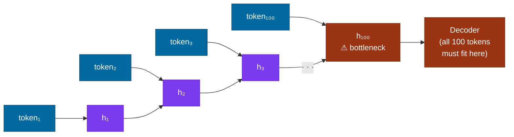
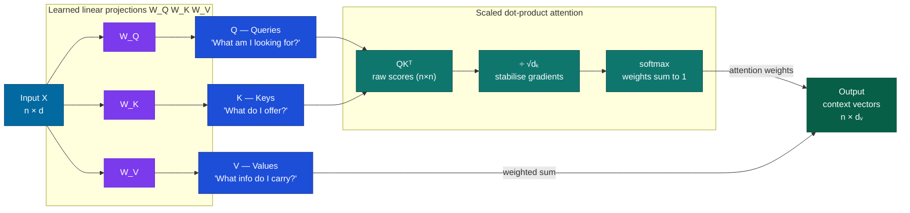

# Attention Mechanism

## What it is

Attention is a mechanism that lets a model decide, for each step of its output, how much to focus on each part of its input. When a translation model is about to produce the French word for "bank" — which could be *banque* (financial institution) or *rive* (riverbank) — attention lets it look back at the entire English sentence and weight the context words that disambiguate.

The name is evocative but slightly misleading. Attention isn't really about focusing; it's a **learnable weighted average**. Every input position contributes to every output position — just with different weights. The model learns, through training, which weights lead to good predictions.

## The problem it solves

Before attention, sequence models (RNNs, LSTMs) processed tokens (the basic units a model operates on — roughly words or word-pieces) one at a time. Each step produced a *hidden state* — a fixed-size vector supposed to carry everything the model had learned so far.



Two problems with this architecture:

**The information bottleneck.** By the time the model processes token 100, the hidden state must still somehow carry relevant information from token 1. For long sequences, early context gets squeezed out. A model translating a 200-word sentence can "forget" the subject before it reaches the verb.

**Sequential computation.** Hidden state $h_t$ depends on $h_{t-1}$, which depends on $h_{t-2}$. You cannot compute $h_{50}$ until $h_{49}$ is ready. Training is inherently serial — no parallelism, slow.

Attention solves both:
- Every output position can directly query *any* input position — no bottleneck.
- All positions can be computed simultaneously — training scales with hardware.

This is the core reason transformers displaced RNNs and LSTMs for most language tasks from 2018 onward.

## How it works under the hood

### The library analogy

Think of a reference library. You walk in with a question — *the query* ($Q$). Each book has an index of the topics it covers — *the keys* ($K$). You scan the index to find which books are relevant to your question, then read the relevant sections — *the values* ($V$). You leave with a synthesis, weighted by how relevant each book was.

Attention works exactly this way, except:
- Queries, keys, and values are all dense vectors derived from the same input sequence.
- "Relevance" is measured by dot-product similarity.
- You don't pick one book; you take a weighted blend of *all* of them, with weights learned from data.

### The three projections

For every token in the input sequence, the model derives three vectors by multiplying the token's embedding through three learned weight matrices:

$$Q = X W_Q \qquad K = X W_K \qquad V = X W_V$$

Where $X \in \mathbb{R}^{n \times d}$ is the sequence of $n$ token embeddings (each $d$-dimensional), and $W_Q, W_K \in \mathbb{R}^{d \times d_k}$, $W_V \in \mathbb{R}^{d \times d_v}$ are learned during training. Nothing about $Q$, $K$, or $V$ is hand-designed — the model learns how to project its inputs into useful query, key, and value spaces.

### The equation

$$\boxed{\text{Attention}(Q,\, K,\, V) = \text{softmax}\!\left(\frac{QK^T}{\sqrt{d_k}}\right)V}$$

Every symbol earns its place. Let's take them in order:

**$QK^T \in \mathbb{R}^{n \times n}$** — the raw score matrix. Entry $(i, j)$ is the dot product of query vector $i$ and key vector $j$: how much token $i$ "wants" to attend to token $j$. You get an $n \times n$ grid of raw relevance scores — every token scored against every other token simultaneously.

**$/ \sqrt{d_k}$** — the scaling factor. If $d_k$-dimensional vectors have unit-variance components, their dot product has variance $d_k$. Without scaling, the standard deviation of raw scores grows as $\sqrt{d_k}$ — so at $d_k = 512$, scores have a standard deviation roughly 8× larger than at $d_k = 8$ (since $\sqrt{512/8} = 8$). Large scores push softmax into near-one-hot territory where gradients nearly vanish. Dividing by $\sqrt{d_k}$ restores unit variance regardless of $d_k$.

**$\text{softmax}(\cdot)$** — applied row-wise. Each row $i$ becomes a probability distribution over all $n$ positions, summing to 1. These are the attention weights: "given token $i$'s query, what fraction of each token's value should I incorporate?"

**$\times V$** — the weighted sum. For each output position $i$, you take the convex combination of all value vectors, weighted by the softmax scores. Output position $i$ is a blend of every token's information — mostly the ones it found relevant, a little of everyone else.

### Data flow



### Multi-head attention

One set of Q, K, V projections specialises in one type of relationship. The relationship "subject governs verb" is structurally different from "pronoun refers to noun." Multi-head attention runs $h$ independent attention computations in parallel, each with its own $W_Q^{(i)}, W_K^{(i)}, W_V^{(i)}$:

$$\text{MultiHead}(Q, K, V) = \text{Concat}\!\left(\text{head}_1,\, \ldots,\, \text{head}_h\right) W^O$$
$$\text{head}_i = \text{Attention}\!\left(XW_i^Q,\; XW_i^K,\; XW_i^V\right)$$

$W^O \in \mathbb{R}^{hd_v \times d_{\text{model}}}$ is a learned output projection that mixes the concatenated heads back into the model's working dimension. To keep total compute constant, each head uses $d_k = d_{\text{model}} / h$ dimensions. With $h = 8$ heads and $d_{\text{model}} = 512$, each head has $d_k = 64$ — the same total parameter count as one 512-dimensional head, but eight different perspectives on the input.

## Concrete example

**Sentence:** "The animal didn't cross the street because **it** was too tired."

When the model processes "it," it must resolve the coreference: does "it" refer to *animal* or *street*? This is the attention mechanism's job — pulling the relevant context toward the current token.

The heatmap below shows approximate attention weights for the "it" token looking back at the full sentence:


In this illustrative example, "animal" captures the dominant fraction of attention weight (the deep blue cell). The model learned — through training on language prediction alone — that something that "was too tired" is more likely to be an animal than a street. No coreference rule was written; it emerged from the loss. (Exact weights vary by model, layer, and head — treat the heatmap as a demonstration, not a measurement.)

#### Minimal implementation from scratch

```python
import torch
import torch.nn.functional as F

def scaled_dot_product_attention(Q, K, V, mask=None):
    """
    Q, K: (batch, heads, seq_len, d_k)
    V:    (batch, heads, seq_len, d_v)
    """
    d_k = Q.size(-1)

    # Raw scores: (batch, heads, seq_len, seq_len)
    scores = Q @ K.transpose(-2, -1) / d_k ** 0.5

    # Causal mask: prevent attending to future tokens (autoregressive models)
    if mask is not None:
        scores = scores.masked_fill(mask == 0, float('-inf'))

    weights = F.softmax(scores, dim=-1)   # each row sums to 1
    return weights @ V, weights           # output + weights for inspection


# Smoke test
seq_len, d_k, d_v = 5, 8, 8
Q = torch.randn(1, 1, seq_len, d_k)
K = torch.randn(1, 1, seq_len, d_k)
V = torch.randn(1, 1, seq_len, d_v)

output, weights = scaled_dot_product_attention(Q, K, V)
print(output.shape)                      # (1, 1, 5, 8)
print(weights.sum(dim=-1))              # tensor([[[1., 1., 1., 1., 1.]]])
```

## When to use it / when not to

**Self-attention** (Q, K, V all from the same sequence) is the backbone of encoder-only models (BERT, RoBERTa) and decoder-only models (GPT, Claude). **Cross-attention** (Q from the target sequence, K and V from the source sequence) is used in encoder-decoder architectures for translation and summarisation — the decoder queries the encoder's output at each generation step.

The hard constraint is cost. Attention is $O(n^2)$ in both time and memory:

| Sequence length | Attention matrix | Memory (fp16, per head) | Feasible? |
|---|---|---|---|
| 2,048 tokens | 4M entries | ~8 MB | Fast, standard |
| 32,768 tokens | 1B entries | ~2 GB | Manageable with FlashAttention |
| 128,000 tokens | 16B entries | ~32 GB | Requires sparse or linear attention |
| 1M tokens | 1T entries | ~2 TB | Not with standard attention |

#### Alternatives for very long contexts

- **FlashAttention** — identical math, rewritten to be IO-aware. Never materialises the full $n \times n$ matrix in HBM; operates in tiles within SRAM. 2–4× faster, dramatically less memory. The default choice for any serious implementation.
- **Sliding window / local attention** (Longformer, Mistral) — each token attends only to a window of $w$ neighbours, $O(n \cdot w)$. A few global tokens attend everywhere.
- **State space models** (Mamba, RWKV) — $O(n)$ in sequence length via recurrence; trade some cross-position expressiveness for linear scaling.
- **Sparse attention** (BigBird) — attend to a learned or fixed subset of positions.

:::tip[My take]

FlashAttention is worth understanding even if you will never implement attention yourself. The key insight is that the bottleneck is not floating-point operations — it's memory bandwidth. The naive implementation writes the full $n \times n$ score matrix to GPU high-bandwidth memory (HBM), reads it back for softmax, then reads it *again* for the final matrix-value multiply. FlashAttention eliminates those round-trips by fusing all three steps inside SRAM, which is orders of magnitude faster than HBM but too small to hold the full matrix.

This pattern — redesigning an algorithm around the memory hierarchy rather than counting raw FLOPs — recurs constantly across ML systems. Understanding it once lets you reason clearly about a whole class of performance problems.

:::

## Main tools and libraries

| Tool | What it's for |
|---|---|
| `torch.nn.MultiheadAttention` | Standard PyTorch. Correct and readable; not optimised for throughput. |
| FlashAttention (`flash-attn`) | Production default. Drop-in speed and memory improvement. `pip install flash-attn`. |
| xFormers (Meta) | Research variants: memory-efficient, sparse, and blocked attention patterns. |
| Hugging Face Transformers | All major pretrained models; attention is embedded — you get it by loading a model. |
| BertViz | Visualises which heads in which layers attend to which token pairs. Useful for building intuition. |

## Common failure modes and gotchas

**1. Quadratic OOM.** Running attention on sequences longer than your GPU can hold produces a cryptic CUDA out-of-memory error, not a helpful message. The rule: sequence length squared × batch size × number of heads must fit in VRAM. Check before you train.

**2. Attention sinks.** In autoregressive (GPT-style) models, the initial token — often a BOS token — accumulates disproportionately high attention weight across every layer and head, even when it is semantically irrelevant. This is a structural property of causal softmax on long sequences, not a bug in your implementation. Xiao et al., "Efficient Streaming Language Models with Attention Sinks" (2023, arXiv 2309.17453) documents this and shows how to exploit it for streaming inference.

**3. Length extrapolation.** Models trained at context length 2,048 behave unpredictably at 4,096. Absolute sinusoidal positional encodings (the original transformer design) don't extrapolate — the model has never seen those position indices. Relative encodings (RoPE, ALiBi) generalise better but still degrade beyond training length. RoPE can be extended post-training via techniques like YaRN (positional interpolation); ALiBi uses a different mechanism and is not extended via YaRN.

**4. Head redundancy.** Multiple heads in the same layer sometimes converge to learn the same pattern. You pay the compute cost of $h$ heads but get the expressiveness of fewer. Usually a symptom of training instability, insufficient regularisation, or the model having more capacity than the task requires.

**5. Attention ≠ explanation.** High attention weight from token A to token B does not mean B causally explains A's output. Jain & Wallace, "Attention is not Explanation" (NAACL 2019, arXiv 1902.10186) showed that you can often substitute uniform or even adversarially chosen attention weights without changing model predictions. Do not use attention maps to explain model decisions in production.

**6. KV cache memory exhaustion at inference.** During autoregressive generation, the model caches each token's key and value vectors so it doesn't recompute attention over the entire history at every step. This cache grows linearly with sequence length and number of layers — for a long conversation with a large model, the KV cache alone can consume tens of gigabytes. In production serving, KV cache pressure is typically the memory bottleneck, not model weights. Strategies: quantise the cache (8-bit KV is common), use sliding-window attention to bound cache size, or implement paged attention (as in vLLM) to share cache memory across requests.

## Project ideas

**1. Attention from scratch** — Implement scaled dot-product attention and multi-head attention using only `torch.nn.Linear` and `torch.nn.functional`. Assemble a single transformer block (attention + MLP + layer norm + residual connections). Train it character-level on Shakespeare (data fits in a single file; Karpathy's `input.txt` is the canonical choice). The goal is not a good model — it's tracing every matrix multiplication by hand. Check your implementation against [nanoGPT](https://github.com/karpathy/nanoGPT) when you're done. Plan for 1–2 serious days.

**2. Attention head visualisation** — Load pretrained BERT or GPT-2 via Hugging Face. Install BertViz. Pick six sentences covering different linguistic phenomena: subject-verb agreement, pronoun coreference, negation scope, long-range prepositional attachment. For each sentence, identify which layer and head captures the key relationship. You will discover that heads specialise — but not always the way intuition predicts. An afternoon produces genuine insight.

**3. Coreference probe** — Build a small evaluation set of 50–100 Winograd Schema sentences, where pronoun resolution is unambiguous to humans but requires genuine world knowledge (e.g., "The trophy couldn't fit in the suitcase because *it* was too big"). Feed them to a small transformer. At the pronoun position, record the attention weight toward the correct vs. incorrect antecedent. Compute correlation with downstream task accuracy. Fast to build; clarifies exactly what attention is and isn't capturing.

**4. FlashAttention benchmark** — Run a fixed transformer model at context lengths 512, 2,048, 8,192, and 32,768 using standard `torch.nn.MultiheadAttention` vs. FlashAttention. Record peak GPU memory and throughput (tokens/sec) at each length. Plot both curves. The $O(n^2)$ scaling becomes visceral rather than theoretical — and the FlashAttention gains at long context are striking enough that you won't forget them.

## Going deeper

#### Core papers

- Bahdanau et al., "Neural Machine Translation by Jointly Learning to Align and Translate" (ICLR 2015) — the paper that introduced attention, before transformers. Useful for understanding what problem attention was originally designed to solve.
- Vaswani et al., "Attention Is All You Need" (NeurIPS 2017) — the transformer paper. Figure 1 (architecture) and Section 3 (attention equations) are required reading. Dense but not long.
- Dao et al., "FlashAttention: Fast and Memory-Efficient Exact Attention with IO-Awareness" (NeurIPS 2022) — read Section 2 (problem statement) and Section 3.1 (the tiling algorithm) for the core insight.
- Jain & Wallace, "Attention is not Explanation" (NAACL 2019) — important corrective to the widespread misreading of attention weights as interpretability evidence.

#### Best explainers

- "The Illustrated Transformer" by Jay Alammar (`jalammar.github.io`) — the best visual walkthrough of QKV and multi-head attention that exists. Step-by-step animations. Read this before or alongside the paper.
- "The Annotated Transformer" (Rush et al., Harvard NLP, `nlp.seas.harvard.edu`) — the Vaswani paper annotated line-by-line with working PyTorch code.
- 3Blue1Brown, "But what is a GPT? Visual intro to Transformers" — best video explanation of how attention functions within the full transformer stack.
