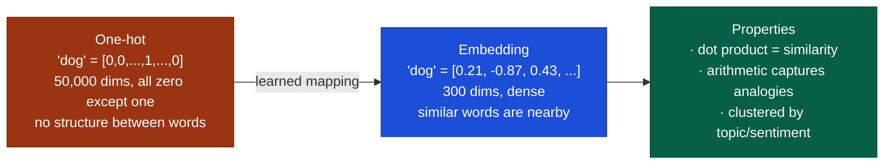
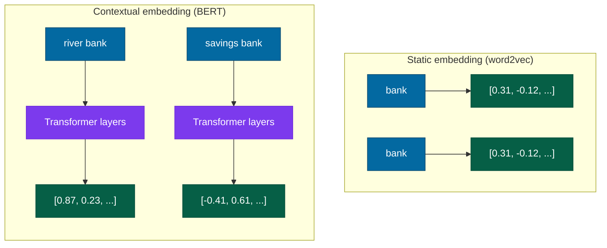

# Embeddings

## What it is

An embedding is a dense, low-dimensional vector — a short list of numbers — representation of a discrete object: a word, a sentence, an image, a user, a product. The vector encodes meaning as geometry: similar things are close together in the embedding space; dissimilar things are far apart.

The key shift: instead of representing a word as a one-hot vector (a 50,000-dimensional vector with a single 1 and 49,999 zeros — no structure, no similarity), you represent it as a 300- or 768-dimensional dense vector where the distances and directions encode semantic relationships.

"King − man + woman ≈ queen" is the famous demonstration: the direction "male → female" in the embedding space is consistent enough that subtracting it from "king" and adding "woman" lands near "queen." The vector arithmetic captures an analogy that the model was never explicitly taught. This works for some well-represented pairs and fails for others — it's a useful illustration of the geometry, not a general reliable property.

## The problem it solves

Discrete symbols are opaque to learning algorithms. The token ID — the arbitrary integer a tokenizer assigns each word or word-fragment — for "dog" (say, 5284) tells the model nothing about its relationship to "cat" (31,092) or "puppy" (19,873). Every word is equally distant from every other word in one-hot space.

Embeddings give the model a continuous, structured space in which to work:



The learning algorithm can now generalize across similar words: if it learns something about dogs, that information transfers to nearby vectors like "puppy," "hound," and "canine." This is transfer learning in miniature.

## How it works under the hood

### Static embeddings: word2vec

Word2vec (Mikolov et al., 2013) trains embeddings by prediction. Two variants:

**CBOW (Continuous Bag of Words)**: predict the center word from its context words.
**Skip-gram**: predict the context words from the center word.

Neither task is the end goal. The end goal is the weight matrix — the grid of learned numbers the network built in order to get good at that prediction task — that results from solving these tasks on billions of words: a matrix where words that appear in similar contexts end up with similar vectors.

The intuition: "dog" and "cat" appear in similar sentences ("my [pet] is sick," "I fed the [animal]," "she walked her [dog/cat]"). After training on enough of these, their vectors converge toward similar regions of the space.

The full equation for skip-gram: maximize

$$\frac{1}{T} \sum_{t=1}^{T} \sum_{-c \leq j \leq c,\, j \neq 0} \log P(w_{t+j} \mid w_t)$$

where $P(w_O \mid w_I) = \frac{\exp(v_{w_O}^{\prime\intercal} v_{w_I})}{\sum_{w=1}^{W} \exp(v_w^{\prime\intercal} v_{w_I})}$ — a softmax over the entire vocabulary, turning raw scores across every possible word into a probability distribution that sums to 1. Computing that sum over the whole vocabulary for every training step is expensive, so in practice, negative sampling — comparing the correct word against just a handful of random wrong ones each step, instead of the entire vocabulary — approximates this efficiently.

### GloVe and FastText

**GloVe** (Pennington et al., 2014) factorizes a global word-word co-occurrence matrix — starts from one big table of how often every word appears near every other word across the whole corpus, then finds a compact set of vectors that reproduces those counts — rather than doing local window prediction like word2vec. Produces similar quality embeddings; the training objective has a cleaner statistical interpretation (it's derived directly from word-count ratios, not from a prediction task standing in for them).

**FastText** (Bojanowski et al., 2017) extends word2vec to subword units — "running" is represented as the sum of embeddings for "run," "runn," "runni," "running." This makes it robust to morphological variation and handles out-of-vocabulary words by decomposing them into known subwords.

### Contextual embeddings: the transformer shift

Static embeddings have a fatal limitation: one vector per word, regardless of context. "Bank" in "river bank" gets the same vector as "bank" in "bank account."

Contextual embeddings solve this by running the input through a full transformer — one complete pass through the network, called a "forward pass" — and using its internal, in-progress representations (the "hidden states") as the embedding, instead of looking up a fixed vector from a table. The same word gets a different vector depending on every other word in its context.



BERT's hidden states are the canonical contextual embeddings for text. For production use, **sentence-transformers** (Reimers & Gurevych, 2019) fine-tunes (continues training, on a smaller, targeted dataset) a BERT-style model specifically to produce meaningful sentence-level embeddings via a siamese network — two copies of the same model, sharing the same weights, each processing one of a pair of sentences, so the two results can be compared directly — trained on semantic similarity tasks.

### Embedding geometry

High-dimensional embedding spaces have counterintuitive geometry:

**Cosine similarity**, not Euclidean distance (straight-line distance, as the crow flies), is the standard measure:

$$\text{similarity}(a, b) = \frac{a \cdot b}{\|a\| \cdot \|b\|}$$

In plain terms: it measures the angle between two vectors, not how long they are. This is what "rotation-invariant" means here — two vectors pointing in the same direction are similar regardless of their magnitude (length). Dot product (without normalization, meaning the vectors' original lengths are left as-is) is useful when magnitude encodes relevance score.

**The curse of dimensionality**: when a vector has hundreds of numbers instead of two or three, most of the space it could occupy turns out to be nearly empty — two random vectors are almost always close to perpendicular to each other ("orthogonal"), simply as a consequence of having so many dimensions to spread across, not because they're meaningfully unrelated. The vectors that actually come from real data cluster inside a much smaller, lower-dimensional region of that vast space (a "manifold" — think of a crumpled 2D sheet of paper sitting inside 3D space). This is why PCA and t-SNE — two different techniques for visualization, both of which compress a high-dimensional vector down to 2D for plotting while preserving as much of its real structure as possible — find meaningful 2D projections even from 768-dimensional BERT embeddings.

**Nearest neighbor search**: finding the closest embedding to a query vector is the core operation in semantic search and retrieval-augmented generation (RAG — retrieving relevant text and handing it to a model as context before it answers). Checking every single stored vector one by one ("exact search") costs more, the more vectors you have and the longer each one is — at billion-scale, that's too slow to be practical. Approximate nearest neighbor (ANN) algorithms — several competing methods exist, with names like HNSW, IVF, and ScaNN, each organizing the vectors differently to avoid checking all of them — trade a small accuracy loss for orders-of-magnitude speedup.

### Embedding models for retrieval

Not all contextual embeddings are equal for retrieval. BERT-base embeddings pooled from the last layer (averaged or otherwise combined across all the token vectors from BERT's final layer, into one vector for the whole sentence) perform poorly on semantic search — the model was trained for masked token prediction (guessing a word that's been hidden from the middle of a sentence), not for producing good sentence-level representations.

Purpose-built embedding models are trained on (query, relevant passage) pairs using contrastive loss — pull the query's vector close to the vector of a passage that actually answers it, and push it away from passages that don't:

$$\mathcal{L}_{\text{contrastive}} = -\log \frac{e^{\text{sim}(q, p^+)/\tau}}{e^{\text{sim}(q, p^+)/\tau} + \sum_i e^{\text{sim}(q, p_i^-)/\tau}}$$

The temperature $\tau$ controls how sharply the distribution concentrates. State-of-the-art retrieval models (E5, GTE, text-embedding-3-large) are trained this way on hundreds of millions of pairs.

## Concrete example

Computing semantic similarity with sentence-transformers:

```python
from sentence_transformers import SentenceTransformer
import numpy as np

model = SentenceTransformer('sentence-transformers/all-MiniLM-L6-v2')

sentences = [
    "The quick brown fox jumps over the lazy dog.",
    "A fast auburn fox leaps over an idle hound.",
    "The Eiffel Tower is located in Paris, France.",
    "Machine learning is a subset of artificial intelligence.",
]

embeddings = model.encode(sentences)   # (4, 384)

# Cosine similarity matrix
norms = np.linalg.norm(embeddings, axis=1, keepdims=True)
normed = embeddings / norms
sim_matrix = normed @ normed.T

print(sim_matrix.round(3))
# The first two sentences score ~0.85 (paraphrases)
# The cross-topic pairs score ~0.1–0.2 (unrelated)
```

Building a simple retrieval index:

```python
import faiss

# Build an exact index over 10,000 passage embeddings
dim = embeddings.shape[1]
index = faiss.IndexFlatIP(dim)       # inner product (cosine, once vectors are rescaled to length 1 -- "L2 normalisation")

passage_embeddings = model.encode(passages, normalize_embeddings=True)
index.add(passage_embeddings)

# Query
query = model.encode(["What is machine learning?"], normalize_embeddings=True)
distances, indices = index.search(query, k=5)
# Returns the 5 closest passages to the query
```

## When to use it / when not to

#### Use embeddings when

- You need semantic similarity between pieces of text, images, or mixed content
- You're building retrieval-augmented generation (RAG) — embeddings are how you search the knowledge base
- You need to cluster, classify, or deduplicate a large text corpus without task-specific labels
- You're building a recommendation system where items and users can be represented in a shared space

#### Be careful when

- Your domain is highly specialized (medical, legal, scientific): general-purpose embeddings may not capture domain-specific semantics well; consider fine-tuning an embedding model on domain pairs
- Your queries and documents are very different in length: embedding models trained on similar-length pairs often perform poorly on query-vs-long-document tasks (use chunking + re-ranking)
- You need exact keyword matching: embeddings are soft; "GDPR Article 17" may not retrieve documents that contain exactly that string. Hybrid search — combining BM25 (a classic keyword-matching ranking algorithm, still hard to beat for exact terms) with dense retrieval (the embedding-based search this page is about) — handles both

#### Choosing an embedding model

For English text: `text-embedding-3-small` (OpenAI) or `all-MiniLM-L6-v2` (free, fast, good quality) for quick starts. For production retrieval: check the MTEB (Massive Text Embedding Benchmark) leaderboard (Hugging Face) — it benchmarks embedding models across retrieval, clustering, and similarity tasks.

## Main tools and libraries

| Tool | Use for |
|---|---|
| sentence-transformers | Fine-tuned embedding models, easy API, runs locally |
| OpenAI Embeddings API | `text-embedding-3-small/large` — strong quality, no infra |
| Hugging Face MTEB leaderboard | Picking the right embedding model for your task |
| FAISS (Meta) | Billion-scale approximate nearest neighbor search |
| Qdrant / Weaviate / Pinecone | Vector databases: store, index, and query embeddings with metadata filtering |
| Annoy / HNSWlib | Lightweight ANN for smaller-scale or in-process use |

## Common failure modes and gotchas

**1. Using the wrong embedding model for the task.** An embedding model trained for semantic similarity may perform poorly for retrieval (query-passage pairs). A model trained on English performs poorly on other languages. Check the MTEB benchmark for the specific task type before committing to a model.

**2. Embedding long documents directly.** Most embedding models have a maximum token length (typically 256–512 tokens). Passing a 5,000-word document into a model with a 512-token window silently truncates it. Fix: chunk documents, embed chunks, store chunk-level embeddings.

**3. Neglecting normalization.** If you're using cosine similarity but storing raw (unnormalized) embeddings, and your retrieval library uses dot product, you get meaningfully different rankings. Normalize before indexing, or use a library that handles this consistently.

**4. Stale embeddings after model updates.** If you update the embedding model (e.g., from `text-embedding-ada-002` to `text-embedding-3-small`), all existing embeddings in the index are invalid — the new model produces embeddings in a different space. You must re-embed everything.

**5. Distribution shift between query and corpus.** A model trained on symmetric sentence pairs may produce mismatched query vs. document embeddings. Purpose-built asymmetric models (trained on (question, answer) pairs rather than (sentence, paraphrase) pairs) perform better when query and document styles differ significantly.

**6. Cosine similarity ≠ task relevance.** High cosine similarity means the vectors are close in embedding space. It doesn't mean the retrieved passage will help answer the query. A paragraph about the history of banking may be highly similar to a query about river banks. Add re-ranking (a cross-encoder that scores query-document pairs directly) for precision-critical applications.

:::tip[My take]

The MTEB leaderboard changed how I think about embedding models. Before it existed, model selection was driven by benchmarks in the paper — which are always cherry-picked. MTEB tests across 56 tasks in 7 task categories. The ranking surprises people: small models like `all-MiniLM-L6-v2` score competitively with models 10× their size on many retrieval tasks. The performance gap that justifies a paid API model over a free local model is smaller than most teams assume. Run the benchmark for your specific task type before paying for an API.

:::

## Project ideas

**1. Word2vec from scratch** — Implement skip-gram word2vec using only NumPy. Use the text8 or WikiText-2 dataset. After training, verify the learned geometry: compute nearest neighbors for "king," "france," "computer." Then test the analogy offset: `king − man + woman`. Does it land near "queen"? How close? This makes the geometry intuitive rather than incantatory.

**2. MTEB benchmark mini-run** — Pick three embedding models (one large API model, one mid-size open model, one small fast model). Run them on a retrieval task from MTEB using the `mteb` Python package. Compare recall@10 and inference time. The exercise forces you to read evaluation methodology carefully and usually produces a surprise about which model wins.

**3. Domain-adapted embeddings** — Take a specialized corpus (arXiv papers in your area, legal documents, medical notes — whatever you have access to). Compute cosine similarity on 20–30 hand-labeled pairs (same-topic vs. different-topic) using a general-purpose embedding model and a domain-specific one (BioASQ embeddings for medicine, LegalBERT for law). Quantify the gap. This makes domain adaptation concrete: you see where general embeddings fail and why.

**4. Hybrid search comparison** — Build a simple retrieval system over a corpus of 1,000+ documents using (a) BM25 keyword search only, (b) dense embedding search only, and (c) hybrid (BM25 + dense, score fusion). Use a set of 50–100 test queries with known relevant documents. Measure recall@5 for each approach. BM25 wins on exact-match queries; dense wins on paraphrases and synonyms; hybrid wins overall. This is the practical justification for hybrid retrieval in RAG systems.

## Going deeper

#### Foundational papers

- Mikolov et al., "Efficient Estimation of Word Representations in Vector Space" (arXiv 2013) — the word2vec paper. Read Section 4 (model architectures) and Section 5 (results) for the analogy tasks.
- Pennington, Socher & Manning, "GloVe: Global Vectors for Word Representation" (EMNLP 2014) — the global co-occurrence alternative to word2vec. The derivation of the objective function is worth reading.
- Reimers & Gurevych, "Sentence-BERT: Sentence Embeddings using Siamese BERT-Networks" (EMNLP 2019) — introduces the siamese fine-tuning approach for sentence-level embeddings. The foundation for all modern sentence embedding models.
- Muennighoff et al., "MTEB: Massive Text Embedding Benchmark" (EACL 2023) — the benchmark paper. Table 2 (model comparison) is the most useful practical reference for choosing an embedding model.

#### Best explainers

- "The Illustrated Word2Vec" by Jay Alammar — the clearest visual explanation of skip-gram training and the resulting geometry.
- Karpathy, "The Unreasonable Effectiveness of Recurrent Neural Networks" (blog) — Section on char-RNN includes intuitive discussion of what learned representations contain.
- "Understanding UMAP" (McInnes et al.) — useful for understanding why dimensionality reduction techniques (t-SNE, UMAP) work on embedding spaces and how to interpret what they show.
