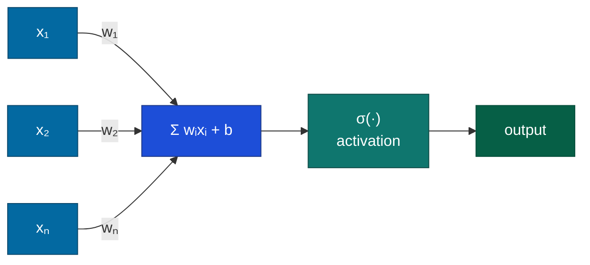
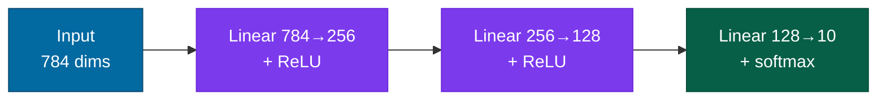
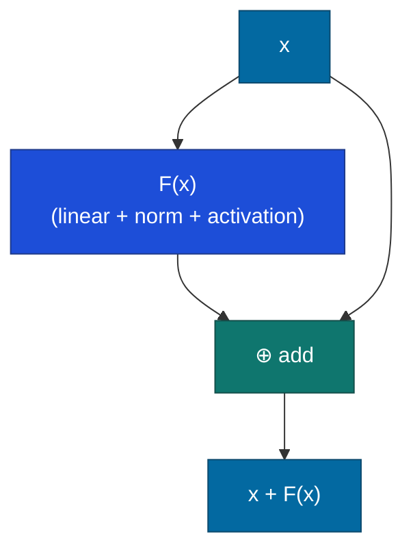

# Neural Networks

## What it is

A neural network is a stack of parameterized transformations. In plain terms: each layer takes a list of numbers in, runs it through a simple, adjustable transformation — multiply, add, then bend the result through a nonlinear step — and hands a new list of numbers to the next layer. Chain enough of those simple steps together, each one adjustable through training, and the whole stack can approximate very complicated relationships. Precisely: each layer takes an input vector, multiplies it by a learned weight matrix, adds a bias, and passes the result through a non-linearity:

$$h^{(l)} = \sigma\!\left(W^{(l)}\, h^{(l-1)} + b^{(l)}\right)$$

Chain enough of these and you get a universal function approximator — a function that can, given sufficient width (how many neurons sit in a layer, side by side) and data, approximate any continuous mapping between inputs and outputs.

The biological framing — artificial neurons loosely inspired by brain cells — is mostly a historical accident. The useful framing: each layer is a differentiable operation (one whose output changes smoothly enough, as its inputs change, that you can calculate a direction of improvement from it) on vectors, and the whole network is a function we optimize by gradient descent — repeatedly nudging every number in the network a small step in whichever direction reduces its errors.

## The problem it solves

Linear models draw straight-line decision boundaries. They fail whenever the relationship between inputs and outputs isn't linearly separable. The classic demonstration:

**XOR** — the simplest function a linear classifier cannot learn.

| x₁ | x₂ | XOR |
|---|---|---|
| 0 | 0 | 0 |
| 0 | 1 | 1 |
| 1 | 0 | 1 |
| 1 | 1 | 0 |

No line separates the 1s from the 0s. Logistic regression fails at 50% accuracy regardless of training time. A two-layer network learns XOR exactly in a few gradient steps — the hidden layer remaps the input space into a representation where the boundary becomes linear.

This is the universal approximation theorem in miniature: composing non-linear transformations lets the network reshape input space into one where the downstream task is easy.

## How it works under the hood

### The perceptron

The base unit. Each neuron computes a weighted sum of its inputs, adds a bias, and passes the result through an activation function:



The weights $w_i$ and bias $b$ are learned parameters. The activation $\sigma(\cdot)$ introduces non-linearity — without it, stacking layers is pointless because a composition of linear transformations is still a linear transformation.

### Activation functions

The choice of non-linearity determines both the network's expressive capacity and its training dynamics:

| Activation | Formula | Properties |
|---|---|---|
| Sigmoid | $1/(1+e^{-x})$ | Squashes to (0,1). Saturates at extremes — meaning for very large or very small inputs the output barely changes, so the training signal ("gradient") for that neuron shrinks toward nothing. Legacy. |
| Tanh | $(e^x - e^{-x})/(e^x + e^{-x})$ | Zero-centered. Saturates less badly than sigmoid. Still limited for deep nets. |
| ReLU | $\max(0, x)$ | The workhorse. Non-saturating above zero, sparse activations. Suffers from "dead neurons" — ones stuck outputting zero forever, covered under Common Failure Modes below. |
| Leaky ReLU | $\max(0.01x,\, x)$ | Small slope below zero prevents dead neurons. Not always better in practice. |
| GELU | $x \cdot \Phi(x)$ | Smooth probabilistic ReLU. Default in BERT, GPT, and most transformer architectures. |
| SiLU / Swish | $x \cdot \sigma(x)$ | Similar to GELU. Default in Llama and many modern language models. |

Practical defaults: **ReLU** for general-purpose networks; **GELU** or **SiLU** for transformer-style architectures.

### Layers

Neurons are grouped into layers. Each layer transforms its input into a new representation:



In an image classifier, shallow layers tend to detect edges and textures; deeper layers detect parts and objects. Nobody programs this hierarchy — it emerges from minimizing the loss (the number that scores how wrong the network's current output is) on enough data.

### Backpropagation

The plain-language version first: run an example through the network, see how wrong the output was, then work backward layer by layer, figuring out how much each individual weight contributed to that error and nudging it in the direction that would have made the error smaller. Repeat across millions of examples and the weights converge on something that works.

To minimize the loss, we need the gradient of the loss with respect to every weight — a number, for each individual weight, saying which direction to nudge it and by roughly how much. Backpropagation computes this by applying the chain rule (a calculus rule for tracking how a change at one point ripples through a series of dependent steps) recursively from the output layer back to the input:

$$\frac{\partial \mathcal{L}}{\partial W^{(l)}} = \frac{\partial \mathcal{L}}{\partial h^{(l)}} \cdot \frac{\partial h^{(l)}}{\partial W^{(l)}}$$

If you know how much the loss changes with respect to a layer's output ($\partial \mathcal{L} / \partial h^{(l)}$), you can compute how much it changes with respect to that layer's inputs ($\partial \mathcal{L} / \partial h^{(l-1)}$). The gradient flows backwards through the same operations as the forward pass, multiplying local derivatives (each step's own small, local "how much did I contribute" number) at each step.

Modern frameworks (PyTorch, JAX) build a computational graph during the forward pass and differentiate it automatically — you write the forward pass and get gradients for free.

### Weight initialization

If all weights start at zero, all neurons compute the same output and the same gradient — the network never breaks symmetry and training stalls.

**Xavier/Glorot initialization** (for sigmoid/tanh): draw weights from a distribution scaled by $\sqrt{2/(n_{\text{in}} + n_{\text{out}})}$, balancing variance across both the number of inputs and outputs a layer connects to (its "fan") so activations neither explode nor vanish.

**He initialization** (for ReLU): scale by $\sqrt{2/n_{\text{in}}}$, compensating for the fact that ReLU zeroes out half its inputs on average. PyTorch uses He initialization for convolutional layers by default.

### Normalization

Training deep networks without normalization causes **internal covariate shift** — the distribution of activations shifts as parameters update, destabilizing later layers.

**Batch normalization** (BatchNorm) — normalizes activations over the batch dimension during training; maintains running statistics for inference. Effective but sensitive to small batch sizes.

**Layer normalization** (LayerNorm) — normalizes over the feature dimension for each example independently. Batch-size invariant. The standard choice for transformers and language models.

### Residual connections

Introduced in ResNets (He et al., 2016). Instead of $h^{(l)} = F(h^{(l-1)})$, you add a skip connection:

$$h^{(l)} = h^{(l-1)} + F(h^{(l-1)})$$



Gradients can flow directly from output to input via the skip path, bypassing the learned transformation. This defeats vanishing gradients in very deep networks and enables training at depths (100+ layers) where plain networks collapse. Residual connections are now standard in virtually every deep architecture.

## Concrete example

A full training loop for MNIST digit classification:

```python
import torch
import torch.nn as nn
import torch.optim as optim
from torchvision import datasets, transforms
from torch.utils.data import DataLoader

class MLP(nn.Module):
    def __init__(self):
        super().__init__()
        self.net = nn.Sequential(
            nn.Flatten(),              # 28×28 image → 784-dim vector
            nn.Linear(784, 256),
            nn.ReLU(),
            nn.Linear(256, 128),
            nn.ReLU(),
            nn.Linear(128, 10),        # 10 digit classes
        )

    def forward(self, x):
        return self.net(x)

transform    = transforms.ToTensor()
train_data   = datasets.MNIST('.', train=True,  download=True, transform=transform)
test_data    = datasets.MNIST('.', train=False, download=True, transform=transform)
train_loader = DataLoader(train_data, batch_size=128, shuffle=True)
test_loader  = DataLoader(test_data,  batch_size=512)

device    = torch.device("cuda" if torch.cuda.is_available() else "cpu")
model     = MLP().to(device)
optimizer = optim.Adam(model.parameters(), lr=1e-3)
criterion = nn.CrossEntropyLoss()

for epoch in range(5):
    model.train()
    for X, y in train_loader:
        optimizer.zero_grad()
        loss = criterion(model(X), y)
        loss.backward()                # backpropagation
        optimizer.step()               # gradient descent step

    model.eval()
    with torch.no_grad():
        correct = sum(
            (model(X).argmax(1) == y).sum().item()
            for X, y in test_loader
        )
    print(f"Epoch {epoch+1}: {correct / len(test_data) * 100:.1f}% accuracy")
# Reaches ~97–98% after 5 epochs with no tuning
```

The same pattern — `forward`, `loss`, `backward`, `step` — scales to networks with billions of parameters and months of training. The structure doesn't change; the stakes do.

## When to use it / when not to

#### Use neural networks when

- Your data is unstructured (images, text, audio, video) — spatial, sequential, or semantic structure benefits from learned representations
- The mapping is too complex for hand-crafted feature engineering to capture
- You have enough labeled data and compute to let the network discover its own representations

#### Use a simpler model when

- Your data is tabular with fewer than ~10K rows — XGBoost (a gradient-boosted decision tree method, not a neural network at all) almost always wins here with less pain
- Interpretability is a hard requirement — a two-layer MLP (multilayer perceptron, the plain stack-of-layers network this page describes) is already a black box
- Latency or memory is severely constrained and a simpler model is close enough

#### The practical question

Can you solve this with logistic regression or XGBoost? If yes: do that first, measure, and only reach for neural networks when you can quantify the performance gap and it's worth the complexity cost.

## Main tools and libraries

| Library | Use for |
|---|---|
| `torch.nn.Module` | Custom architectures — the default for anything non-standard |
| PyTorch Lightning | Training loop boilerplate, multi-GPU, mixed precision, logging |
| Keras (`tf.keras`) | Fast prototyping; mobile deployment via TFLite |
| JAX + Flax / Haiku | TPU training, functional programming style, research-grade implementations |
| `torch.compile` | Drop-in speedup for existing PyTorch models (PyTorch 2.0+, Python 3.10+) |

## Common failure modes and gotchas

**1. Vanishing gradients.** In deep networks with saturating activations (sigmoid, tanh — see the table above), gradients shrink exponentially as they propagate backward. Layers near the input receive near-zero gradient and barely update. Fix: use ReLU/GELU, add LayerNorm, add residual connections.

**2. Dead ReLU neurons.** If a ReLU neuron's pre-activation — its weighted-sum-plus-bias value, before the activation function is applied — is negative for every example, its output is permanently zero — no gradient, no update. A small fraction of dead neurons is normal and harmless; it becomes a problem when a large fraction across many layers dies simultaneously, which can happen with high learning rates or poor initialization. Diagnosis: monitor the fraction of zero activations per layer. Fix: lower the learning rate, use He initialization, or switch to GELU.

**3. Exploding gradients.** Gradients grow exponentially rather than vanishing — manifests as NaN ("not a number," the value a computation produces once it overflows past any representable number) losses or wildly oscillating curves early in training. Fix: gradient clipping (`torch.nn.utils.clip_grad_norm_`, which caps how large a single update step is allowed to be), reduce the learning rate, verify weight initialization.

**4. Overfitting on small datasets.** Deep networks have enormous capacity and will memorize small training sets rather than learning to generalize. Fix: dropout (`nn.Dropout`, which randomly zeroes out some neurons during training so the network can't over-rely on any one of them), weight decay (the `weight_decay` argument in the optimizer, which nudges all weights toward smaller values), data augmentation, early stopping — or use a shallower model.

**5. Learning rate sensitivity.** Too high: training diverges. Too low: training stalls. Standard starting point: `lr=1e-3` with Adam. Use a learning rate finder or cosine warm-up schedule for anything non-trivial.

**6. Wrong loss function.** Cross-entropy (a loss that scores how confident the model was in the correct category) for classification, MSE — mean squared error, the average squared gap between a predicted number and the true one — for regression. MSE applied to a classification problem trains the model to predict class indices as real numbers, which distorts gradient scaling at the output layer.

:::tip[My take]

Initialization and normalization are usually more important than architecture choice. Before spending a week tuning depth, width, and activation functions, spend an afternoon understanding Xavier vs. He initialization — many training failures that look like architecture problems are actually initialization or learning rate problems in disguise. The residual connection is the single most impactful architectural idea of the last decade; if you're building anything deeper than five layers, add it from the start.

:::

## Project ideas

**1. XOR from scratch** — Implement a two-layer network using only NumPy: no autograd, no frameworks. Write the forward pass, compute cross-entropy loss, derive the gradient analytically for each layer using the chain rule, and implement the update step. Takes 2–4 hours; the mental model you build outlasts any tutorial.

**2. Activation function ablation** — Train the same MLP (fixed architecture, hyperparameters, and random seed) on CIFAR-10 with sigmoid, tanh, ReLU, Leaky ReLU, and GELU. Record test accuracy and training loss curves across 20 epochs. Also log the fraction of zero activations per layer. The empirical gap between sigmoid and ReLU will be stark; the gap between ReLU variants much smaller.

**3. Vanishing gradient visualizer** — Build a 10-layer MLP with sigmoid activations and no normalization. On each training step, log the L2 norm of the gradient for each layer's weight matrix. Plot gradient norm vs. layer depth after one epoch. The exponential decay toward earlier layers becomes visceral rather than theoretical. Then add LayerNorm and residual connections and re-run: the decay disappears.

**4. MNIST: MLP vs CNN** — Train an MLP (three dense layers, ~100K parameters) and a small CNN (two conv layers + pooling + dense, ~100K parameters) on MNIST. Compare test accuracy at 1, 5, and 20 epochs. Then randomly permute pixel positions in every image, destroying spatial structure, and re-run both. The CNN's advantage collapses; the MLP is unaffected. This makes "inductive bias" concrete rather than abstract.

## Going deeper

#### Foundational papers

- Rosenblatt, "The Perceptron: A Probabilistic Model for Information Storage and Organization in the Brain" (1958) — the origin. Short and accessible.
- Rumelhart, Hinton & Williams, "Learning representations by back-propagating errors" (*Nature*, 1986) — the paper that popularized backpropagation. The original derivation is remarkably clear.
- Glorot & Bengio, "Understanding the difficulty of training deep feedforward neural networks" (AISTATS 2010) — explains vanishing gradients empirically and introduces Xavier initialization. Three pages; permanently changes how you think about weight initialization.
- He et al., "Deep Residual Learning for Image Recognition" (CVPR 2016) — introduces residual connections. A 152-layer network outperforms everything; the mechanism is a single addition.

#### Best explainers

- Karpathy, micrograd (GitHub: `karpathy/micrograd`) — a 100-line autograd engine implementing backpropagation from scratch. The best possible introduction to what PyTorch does under the hood.
- Karpathy, "Neural Networks: Zero to Hero" — the YouTube series. Episode 1 (micrograd) derives the full backprop algorithm in real time.
- Nielsen, "Neural Networks and Deep Learning" — free at neuralnetworksanddeeplearning.com. Chapter 2 (how backpropagation works) is the clearest written derivation available.
- 3Blue1Brown, "Neural Networks" series — best visual intuition for what weight matrices are doing geometrically and what backpropagation computes via the chain rule.
