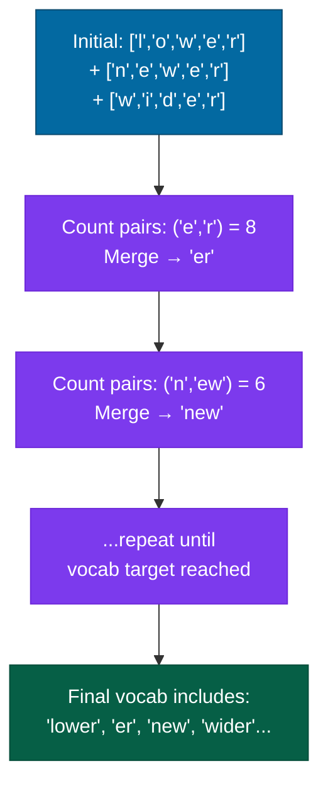

# Tokenization

## What it is

Tokenization is the process of converting raw text into the discrete units — tokens — that a language model operates on. A token is typically a word, a word fragment, or a character, depending on the tokenizer design. The tokenizer is a fixed preprocessing step: it runs before the model sees any data and its decisions are baked into the model permanently.

This makes tokenization consequential in ways that aren't immediately obvious. The vocabulary size, the splitting strategy, and the way rare or unusual strings are handled all affect what the model can represent, how efficiently it processes information, and where it systematically fails.

## The problem it solves

Language models operate on sequences of integers (token IDs), not raw text. The tokenizer bridges the gap. The design space involves three competing pressures:

**Coverage**: the tokenizer must handle any valid input, including rare words, proper nouns, code, non-English text, and arbitrary Unicode.

**Efficiency**: fewer tokens per piece of text means the model processes more content per context window. "Tokenization" as one token is more efficient than ["Token", "ization"] as two.

**Vocabulary size**: large vocabularies give the model more atomic units to work with but increase the size of the embedding table and the final projection layer (both $V \times d_{\text{model}}$ matrices). Typical range: 30,000–150,000.

Character-level tokenization maximizes coverage (every Unicode character is representable) but is maximally inefficient — a typical English sentence becomes 5× as many tokens. Word-level tokenization is efficient for common words but fails on rare words and requires an enormous vocabulary to cover a language. Subword tokenization is the compromise that most modern LLMs use.

## How it works under the hood

### Byte Pair Encoding (BPE)

BPE starts with a vocabulary of individual bytes (or characters) and iteratively merges the most frequent adjacent pair into a new token. The algorithm:

1. Initialize vocabulary with all individual characters
2. Count all adjacent pair frequencies in the training corpus
3. Merge the most frequent pair into a new token
4. Repeat until vocabulary size reaches the target



The result: common words become single tokens; rare words are split into known subword fragments. "Tokenization" might become ["Token", "ization"] or ["Token", "iz", "ation"] depending on what the training corpus prioritized. Unknown strings always decompose into known bytes.

GPT-2 uses BPE with a byte-level fallback — it starts with the 256 possible byte values rather than Unicode characters. This guarantees that every possible input string is representable without an `[UNK]` (unknown) token.

### WordPiece

WordPiece (used by BERT) is similar to BPE but chooses merges that maximize the likelihood of the training corpus under the language model, rather than the raw pair frequency. In practice the resulting vocabularies are similar; WordPiece tends to be slightly better at keeping common morphological boundaries (prefixes, suffixes) intact.

BERT uses `[CLS]` (classification token prepended to every input) and `[SEP]` (separator token between segments). These are special tokens added to the vocabulary and serve as structural signals — `[CLS]` marks the sequence boundary for classification heads; `[SEP]` marks segment boundaries. They are not positional signals; BERT uses separate learned positional embeddings for position.

### Unigram Language Model (SentencePiece)

Unigram tokenization (Kudo, 2018) starts from a large candidate vocabulary and iteratively removes tokens whose removal increases corpus log-probability the least. The result is a probabilistic tokenizer — the same string can be tokenized in multiple ways, each with an associated probability. SentencePiece implements both BPE and Unigram and is language-agnostic: it treats the input as a sequence of Unicode characters without pre-tokenization by spaces, making it suitable for languages like Japanese and Chinese that don't use word-boundary whitespace.

Llama and Llama 2 use SentencePiece with BPE and a vocabulary of 32,000 tokens. Llama 3 expanded to 128,256 tokens to improve multilingual coverage.

### Vocabulary size tradeoffs

| Vocab size | Examples | Tokens/word | Embedding table |
|---|---|---|---|
| 32,000 | Llama 2 | ~1.3 (English) | 32K × d_model |
| 50,257 | GPT-2/3 | ~1.2 (English) | 50K × d_model |
| 100,277 | GPT-4 (tiktoken cl100k) | ~1.1 (English) | 100K × d_model |
| 128,256 | Llama 3 | ~1.05 (English) | 128K × d_model |

Larger vocabularies: more efficient (shorter sequences), better multilingual coverage, but larger embedding tables and slower output projection. At 7B parameters with a 128K vocabulary and $d_{\text{model}} = 4096$, the embedding table alone is $128{,}256 \times 4{,}096 \times 2\ \text{bytes} \approx 1\ \text{GB}$.

### Special tokens

Tokenizers define special tokens that carry structural meaning:

| Token | Role |
|---|---|
| `[BOS]` / `<s>` | Beginning of sequence |
| `[EOS]` / `</s>` | End of sequence; the model learns to generate this to signal completion |
| `[PAD]` | Padding to a fixed length; masked out in attention |
| `[UNK]` | Unknown (rare in byte-level tokenizers) |
| `[CLS]` | BERT-style classification anchor — the model is trained to summarize the sequence into this token's representation |
| `[SEP]` | Separator between two segments in BERT-style inputs |
| <code>&lt;&#124;endoftext&#124;&gt;</code> | GPT-2/3 document boundary token |
| <code>&lt;&#124;im_start&#124;&gt;</code> / <code>&lt;&#124;im_end&#124;&gt;</code> | Chat message delimiters in instruction-tuned GPT models |

Chat models add role-specific tokens to distinguish user, assistant, and system content. These structural tokens tell the model where it is in a conversation — their exact form varies by model family.

## Concrete example

BPE tokenization in practice with tiktoken (OpenAI's tokenizer):

```python
import tiktoken

# GPT-4's tokenizer (cl100k_base, 100,277 tokens)
enc = tiktoken.get_encoding("cl100k_base")

texts = [
    "Hello, world!",
    "Tokenization",
    "Tokenization is the process of converting raw text into tokens.",
    "สวัสดีชาวโลก",       # Thai: "Hello, world!"
    "1 + 1 = 2",
    "def fibonacci(n):\n    return n if n <= 1 else fibonacci(n-1) + fibonacci(n-2)",
]

for text in texts:
    tokens = enc.encode(text)
    decoded = [enc.decode([t]) for t in tokens]
    print(f"{len(tokens):3d} tokens | {text[:50]!r}")
    print(f"         {decoded}")
    print()

# Outputs (approximate):
#   4 tokens | 'Hello, world!'
#             ['Hello', ',', ' world', '!']
#
#   2 tokens | 'Tokenization'
#             ['Token', 'ization']    (note: not 'Tok' + 'enization')
#
#  13 tokens | 'Tokenization is the process of...'
#
#  10 tokens | 'สวัสดีชาวโลก'       (Thai requires more tokens per character)
#
#   7 tokens | '1 + 1 = 2'
#
#  19 tokens | 'def fibonacci(n):...'
```

Counting tokens before sending to the API:

```python
def count_tokens(text: str, model: str = "gpt-4") -> int:
    enc = tiktoken.encoding_for_model(model)
    return len(enc.encode(text))

# Context window check
max_tokens = 128_000
prompt = "..." * 10000
if count_tokens(prompt) > max_tokens * 0.8:
    print("Warning: prompt uses more than 80% of context window")
```

## When to use it / when not to

Tokenization isn't optional — every language model has a tokenizer baked in. The decisions arise at three points:

**Training a model from scratch**: choose a tokenizer that matches your use case. For code-heavy workloads, ensure the tokenizer doesn't split common programming constructs inefficiently. For multilingual use, prefer a larger vocabulary or a byte-level tokenizer. Train on a corpus that represents your target distribution.

**Fine-tuning a pretrained model**: you're stuck with the base model's tokenizer. No changes possible without retraining from scratch.

**Using a pretrained model via API**: tokenization affects cost (most APIs charge per token) and context window utilization. Understanding your tokenizer helps you optimize prompts and avoid surprises.

#### Where tokenization choices actively matter for behavior

- **Arithmetic**: numbers are often split inconsistently. "100" might be one token; "1,000" might be ["1", ",", "000"]. This is part of why LLMs struggle with arithmetic — the number system isn't represented in a way that respects numerical structure.
- **Non-English languages**: a model trained primarily on English text will have a vocabulary dominated by English tokens. Thai, Arabic, or Chinese input requires many more tokens per word, consuming more context and costing more.
- **Code**: identifiers, keywords, and punctuation in code are tokenized differently from prose. Models trained heavily on code (Codex, Code Llama) have tokenizers tuned for programming language patterns.

## Main tools and libraries

| Tool | Use for |
|---|---|
| tiktoken (OpenAI) | GPT-2, GPT-3, GPT-4 tokenizers; fast, Rust-backed |
| Hugging Face tokenizers | All major open models; `AutoTokenizer.from_pretrained()` loads the correct tokenizer |
| SentencePiece | Llama, T5, and other SentencePiece-based models; also for training new tokenizers |
| tokenizers (HF, Rust) | High-performance tokenizer training and inference; the backend for most HF tokenizers |

```python
# Loading the correct tokenizer for any HF model
from transformers import AutoTokenizer
tokenizer = AutoTokenizer.from_pretrained("meta-llama/Llama-2-7b-hf")
tokens = tokenizer("Hello, world!")
print(tokens)            # {'input_ids': [1, 15043, 29892, 3186, 29991]}
print(tokenizer.decode(tokens['input_ids']))  # 'Hello, world!'
```

## Common failure modes and gotchas

**1. Token boundary effects on tasks.** Tasks that require reasoning at the character level (counting letters, reversing strings, rhyming, spelling correction) are difficult for tokenized models because the character boundary is invisible to the model. "strawberry" in GPT-4's tokenizer is ["straw", "berry"] — the model sees two tokens, not ten characters.

**2. Off-by-one in special tokens.** Most chat models require specific token sequences to mark message boundaries. Sending raw text without these tokens causes the model to treat your message as continuation of a previous context, producing confused or hallucinated responses. Always use the model's `apply_chat_template` method.

**3. Token count estimation errors.** Tokenization is non-linear: adding one sentence doesn't add a fixed number of tokens. Whitespace, punctuation, and language all affect token density. Never estimate token counts by word count alone; always use the actual tokenizer.

**4. Vocabulary mismatch after model updates.** OpenAI silently updated GPT-3.5's tokenizer between versions. Code that counted tokens for cost estimation using the old tokenizer quietly undercounted after the update. Pin your tokenizer version alongside your model version.

**5. Inconsistent number tokenization.** Numbers split differently depending on context. "2024" may be one token; "2,024" may be three. This is why LLMs make arithmetic errors that seem random — the numerical information isn't consistently encoded as numerical structure.

**6. Leading space matters.** In BPE tokenizers, " hello" (with a leading space) and "hello" (without) may tokenize differently — typically to different token IDs. This matters at the start of generated text and when inserting words into templates. Be precise about whitespace in your prompts.

:::tip[My take]

The most practical thing to understand about tokenization is that it's where your intuitions about "what the model sees" most reliably fail. You think you sent a sentence; the model received a sequence of subword fragments with no inherent word boundary signal. You think you sent a number; the model received digit substrings with no numerical structure. Most of the places where LLMs behave strangely on text-processing tasks (character counting, anagram detection, spelling) trace back to tokenization, not to some mysterious limitation of attention. Understanding your tokenizer closes the gap between what you intended and what the model received.

:::

## Project ideas

**1. Tokenizer explorer** — Write a script that tokenizes 100 sentences across four categories: ordinary English prose, Python code, a language other than English (Japanese or Arabic work well), and structured data (JSON, CSV, SQL). For each category, compute average tokens-per-word and identify the most-split tokens. Build an intuition for where your model's vocabulary is and isn't efficient.

**2. BPE from scratch** — Implement the BPE training algorithm from scratch on a small corpus (use WikiText-2 or a book from Project Gutenberg). Train a vocabulary of 1,000 tokens. Visualize the merge history: which pairs get merged first? Which word forms end up as single tokens? Compare your learned vocabulary to tiktoken's for the same text.

**3. Cross-language token efficiency** — Pick 10 sentences translated into 5 languages (English, French, Arabic, Mandarin, Japanese). Tokenize each with GPT-4's tokenizer. Compute tokens-per-word for each language. Plot the result. The token efficiency gap between English and languages like Arabic or Thai (where the vocabulary has less coverage) directly corresponds to context window cost and generation speed disadvantages for non-English users.

**4. Tokenization and arithmetic** — Test a model's arithmetic accuracy on addition problems where the operands are formatted differently: `1234 + 5678`, `1,234 + 5,678`, `$1,234 + $5,678`, and the same numbers written as word ("one thousand two hundred thirty-four"). Tokenize each format and count the tokens. Correlate token count and format with arithmetic accuracy. This concretizes how tokenization shapes model behavior on seemingly simple tasks.

## Going deeper

#### Foundational work

- Sennrich, Haddow & Birch, "Neural Machine Translation of Rare Words with Subword Units" (ACL 2016) — introduces BPE for NMT. The starting point for all modern subword tokenizers.
- Kudo & Richardson, "SentencePiece: A simple and language independent subword tokenizer and detokenizer for Neural Text Processing" (EMNLP 2018) — introduces SentencePiece and the Unigram language model tokenizer.
- Kudo, "Subword Regularization: Improving Neural Network Translation Models with Multiple Subword Candidates" (ACL 2018) — probabilistic tokenization and why multiple segmentations improve robustness.

#### Best explainers

- "The Tokenizer" (Karpathy, "Let's build the GPT Tokenizer" — YouTube) — the most thorough walkthrough of BPE tokenization from scratch that exists. Watch before building anything involving tokenization.
- Hugging Face NLP Course, Chapter 6 (tokenizers from scratch) — covers BPE, WordPiece, and Unigram with code examples in the HF tokenizers library.
- tiktoken source code (GitHub: `openai/tiktoken`) — small codebase; reading it is faster than reading the paper and builds real intuition.
