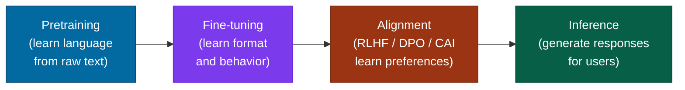
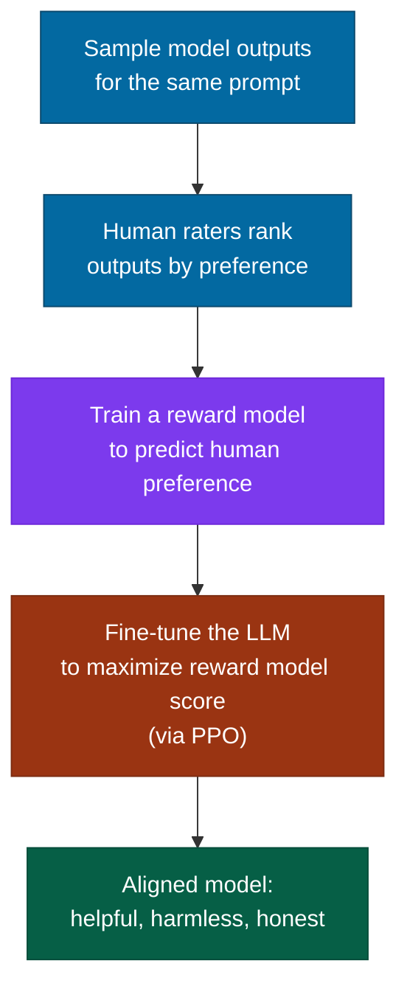

# Training vs Inference

## What it is

A language model goes through several distinct phases before it responds to your prompt. Understanding each phase — what it optimizes for, what it costs, and what it produces — is essential for reasoning about model behavior, choosing between approaches, and debugging failures.

The phases:



Each phase requires different data, compute, and expertise. A failed deployment is often a failure of understanding which phase is responsible for which capability.

## The problem it solves

The confusion this page addresses: people often conflate "the model" with "training" and "ChatGPT" with "inference," as if there's just one thing happening. In reality, the capabilities you experience in a product are the result of three or four distinct optimization passes, each shaping the model's behavior in different ways. A model that's good at predicting text (pretraining) but never fine-tuned will complete your sentence rather than answer your question. A model that's fine-tuned but not aligned may answer questions but in formats or tones that are unhelpful or unsafe.

## How it works under the hood

### Phase 1: Pretraining

**What it is**: Train a transformer from random initialization on a massive corpus of text, predicting the next token at every position.

**Objective**: minimize cross-entropy loss over the training corpus:
$$\mathcal{L} = -\sum_{t} \log P(w_t \mid w_1, \ldots, w_{t-1}; \theta)$$

**Data**: typically trillions of tokens drawn from Common Crawl (web text), books, code repositories, Wikipedia, and curated high-quality sources. GPT-3 trained on ~300B tokens; Llama 3 on ~15 trillion tokens.

**Compute**: orders of magnitude larger than any subsequent phase. GPT-4 reportedly required tens of thousands of A100 GPU-days (the exact figure is not public). Llama 3 70B required ~6.4 million GPU-hours. This is where most of the cost lives.

**What you get**: a model that predicts text fluently. It has internalized grammar, facts, reasoning patterns, code structure, and the style of everything it was trained on. It will also complete hate speech, harmful instructions, and misinformation if that's what the context suggests is coming next — predicting what comes next, not what is good.

**What you don't get**: a model that follows instructions, stays on task, or behaves helpfully. Instruction following is not a consequence of predicting text — it requires additional training.

### Phase 2: Supervised Fine-Tuning (SFT)

**What it is**: continue training the pretrained model on a much smaller dataset of (prompt, ideal response) pairs, teaching it to follow instructions and produce outputs in the desired format.

**Data**: thousands to hundreds of thousands of examples, typically human-written. For ChatGPT-style assistants: conversations demonstrating how a helpful assistant should respond to questions, code requests, creative writing, etc. Quality matters enormously — a small high-quality SFT dataset often outperforms a large noisy one.

**Compute**: dramatically cheaper than pretraining. SFT on a 7B model takes hours to days on a few GPUs.

**What you get**: a model that answers questions instead of completing text, maintains a conversational format, follows system prompt instructions.

**What you don't get**: reliably good judgement about edge cases, safety behavior, or calibrated preferences about subjective quality.

### Phase 3: Alignment — RLHF, DPO (Direct Preference Optimization), Constitutional AI

The gap between "follows instructions" and "responds the way a thoughtful, careful, helpful assistant would" is what alignment training addresses.

#### RLHF (Reinforcement Learning from Human Feedback)

The three-step process OpenAI used for InstructGPT and ChatGPT:



1. Collect human preference data: show raters two or more model outputs for the same prompt, have them rank by quality.
2. Train a **reward model** to predict these human preferences.
3. Fine-tune the language model using PPO (Proximal Policy Optimization) to generate responses that score highly under the reward model, while staying close to the SFT model (the KL penalty prevents reward hacking).

RLHF is expensive: it requires both the reward model and the PPO loop, which is computationally intensive and operationally complex.

#### DPO (Direct Preference Optimization)

Rafailov et al. (2023) showed that the RLHF objective can be optimized directly from preference data without training a separate reward model or running RL. DPO recasts the problem as a classification loss on (preferred, rejected) response pairs:

$$\mathcal{L}_{\text{DPO}} = -\mathbb{E}\!\left[\log \sigma\!\left(\beta \log \frac{\pi_\theta(y_w \mid x)}{\pi_{\text{ref}}(y_w \mid x)} - \beta \log \frac{\pi_\theta(y_l \mid x)}{\pi_{\text{ref}}(y_l \mid x)}\right)\right]$$

Where $y_w$ is the preferred response, $y_l$ is the rejected response, and $\pi_{\text{ref}}$ is the reference (SFT) model. DPO is simpler to implement and often produces comparable results to RLHF; it has become the dominant alignment technique for open models.

#### Constitutional AI (CAI)

Anthropic's approach for Claude. Instead of relying entirely on human preference labels (which are expensive and inconsistent), CAI has the model critique and revise its own outputs according to a set of principles (the "constitution"). A red-teaming phase generates harmful responses; a critique-revision phase has the model improve them; supervised learning on the improved outputs bootstraps the alignment signal. Human preference labels are then used in a smaller targeted pass. This reduces labeling cost and makes the alignment process more transparent.

### Phase 4: Inference

Inference is the phase users interact with — the model generates a response to a prompt.

**The forward pass**: a single forward pass through all $N$ transformer layers, producing a vector of logits over the vocabulary for the next token.

**Sampling**: the logits are converted to a probability distribution; the next token is drawn from it. Repeat until `[EOS]`.

Key sampling parameters:

| Parameter | What it controls |
|---|---|
| **Temperature** ($T$) | Sharpness of the distribution. $T \to 0$: approaches greedy decoding (always pick the highest-probability token). $T=1$: sample from the distribution as trained. $T>1$: flatten the distribution, more randomness. |
| **top-p (nucleus sampling)** | Sample from the smallest set of tokens whose cumulative probability exceeds $p$. Typical: $p=0.9$. Prevents sampling from very unlikely tokens. |
| **top-k** | Sample from only the $k$ most probable tokens. Less principled than top-p but simpler to tune. |
| **Repetition penalty** | Reduce the probability of tokens that have already appeared in the context. Prevents loops. |

**Compute at inference**: one forward pass per generated token. For a 70B model, a single forward pass costs roughly 70B × 2 = 140GB of memory reads (the model weights). Each token generated triggers this. Context length matters: the KV cache grows with sequence length, increasing memory pressure.

**Inference optimization techniques:**

- **Quantization**: represent weights in 8-bit (INT8) or 4-bit (INT4) rather than 16-bit (FP16). Reduces memory by 2–4×, small accuracy loss. GGUF format (llama.cpp) enables 4-bit quantized inference on consumer hardware.
- **Continuous batching**: rather than waiting for all requests in a batch to finish before starting new ones, interleave requests dynamically. Dramatically improves GPU utilization in serving scenarios.
- **Speculative decoding**: use a small draft model to generate candidate tokens; verify them with the large model in a single forward pass. Achieves 2–3× speedup with identical output distribution.
- **Flash Attention**: fuses attention computation into SRAM to avoid HBM round-trips. Standard in all serious inference stacks.

### Parameter-efficient fine-tuning (PEFT)

Full fine-tuning updates all $\theta$ parameters — for a 70B model, this requires 70B gradients in memory simultaneously, making it impractical without a significant GPU cluster. PEFT methods adapt a pretrained model by training only a small number of additional parameters:

**LoRA (Low-Rank Adaptation)**: freeze the original weight matrix $W$; add a trainable low-rank decomposition $\Delta W = BA$ where $B \in \mathbb{R}^{d \times r}$ and $A \in \mathbb{R}^{r \times k}$ with rank $r \ll \min(d, k)$. Only $B$ and $A$ are trained. At inference, merge: $W' = W + BA$. With rank 16, this is ~0.1% of the original parameters.

**QLoRA**: combines LoRA with 4-bit quantization of the base model. Allows fine-tuning 70B+ parameter models on a single consumer GPU (24GB VRAM). The standard approach for domain-specific fine-tuning of large open models.

## Concrete example

Fine-tuning Llama 3 8B on a custom dataset using QLoRA:

```python
from transformers import AutoModelForCausalLM, AutoTokenizer, TrainingArguments
from peft import LoraConfig, get_peft_model
from trl import SFTTrainer
from datasets import load_dataset

model_id = "meta-llama/Meta-Llama-3-8B"
tokenizer = AutoTokenizer.from_pretrained(model_id)

# Load in 4-bit (QLoRA)
model = AutoModelForCausalLM.from_pretrained(
    model_id,
    load_in_4bit=True,
    device_map="auto",
)

# Apply LoRA adapters — only these are trained
lora_config = LoraConfig(
    r=16,                        # rank: higher = more capacity, more memory
    lora_alpha=32,               # scaling factor
    target_modules=["q_proj", "v_proj"],  # which weight matrices to adapt
    lora_dropout=0.05,
    task_type="CAUSAL_LM",
)
model = get_peft_model(model, lora_config)
model.print_trainable_parameters()
# trainable params: 6,815,744 || all params: 8,036,352,000 || trainable%: 0.08%

dataset = load_dataset("your_dataset_name")

trainer = SFTTrainer(
    model=model,
    train_dataset=dataset["train"],
    args=TrainingArguments(
        output_dir="./lora-llama3",
        num_train_epochs=3,
        per_device_train_batch_size=4,
        gradient_accumulation_steps=4,
        learning_rate=2e-4,
        bf16=True,
    ),
    dataset_text_field="text",
)
trainer.train()

# Save only the LoRA adapter weights (~25MB), not the full model
model.save_pretrained("lora-adapter-only")
```

## When to use it / when not to

#### When to use each phase

| Goal | Approach |
|---|---|
| Use a capable foundation model as-is | Prompt engineering only — no training |
| Adapt a model to a new format or task | SFT on 500–10,000 (prompt, response) pairs |
| Teach domain-specific knowledge | Continued pretraining on domain text (SFT teaches format and behavior, not new factual knowledge) |
| Adjust tone, safety behavior, or preferences | DPO on (preferred, rejected) response pairs |
| Reach frontier model performance in a domain | Full RLHF pipeline — expensive, rarely worth it for domain-specific use |

#### Before fine-tuning, always try prompting first

Fine-tuning is not free: it costs compute, requires good data, and produces a model that needs to be maintained as the base model updates. Many tasks that seem to require fine-tuning work well with few-shot prompting or a well-structured system prompt. The bar for fine-tuning should be: "I have tried prompting and it consistently fails on my distribution, and I have at least 500 high-quality labeled examples."

## Main tools and libraries

| Tool | Use for |
|---|---|
| Hugging Face `transformers` + `trl` | SFT and DPO fine-tuning pipelines |
| PEFT library (HF) | LoRA, QLoRA, prefix tuning — PEFT adapter training |
| Axolotl | Config-driven fine-tuning wrapper; handles QLoRA, FSDP, Flash Attention |
| LLaMA-Factory | GUI + CLI for fine-tuning many open models; lowers the engineering bar |
| vLLM | High-throughput inference server; paged attention, continuous batching |
| llama.cpp | CPU/consumer GPU inference via GGUF quantization |
| Ollama | Local model serving; wraps llama.cpp with a clean API |

## Common failure modes and gotchas

**1. Catastrophic forgetting.** Fine-tuning on a narrow dataset can degrade the model's general capabilities. A customer service fine-tune that performs perfectly on support tickets may have lost coherence on anything else. Fix: use LoRA (which preserves the base weights) or regularization techniques; evaluate on a diverse held-out set, not just the target domain.

**2. Data leakage between phases.** If your fine-tuning data includes examples similar to your evaluation set, you get optimistic numbers that don't hold in production. Keep a held-out evaluation set that was never seen during any training phase.

**3. Reward model overoptimization.** In RLHF, the language model can learn to exploit the reward model — producing responses that score highly under the reward model's distribution but are actually worse by human judgment. This is Goodhart's Law applied to RL. Fix: the KL penalty term in PPO limits how far the policy can drift; use iterative human evaluation rather than relying purely on reward model scores.

**4. SFT data format mismatch.** The SFT data must be formatted exactly as the model expects — with the correct chat template, special tokens, and role markers. A mismatch between your training format and the model's expected format causes training to proceed but the resulting model to behave strangely at inference time.

**5. Wrong LoRA rank for the task.** Rank 4–8 is often enough for style and format adaptation; rank 64–128 may be needed for significant knowledge injection. Using too low a rank for a complex task produces a model that seems fine during training but fails on diverse prompts. Monitor validation loss and spot-check outputs, not just training loss.

**6. Inference/training temperature mismatch.** A model trained to predict text at temperature 1.0 is typically evaluated at temperature 0.7 or lower. If you're fine-tuning, be aware that the training objective and the sampling parameters at inference are different things — the model isn't trained to "know" what temperature it will be sampled at.

:::tip[My take]

The most underappreciated fact about pretraining vs. fine-tuning: pretraining is where capability comes from; fine-tuning is where behavior comes from. A fine-tuned model can only express capabilities that were already latent in the pretrained base — you cannot teach a 1B parameter model to reason like a 70B model through fine-tuning. But you can make a 70B model behave exactly how you want with 1,000 high-quality fine-tuning examples. The common mistake is reaching for a bigger model when the problem is actually a behavior problem solvable with data.

:::

## Project ideas

**1. SFT from scratch** — Collect 500–1,000 examples of a task you care about: question-answer pairs for a topic you know well, or conversations in a style you want to replicate. Fine-tune Llama 3 8B or Mistral 7B using SFT Trainer. Evaluate on a held-out set before and after. The goal is not a production model — it's understanding what SFT actually changes (and what it doesn't).

**2. LoRA rank ablation** — Fine-tune the same model on the same dataset using LoRA ranks 4, 16, 64, and 256. Compare validation loss, task performance, and adapter size. Plot the results. This makes the rank-vs-capacity tradeoff concrete: you'll see where adding rank stops helping.

**3. DPO preference dataset** — Take 200 prompts. For each, generate two responses: one good (helpful, accurate, clear) and one that's noticeably worse (verbose, evasive, or slightly inaccurate). Run DPO with these pairs on a small base model. Evaluate on a blind test set before and after. This makes preference optimization tangible — you can measure the behavior change directly.

**4. Inference profiling** — Profile a 7B model at batch sizes 1, 4, 16, 64 and sequence lengths 512, 2K, 8K. Measure tokens/second and peak GPU memory at each combination. Plot the interaction. You'll discover that memory becomes the binding constraint at long sequences, and that throughput is surprisingly non-linear with batch size — the practical foundation for understanding why vLLM's continuous batching was such an improvement.

## Going deeper

#### Core papers

- Ouyang et al., "Training language models to follow instructions with human feedback" (InstructGPT, NeurIPS 2022) — the definitive RLHF paper. Sections 3 (methods) and 5 (results) are the essential read.
- Rafailov et al., "Direct Preference Optimization: Your Language Model is Secretly a Reward Model" (NeurIPS 2023) — introduces DPO. Read Section 4 (the DPO derivation) for the key insight.
- Bai et al., "Constitutional AI: Harmlessness from AI Feedback" (Anthropic, 2022) — introduces CAI and RLAIF. The alternative to pure human feedback labeling.
- Hu et al., "LoRA: Low-Rank Adaptation of Large Language Models" (ICLR 2022) — introduces LoRA. Section 4 (the low-rank hypothesis) explains why this works.
- Dettmers et al., "QLoRA: Efficient Finetuning of Quantized LLMs" (NeurIPS 2023) — introduces 4-bit quantization + LoRA. The reason 70B fine-tuning became accessible to individual researchers.

#### Best explainers

- Hugging Face RLHF blog post ("Illustrating Reinforcement Learning from Human Feedback") — clear visual walkthrough of the full RLHF pipeline.
- Sebastian Raschka, "Finetuning Large Language Models" — a thorough practical guide covering SFT, LoRA, and alignment techniques with code.
- Lilian Weng, "Prompt Engineering" (lilianweng.github.io) — covers the prompting side, which should always be tried before fine-tuning.
