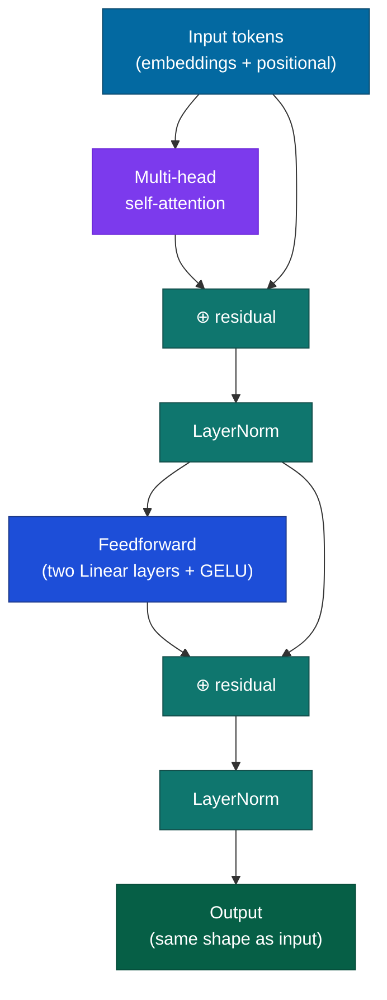
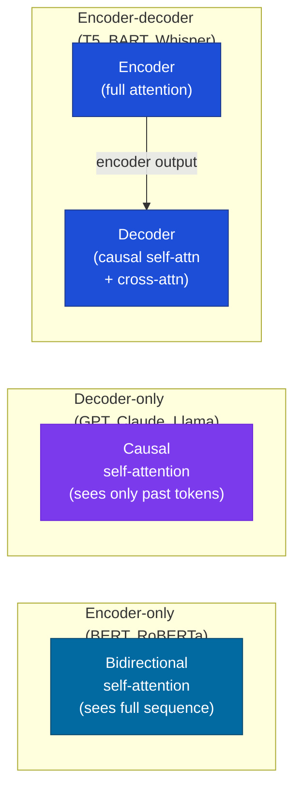

# Transformers

## What it is

The transformer is a neural network architecture built entirely from attention mechanisms and feedforward layers — no recurrence, no convolutions. Introduced in Vaswani et al., "Attention Is All You Need" (2017), it displaced RNNs and LSTMs for virtually every language task within two years and has since become the dominant architecture for text, images, audio, and multimodal models.

A transformer block applies two operations in sequence, each followed by a residual connection and layer normalization:

1. **Multi-head self-attention** — each token gathers information from every other token
2. **Feedforward network** — each token is transformed independently through a two-layer MLP

Stack $N$ of these blocks and you have a transformer. The [Attention Mechanism](attention.md) page covers attention in depth; this page covers the full architecture.

## The problem it solves

RNNs and LSTMs (older network designs that read a sequence one step at a time, carrying forward a running summary of everything so far) had two structural problems. First, an information bottleneck: everything the network has read has to be squeezed into one fixed-size running summary (a "hidden state") before it can be used, and long-range relationships get lost in that squeeze. Second, sequential computation: because each step's summary depends on the step before it, you cannot compute step $t$ until step $t-1$ is done — no GPU parallelism (running many calculations at once on the same hardware) during training.

Attention solves both. But attention alone isn't an architecture — you still need:

- A way to encode position (attention has no notion of order)
- Something to do with each token after it has gathered context (the feedforward layer)
- A way to stabilize and deepen the network (residual connections, LayerNorm)
- A way to stack multiple "viewpoints" on the same token (multi-head attention)
- A way to generate sequences autoregressively — one token at a time, each new token conditioned on everything generated so far (the decoder and causal masking)

The transformer packages all of these cleanly.

## How it works under the hood

### Input representation

Before entering the transformer, each token (roughly, a word or word-fragment) is represented as a dense vector — a list of numbers, called an embedding — that the model learned to represent what that token means. For a vocabulary of size $V$ and embedding dimension $d_{\text{model}}$, this is a lookup table $E \in \mathbb{R}^{V \times d_{\text{model}}}$: each token ID maps to a $d_{\text{model}}$-dimensional vector.

Attention is permutation-invariant — "the cat sat" and "sat the cat" produce the same attention scores without positional information. Positional encodings inject token order.

**Sinusoidal encodings** (original paper): fixed, deterministic vectors based on sine and cosine functions of position and dimension index:

$$PE_{(pos, 2i)} = \sin\!\left(\frac{pos}{10000^{2i/d_{\text{model}}}}\right) \qquad PE_{(pos, 2i+1)} = \cos\!\left(\frac{pos}{10000^{2i/d_{\text{model}}}}\right)$$

The model can learn to use relative position differences from these encodings. The downside: they don't generalize well beyond the training context length.

**Learned positional embeddings**: a second lookup table, one vector per position. Simple and effective; used in BERT and most early transformers. Same generalization limitation.

**Rotary Position Embedding (RoPE)**: rotates the query and key vectors — the two internal representations attention uses to decide what's relevant to what, covered on the [Attention Mechanism](attention.md) page — by an angle proportional to their position before computing attention scores. Naturally encodes relative position in the attention matrix rather than adding absolute position to embeddings. Better extrapolation and the current default for most LLMs (Llama, Mistral, GPT-4).

**ALiBi**: adds a position-dependent bias directly to attention logits — a linear penalty proportional to the distance between tokens. Requires no learned parameters. Generalizes well to longer sequences than seen during training.

### The transformer block



Note: modern LLMs typically use **pre-norm** (LayerNorm — the rescaling step that keeps each token's numbers in a consistent range — before the sublayer, meaning before attention or the feedforward step, rather than after), which stabilizes training better than the original post-norm arrangement. The diagram shows the logical structure; the ordering of norm and residual matters in practice.

The feedforward network inside each block:

$$\text{FFN}(x) = \text{GELU}(xW_1 + b_1)\, W_2 + b_2$$

(Two matrix multiplications with a smooth, nonlinear bend — GELU — applied in between.)

Where $W_1 \in \mathbb{R}^{d_{\text{model}} \times d_{\text{ff}}}$ and $d_{\text{ff}}$ is typically $4 \times d_{\text{model}}$. This layer processes each token position independently — no interaction between positions here. Interaction happens in attention; transformation happens in the feedforward.

### Encoder vs. decoder vs. encoder-decoder

Three architectural variants, each suited to different tasks:



**Encoder-only** (BERT, RoBERTa): processes the entire sequence with bidirectional attention — every token can attend to every other token. Best for tasks requiring understanding of the full input: classification, tagging, similarity. Cannot generate.

**Decoder-only** (GPT, Claude, Llama, Mistral): processes tokens left-to-right with causal masking — each token can only attend to itself and earlier tokens. Trained to predict the next token. Can generate; also surprisingly good at understanding tasks via prompting.

**Encoder-decoder** (T5, BART, Whisper, original machine translation models): the encoder reads the full input with bidirectional attention; the decoder generates output token-by-token using causal self-attention plus cross-attention over the encoder's output. Natural fit for seq-to-seq tasks: translation, summarization, ASR.

### Causal masking

In decoder-only and decoder components, the attention matrix is masked to prevent attending to future positions:

$$\text{scores}_{ij} = \begin{cases} QK^T_{ij} / \sqrt{d_k} & \text{if } j \leq i \\ -\infty & \text{if } j > i \end{cases}$$

After softmax — the step that turns raw scores into a set of positive numbers summing to 1, so they behave like genuine odds — the $-\infty$ entries become zero — token $i$ receives no information from token $j > i$. This allows training on the full sequence in parallel (the labels are just the input shifted by one position) while maintaining the autoregressive property that generation requires.

### Scaling

The transformer's dominant empirical property: performance scales predictably with model size, dataset size, and compute, following power laws — a mathematical relationship where doubling the input (say, compute) produces a consistent, predictable fractional improvement in output, rather than a fixed or diminishing-to-nothing one (Kaplan et al., 2020). Hoffmann et al. 2022 ("Chinchilla") later revised the optimal compute allocation, finding that most large models were undertrained — the optimal ratio is roughly 1 token per parameter, not 100. Both papers agree on the power-law structure; they disagree on where to allocate a fixed compute budget. This regularity is why models got so large so fast: there was no clear ceiling, and each doubling of compute produced a predictable improvement.

Key parameters:
- $d_{\text{model}}$: how long each token's vector is as it flows through the residual connections from block to block — the network's main "width," and the size every other internal dimension is defined relative to
- $N$: number of transformer blocks stacked
- $h$: number of attention heads per block
- $d_{\text{ff}}$: feedforward expansion factor (typically $4 \times d_{\text{model}}$)
- $V$: vocabulary size

GPT-3 (175B): $d_{\text{model}} = 12{,}288$, $N = 96$, $h = 96$, $d_{\text{ff}} = 49{,}152$.

## Concrete example

A minimal transformer decoder block in PyTorch:

```python
import torch
import torch.nn as nn
import torch.nn.functional as F

class TransformerBlock(nn.Module):
    def __init__(self, d_model: int, n_heads: int, d_ff: int, dropout: float = 0.1):
        super().__init__()
        self.attn = nn.MultiheadAttention(d_model, n_heads, batch_first=True)
        self.ff   = nn.Sequential(
            nn.Linear(d_model, d_ff),
            nn.GELU(),
            nn.Linear(d_ff, d_model),
        )
        self.norm1   = nn.LayerNorm(d_model)
        self.norm2   = nn.LayerNorm(d_model)
        self.dropout = nn.Dropout(dropout)

    def forward(self, x: torch.Tensor, causal_mask: torch.Tensor = None):
        # Pre-norm self-attention with residual
        normed = self.norm1(x)
        attn_out, _ = self.attn(normed, normed, normed, attn_mask=causal_mask)
        x = x + self.dropout(attn_out)

        # Pre-norm feedforward with residual
        x = x + self.dropout(self.ff(self.norm2(x)))
        return x


def make_causal_mask(seq_len: int) -> torch.Tensor:
    # Upper-triangular matrix filled with -inf (positions token can't see)
    mask = torch.triu(torch.full((seq_len, seq_len), float('-inf')), diagonal=1)
    return mask


# Usage
d_model, n_heads, d_ff, seq_len, batch = 512, 8, 2048, 64, 4
block = TransformerBlock(d_model, n_heads, d_ff)
x     = torch.randn(batch, seq_len, d_model)
mask  = make_causal_mask(seq_len)
out   = block(x, mask)
print(out.shape)  # (4, 64, 512)
```

Stack $N$ of these blocks, add an embedding layer at the front and a linear projection to logits at the back, and you have a complete GPT-style language model.

## When to use it / when not to

#### Use a transformer when

- Your data is sequential (text, code, audio, video frames) or can be treated as a sequence of patches (images via ViT)
- You want to leverage pretrained weights — every major foundation model is transformer-based
- Your context is long enough to benefit from global attention (>10 tokens of meaningful context)

#### Prefer a simpler architecture when

- You're operating on-device with severe memory constraints — CNNs are still more efficient for many computer vision tasks at this scale
- Your sequence is very long (>100K tokens) and full attention is prohibitively expensive — consider state space models (Mamba) or hybrid approaches
- You need real-time streaming with linear compute per step — recurrent-style models still win here

#### Encoder vs. decoder choice in practice

- **Understanding tasks** (classification, NER, semantic similarity): encoder-only (BERT family)
- **Generation tasks** (chat, summarization, translation, code): decoder-only (GPT/Llama family) unless you need the encoder-decoder seq-to-seq structure specifically
- **Structured seq-to-seq** (ASR, formal translation): encoder-decoder (T5, Whisper)

The decoder-only trend is strong: GPT, Llama, Claude, Gemini, and Mistral are all decoder-only, and fine-tuning them on understanding tasks works well enough that encoder-only models are chosen less often for new projects. The exception: when you need fast, lightweight embeddings for retrieval or classification and don't need generation, encoder-only models (BERT, RoBERTa, DeBERTa) are still faster and cheaper per inference call.

## Main tools and libraries

| Tool | Use for |
|---|---|
| Hugging Face Transformers | Loading and fine-tuning any pretrained transformer — the standard starting point |
| Hugging Face PEFT | Parameter-efficient fine-tuning (LoRA, QLoRA, prefix tuning) — adapts large models cheaply |
| nanoGPT (`karpathy/nanoGPT`) | Clean, readable GPT-2 implementation; the best starting point for building from scratch |
| `torch.nn.Transformer` | PyTorch's built-in module; correct but not optimized — use for learning, not production |
| FlashAttention (`flash-attn`) | Drop-in speedup for the attention computation; essential for any serious training run |
| vLLM | High-throughput inference server; paged KV cache, continuous batching, OpenAI-compatible API |

## Common failure modes and gotchas

**1. Context length vs. context use.** A model with a 128K context window does not equally attend to all 128K tokens — attention sinks (see the [Attention Mechanism](attention.md) page), recency bias, and practical degradation mean that useful "effective context" is often much smaller. Don't assume long-context models use everything they can see.

**2. Positional encoding mismatch.** Sinusoidal and learned absolute encodings fail sharply at lengths beyond training — a model trained at 4K tokens produces garbage output at 8K. RoPE and ALiBi extrapolate more gracefully but still degrade. Always verify that inference context length matches training context length, or use a model with a known extension technique (YaRN for RoPE, or a model fine-tuned at longer context).

**3. Pre-norm vs post-norm instability.** The original paper used post-norm (residual then LayerNorm). Pre-norm (LayerNorm then sublayer) is more stable for training very deep networks but slightly changes the effective gradient flow. If you're seeing unstable training loss early on, check which convention your code uses.

**4. Attention head redundancy in fine-tuned models.** After task-specific fine-tuning, many attention heads in the early layers become redundant and attend nearly uniformly. This is normal and can be exploited for inference speedup (attention head pruning), but it means that the effective number of "active" attention patterns is often much smaller than $h$.

**5. KV cache sizing.** At inference time, the model caches the key and value vectors — attention's internal representations — from every token already generated, so it doesn't have to redo that work on every new token. The cache grows as (batch size × number of layers × context length × $2 \times d_{\text{model}}$) — concretely, at $d_{\text{model}} = 4{,}096$, 32 layers, and a 32K-token context, one request's cache alone runs into the tens of gigabytes. For long-context requests with large batches, the KV cache dominates GPU memory — often exceeding model weight memory. Plan for this before deploying.

**6. Tokenization artifacts at boundaries.** Because transformers operate on tokens rather than characters, they sometimes fail at tasks that require character-level reasoning: counting letters, reversing strings, rhyming. The model isn't "bad at spelling" in the way a human would be — it's operating on a different abstraction layer entirely.

## Project ideas

**1. Build a GPT from scratch** — Implement a complete autoregressive transformer using nanoGPT as a reference. Train character-level on Shakespeare (`input.txt`, ~1MB). Implement the embedding, positional encoding, $N$ transformer blocks, and the output head yourself. The goal is to run the full training loop and watch loss decrease — not to build a good model. Two serious days; the understanding gained is permanent.

**2. Encoder vs. decoder comparison** — Take a text classification task (SST-2 sentiment, AGNews topic classification). Fine-tune BERT-base (encoder-only) and GPT-2-medium (decoder-only, using the last token's hidden state as the classifier input). Match parameter counts as closely as possible. Compare accuracy, training time per epoch, and convergence speed. Also test few-shot prompting on GPT-2 without fine-tuning. Puts the encoder/decoder tradeoff in concrete terms.

**3. Positional encoding extrapolation test** — Take a pretrained model with learned absolute positional embeddings (BERT or GPT-2). Run it on sequences longer than its training length and measure perplexity or task performance vs. a model with RoPE (Llama 2 7B or Mistral 7B). The absolute encoding model's performance will degrade sharply; the RoPE model will degrade more gracefully. Makes the "length extrapolation" failure mode visceral.

**4. KV cache profiling** — Run inference with a 7B model at batch size 1 and context lengths 1K, 8K, 32K, 128K. At each length, measure peak GPU memory and tokens-per-second throughput. Plot both curves. The KV cache's linear memory growth and its effect on throughput will become concrete numbers rather than abstract warnings.

## Going deeper

#### Core papers

- Vaswani et al., "Attention Is All You Need" (NeurIPS 2017) — the original transformer. Read Section 3 (model architecture) and Figure 1 in full.
- Devlin et al., "BERT: Pre-training of Deep Bidirectional Transformers for Language Understanding" (NAACL 2019) — introduces the encoder-only pretraining paradigm. Read Section 3 (model architecture) and Section 4 (pre-training tasks).
- Radford et al., "Language Models are Unsupervised Multitask Learners" (OpenAI, 2019) — the GPT-2 paper. Demonstrates few-shot capability and the decoder-only paradigm.
- Kaplan et al., "Scaling Laws for Neural Language Models" (OpenAI, 2020) — documents the power-law relationship between loss and scale. The empirical foundation for why bigger models kept getting funded.
- Su et al., "RoFormer: Enhanced Transformer with Rotary Position Embedding" (2021) — introduces RoPE, now the default positional encoding for most LLMs.

#### Best explainers

- "The Illustrated Transformer" by Jay Alammar — the best visual walkthrough of the full architecture, step by step.
- "The Annotated Transformer" (Harvard NLP) — the Vaswani paper with line-by-line PyTorch annotations.
- nanoGPT (GitHub: `karpathy/nanoGPT`) — 300 lines of readable PyTorch that implement a complete GPT-2. Reading this once is worth more than reading ten architecture papers.
- "Let's build GPT" (Karpathy, YouTube) — walks through building nanoGPT from scratch. The best video explanation of how transformers are assembled.
