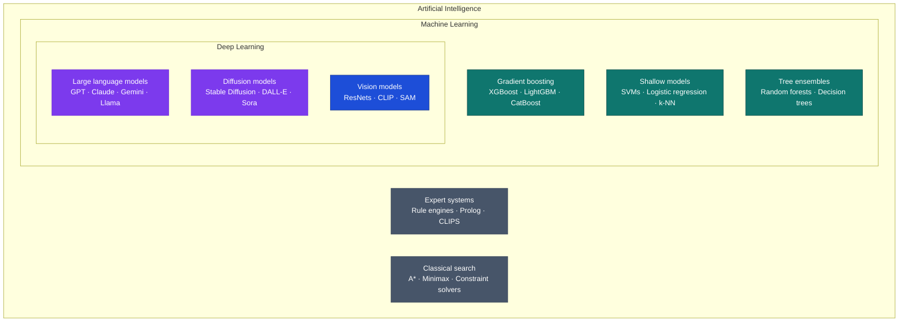
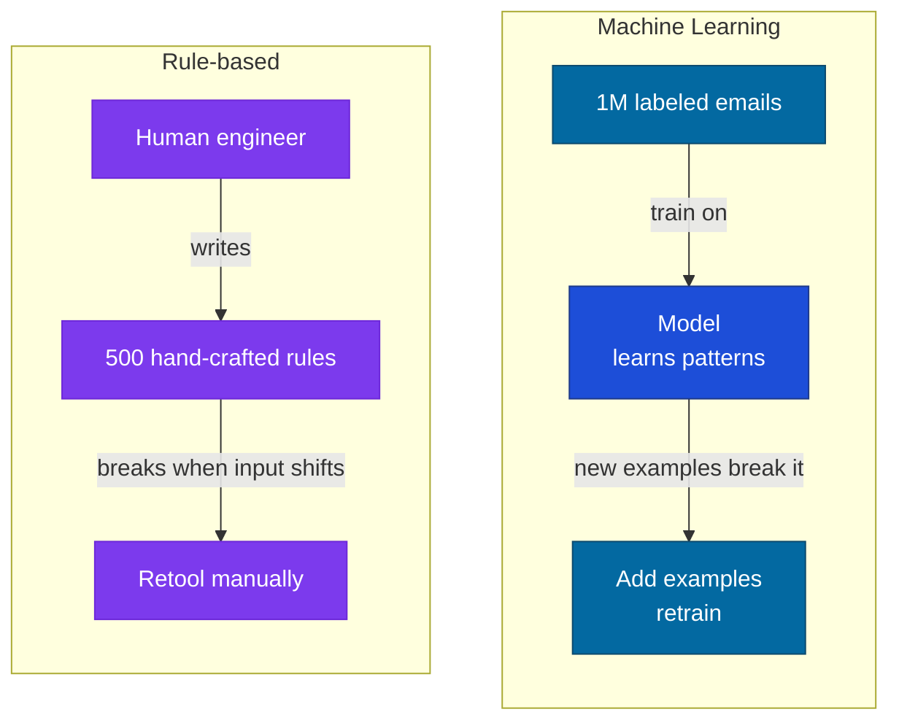
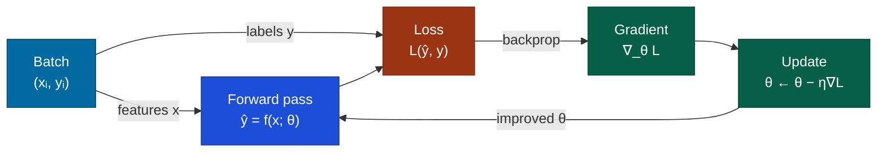

# What is AI?

## What it is

AI is the project of making computers do things that, when done by humans, we'd call intelligent. That's deliberately vague — and that vagueness has caused decades of confusion, because the definition keeps shifting. Chess used to be considered the pinnacle of machine intelligence. Now we call it "just search." Spam filtering was once a hard AI problem. Now it's routine. What we label "real AI" tends to mean "things computers can't do yet."

Three nested terms you'll encounter constantly:



The distinction matters because the tools, failure modes, and requirements differ at each level. A rule-based expert system fails differently than a logistic regression, which fails differently than a transformer. Knowing which category you're in changes what you reach for and what you watch out for.

## The problem it solves

For most of computing history, if you wanted a computer to do something, you had to tell it exactly how. Want to filter spam? Write rules:

```python
# Rule-based spam filter, circa 2000
def is_spam(email):
    if "Nigerian prince" in email.body:
        return True
    if "CLICK HERE NOW" in email.subject:
        return True
    if email.has_attachment and email.sender_unknown:
        return True
    return False
```

This works until spammers learn your rules. They just rephrase. You add more rules. They adapt. You're playing whack-a-mole — and you lose, because they only need to find one gap.

The deeper problem: for many tasks, humans can recognize the right answer without being able to articulate *why*. You know spam when you see it. You recognize a cat in a photo. You notice when a sentence is grammatically wrong. These intuitions are real, but they resist explicit formalization.

ML's bet: if you have enough *examples* of the correct answer, let the system discover the rules itself.



When spammers adapt, you add new labeled examples and retrain. The model updates its own internal rules — you just supply the data.

Deep learning extends this to domains where you don't even know what features to look for. Don't tell the model to detect edges, then textures, then shapes. Just show it labeled images and let it figure out its own intermediate representations.

## How it works under the hood

The core mechanism of ML is **optimization over parameters**.

You have a function $f(x; \theta)$ parameterized by $\theta$ (the weights). You have a dataset of examples $(x_i, y_i)$ — inputs and correct outputs. You define a **loss function** $\mathcal{L}\!\left(f(x;\theta),\, y\right)$ that measures how wrong your predictions are. You adjust $\theta$ to minimize $\mathcal{L}$.

That's the full picture. Everything else — neural architectures, regularization, attention mechanisms, transformers — is engineering around making this optimization work well at scale.



For a simple linear model: $f(x; w, b) = w \cdot x + b$, and you're adjusting $w$ and $b$. For a neural network: $\theta$ is millions or billions of weights across many layers, and you adjust them all simultaneously using backpropagation — the procedure that applies the chain rule backwards through the network to measure how much each weight contributed to the error. In the diagram above, $\eta$ (the **learning rate**) controls the step size taken in the direction the gradient points.

**Deep learning adds one key insight**: make $f$ a composition of many layers, each learning *intermediate representations*. The first layer of an image classifier might learn to detect edges. The second learns textures. The third learns parts — ears, wheels, eyes. The fourth learns objects. Nobody programmed this hierarchy — it emerged from minimizing the loss on a large enough dataset. Depth lets the model factor complex patterns into simpler sub-patterns, each learned separately.

## Concrete example

The same task — spam classification — at three levels of the stack:

#### Level 1: Rule-based

```python
def is_spam_rules(email: str) -> bool:
    patterns = ["buy now", "free offer", "click here", "unsubscribe"]
    return any(p in email.lower() for p in patterns)
```

Breaks the moment spammers rephrase. The rules are explicit and therefore gameable.

#### Level 2: Traditional ML

```python
from sklearn.linear_model import LogisticRegression
from sklearn.feature_extraction.text import TfidfVectorizer

vectorizer = TfidfVectorizer(max_features=10_000)
X_train = vectorizer.fit_transform(train_emails)

clf = LogisticRegression()
clf.fit(X_train, train_labels)

predictions = clf.predict(vectorizer.transform(test_emails))
```

Better. Generalizes to unseen phrasings. But what features to extract (TF-IDF word frequencies here) is still a hand-made decision.

#### Level 3: Fine-tuned language model

```python
from transformers import pipeline

classifier = pipeline("text-classification", model="distilbert-base-uncased")
# Fine-tuning step omitted — use Hugging Face Trainer or PEFT for the training loop.
# This loads a base model; after fine-tuning on labeled spam examples, it generalises
# to phrasings it was never explicitly trained on.
```

Raw text in. The model learns its own intermediate representations and handles novel phrasing patterns it was never explicitly trained on — because it built a model of language, not a list of rules.

The tradeoff: each level requires more data and compute, and offers less interpretability.

## When to use it / when not to

#### Use traditional ML when

- You have labeled examples but can't write the rules explicitly
- Your data is tabular/structured (XGBoost often wins here)
- You need a genuinely interpretable model — logistic regression and shallow decision trees are; a 500-tree XGBoost ensemble is not, despite being "traditional ML"
- Data is limited (deep learning needs more of it)

#### Use deep learning when

- You're working with unstructured data: text, images, audio, video
- You have a large dataset and compute to match
- Traditional ML has plateaued and you're far from the performance ceiling

#### Don't use ML at all when

- The rules are simple and writable — a lookup table beats a neural net at constant-time retrieval
- You need formal correctness guarantees (ML systems fail probabilistically)
- Data is too scarce and you can't generate synthetic examples
- You need to audit every decision for regulation — requirements are tightening in finance, healthcare, and hiring, not loosening; verify domain-specific rules before assuming ML is permissible

:::tip[My take]

The "AI vs. rules" framing is almost always a false choice. The best production systems combine both: an LLM handles language understanding and fuzzy matching, but hard business logic — pricing caps, legal constraints, permission checks — stays in deterministic code. The mistake is either writing rules for tasks that rules genuinely can't solve, or reaching for ML when a three-line if-statement would do it better and faster.

:::

## Main tools and libraries

#### Traditional ML

| Library | Reach for it when... |
|---|---|
| scikit-learn | Standard algorithms on tabular data; everything that fits in RAM |
| XGBoost / LightGBM | Tabular data where you want to win competitions or maximize accuracy |
| statsmodels | You need statistical inference (p-values, confidence intervals), not just prediction |

#### Deep learning frameworks

| Framework | Reach for it when... |
|---|---|
| PyTorch | Research, custom architectures, and the default for new production workloads outside the Google ecosystem |
| TensorFlow / Keras | Google ecosystem, TFLite for mobile, production serving via TF Serving |
| JAX | Functional programming style, TPU training, cutting-edge research |

#### LLMs in production

| Tool | Reach for it when... |
|---|---|
| Anthropic / OpenAI APIs | Production apps where you don't want to manage infrastructure |
| Hugging Face Transformers | Open models, fine-tuning, need model control and local inference |
| Ollama | Local inference, privacy-sensitive use cases, offline deployment |

## Common failure modes and gotchas

**1. Distribution shift** — the model learns patterns from training data. When production data differs (different time period, different user population, different domain), performance degrades silently. No error, no warning — just quietly wrong answers.

**2. Label leakage** — your training labels contain information that won't be available at inference time. Classic example: predicting hospital readmission using a feature like "was discharged to rehab" — information you can't know until after the decision you're trying to make.

**3. Benchmark overfitting** — optimizing for a metric until the metric stops measuring what you actually care about. A spam filter optimized purely for F1 on a static test set may be brittle on new campaigns using novel phrasing.

**4. Assuming ML beats simple baselines** — a logistic regression or a lookup table often outperforms a neural network when data is scarce. Always start with the simplest possible baseline and measure the gap before reaching for complexity.

**5. Treating capability as intelligence** — a model that passes a benchmark is not "intelligent." It's good at the distribution that benchmark tests. This matters because people extend trust beyond what the model was actually evaluated on.

## Project ideas

**1. Build-then-replace** — Build a rule-based classifier for something you personally care about: categorizing RSS feeds, triaging notes, labeling log lines. Document its specific failure cases. Then replace it with a simple scikit-learn model trained on labeled examples. The goal is to see exactly where ML helps and where it doesn't — ideally you surprise yourself in both directions.

**2. Distribution shift in practice** — Train a sentiment classifier on IMDB movie reviews. Test it, without retraining, on product reviews (Amazon reviews on Kaggle), tweets (Sentiment140), or news comments (AG News via Hugging Face datasets). Quantify the performance drop with real numbers. Then fine-tune on a small labeled sample from the new domain and re-measure. Puts a concrete figure on how much distribution matching matters.

**3. Tabular data shootout** — Pick any Kaggle tabular classification dataset. Run LogisticRegression, RandomForest, XGBoost, and a simple neural network (two dense layers). Record accuracy, training time, and interpretability at several data sizes. The point isn't to win — it's to see which approaches win at which scale, and why XGBoost keeps appearing in winning solutions on structured data.

**4. End-to-end personal ML pipeline** — Build a complete pipeline for a personal dataset: collection → cleaning → feature engineering → training → evaluation → serving as a CLI tool or simple API. Don't optimize the model. Optimize your understanding of each stage. The mental model you build here outlasts any specific framework.

## Going deeper

#### Foundational texts

- Turing, "Computing Machinery and Intelligence" (1950) — *Mind*, Vol. 59. The paper that started the question, including the Turing Test and its critics. Short, readable, still thought-provoking seventy years later.
- Goodfellow, Bengio, Courville, "Deep Learning" (2016) — The definitive textbook. Free at deeplearningbook.org. Chapters 5 (ML foundations) and 6 (feedforward networks) are the essential core. Everything else builds on those.
- Mitchell, "Machine Learning" (1997) — Older but excellent for the statistical learning foundations. Gives you the vocabulary cleanly.

#### Best explainers

- Karpathy, "Neural Networks: Zero to Hero" — YouTube playlist. The best practical introduction that exists: builds a transformer from first principles by the end, starting from scalar autograd (micrograd).
- 3Blue1Brown, "Neural Networks" series — Best visual intuition for what backpropagation is actually doing at the level of the chain rule.
- Nielsen, "Neural Networks and Deep Learning" — Free at neuralnetworksanddeeplearning.com. Gentler than Goodfellow; good for building the first mental model.
