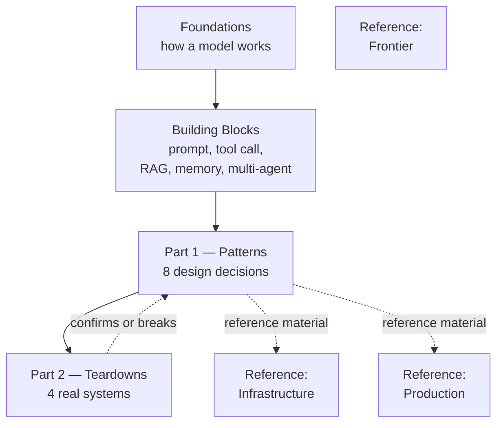

# Start Here

This site is two things stacked on top of each other: a short book — *Agentic Systems: Patterns and Teardowns* — and a reference library it's built on top of. The book is Part 1 and Part 2 in the sidebar. Everything else is the library: prerequisite material and deep single-topic pages you enter from a chapter, not a syllabus you work through first.

**Part 1 — Patterns** is eight design decisions you will face in any multi-agent system, each given as a problem, a diagram, and a test you can apply to your own system. **Part 2 — Teardowns** takes four systems I actually built and takes them apart in the same order every time, so you can watch the eight patterns hold and fail in real code.

## Who this assumes

You can read a flowchart. You've called an LLM API at least once — or you're willing to read one page, [How LLMs Work](./foundations/how-llms-work), that explains what that means. You've never designed a system where several model calls hand work to each other, and you want to before you build one badly.

## Two kinds of page

The book and the library use different templates on purpose — if you notice the shift, that's intentional, not inconsistent.

**Chapters** (Part 1 and Part 2) are argument-shaped: a diagram first, then the prose that explains it. Each Part 1 chapter follows the same six sections — the problem in one diagram, the pattern, decision rules, failure modes, where it shows up in the teardowns, and reference material — and ends with one bolded test you can run against your own system. Each Part 2 chapter follows a fixed eight-section teardown, and every claim in it is read from the system's actual source code; anything inferred is flagged `[VERIFY]`.

**Reference pages** (Foundations, Building Blocks, and the three "Reference:" sections) are encyclopedic: one topic, nine fixed sections — what it is, how it works, working code, when to use it, failure modes, and where to go deeper. They're meant to be entered from a chapter's "Reference material" list when you need depth on one thing, not read cold from the top.

## The map

<strong>Figure 0.1</strong> — The book is Part 1 and Part 2. Foundations and Building Blocks lead into it; the three Reference sections hang off it, entered from a chapter's own links rather than read in sequence.

## Three ways to read it

### The book, in order

[How LLMs Work](./foundations/how-llms-work) → the [Building Blocks](./core-building-blocks/) pages, in their listed order → [Part 1, chapter 1](./patterns/) through chapter 8 → [Part 2, chapter 9](./teardowns/) through chapter 12. Honestly: a weekend, not an afternoon.

### Show me a real system first

If you distrust pattern language until you've seen it survive contact with code: start at [ProjectOS](./teardowns/projectos) (chapter 9), then read the three chapters it anchors — [Stage Gates](./patterns/stage-gates) (2), State Machines (3), and LLM-as-Judge (4) — then work outward from there into the rest of Part 1.

### Something is already wrong with the system I have

The highest-value path if you're not here to learn in the abstract:

- Surprise bill → Cost-Aware Model Routing (chapter 6)
- Bad output shipped to a user → [Stage Gates](./patterns/stage-gates) (2) + QA Pipelines (5)
- Can't tell what state a run is in, or can't resume one → State Machines (3)
- Got prompt-injected → Failure Modes and Attack Surfaces (8)
- Reviewers flag everything and nothing ships → LLM-as-Judge (4)

### Thirty minutes

[Stage Gates](./patterns/stage-gates) (chapter 2) end to end, then the first three figures of the [ProjectOS teardown](./teardowns/projectos) (chapter 9). More chapters are landing; this path gets longer as they do.

---

## What's in the reference library

| Section | What it covers | Pages |
|------|------|------|
| [Foundations](./foundations/) | How a model works under the hood — one required page, nine optional | 10 |
| [Building Blocks](./core-building-blocks/) | Prompting, RAG, tool use, memory, multi-agent — the pieces Part 1 assumes | 8 |
| [Reference: Infrastructure](./meta-infrastructure/) | Evals, observability, guardrails, vector DBs, MCP, and more — entered from a chapter | 18 |
| [Reference: Production](./production-concerns/) | Reliability, monitoring, graceful degradation, deployment patterns | 6 |
| [Reference: Frontier](./aspirational/) | Where the field is heading, confidence levels stated explicitly | 6 |

Cross-references throughout the site use `[[WikiLink]]` syntax pointing to related pages. Every reference page has a "Going deeper" section with papers, docs, and internal cross-references.
