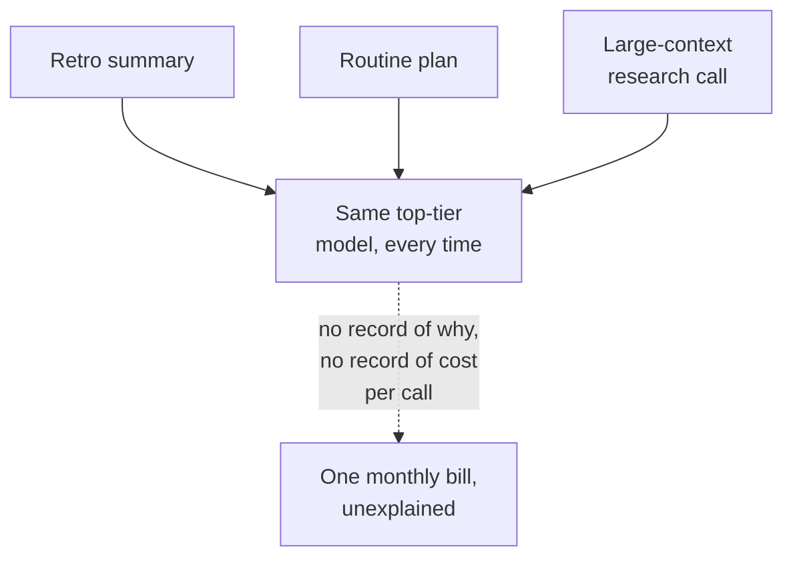
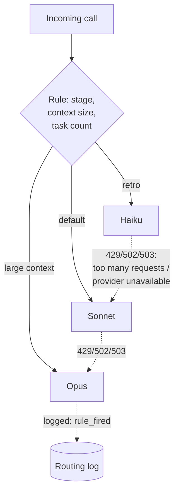

# Cost-aware model routing

Every call to a model has a price attached, set by which tier you asked for — a tier being one grade of model from a provider's lineup, trading capability for cost, cheap-and-fast at one end and expensive-and-capable at the other — and most systems make that choice once, in one place, for every call — usually the strongest available tier, because that's the safe default while you're building. It stays the default long after it stops being necessary, because nothing forces you to revisit it. Cost-aware routing is the discipline of choosing the tier per call instead of once for the whole system, and then, separately, being able to say afterward what each choice actually cost.

That second half is the part most systems skip, and it's the more useful one.

## The problem in one diagram



<p className="fig-caption"><strong>Figure 6.1</strong> — One tier for everything. All three calls succeed. Nobody can say afterward which one needed the expensive tier, or what any of them individually cost.</p>

ProjectOS doesn't have this problem — it has a real router with real rules — but Figure 6.1 is the default it's already better than: pick the strongest tier once, while building, and never revisit it because nothing forces a revisit. ProjectOS's routing rules are the fix for the left half of this diagram. What it's still missing, and what the rest of this chapter is really about, is the right half: retro calls go to Haiku (the cheapest, fastest tier), large-context calls go to Opus (the most capable and most expensive), everything else defaults to Sonnet, the middle tier, and every routing decision is logged with the rule that fired — logged, though, in a way you can't join back to what the call actually cost, "join" meaning lining up two separate records by a shared ID so you can read them as one. The system can tell you which rule routed a call, and separately what a call cost, and never both at once for the same call. Choosing the tier well and being able to account for the choice are two different disciplines, and it's entirely possible to build one without the other.

## The pattern



<p className="fig-caption"><strong>Figure 6.2</strong> — A call is routed by a named rule, not a global default, and steps up one tier on a retryable failure rather than retrying blind. Every decision is logged with which rule fired.</p>

Three pieces make this pattern work, and ProjectOS has all three built, which is why it's worth reading closely even where it falls short. First, routing is rule-based and the rules have names — `retro-default-haiku`, not an unlabeled if-statement (a decision buried in code with no name attached to it) — so a person looking at the log later can answer "why did this go to Opus" without re-deriving the logic. Second, the fallback chain steps up in tier on a retryable error instead of retrying the same call against the same model that just failed it; Haiku falls back to Sonnet, Sonnet falls back to Opus, Opus has nowhere further to go. Third, every routing decision is written down — the rule, the inputs it considered, the model it chose.

Here's the shape, generalized from how ProjectOS actually does it — a rule table, a chain of fallback tiers per starting model, and a logged decision that carries enough to reconstruct why. Read it top to bottom: the first rule whose condition matches wins, and anything that matches none of them falls through to `DEFAULT_MODEL`. Each `lambda` is a small, unnamed rule of the form "if this condition on the call is true" — here, is this a retro call, is the context bigger than roughly 8,000 tokens (about 6,000 words, ten pages of text), does the plan have 15 or more tasks:

```python
RULES = [
    ("retro-default-haiku",   lambda ctx: ctx.agent == "retro", "haiku"),
    ("large-context-opus",    lambda ctx: ctx.token_count > 8000, "opus"),
    ("heavy-execution-sonnet", lambda ctx: ctx.task_count >= 15, "sonnet"),
]
DEFAULT_MODEL = "sonnet"

FALLBACK_CHAINS = {
    "haiku":  ["haiku", "sonnet"],
    "sonnet": ["sonnet", "opus"],
    "opus":   ["opus"],
}

def route(ctx, trace_id):
    for rule_name, matches, model in RULES:
        if matches(ctx):
            log_routing_decision(trace_id, rule_name, model)  # joined to real cost later
            return FALLBACK_CHAINS[model]
    log_routing_decision(trace_id, "default", DEFAULT_MODEL)
    return FALLBACK_CHAINS[DEFAULT_MODEL]
```

The detail worth noticing is `trace_id` threaded into `log_routing_decision` — that's the join key that lets you later ask "what did the `large-context-opus` rule actually cost us this month," by joining the routing log to wherever token usage and price get recorded. Leave it out, as ProjectOS does — its equivalent call always passes a null trace id, null meaning deliberately left blank, no value at all — and you can still see which rule fired, you just can never connect that back to a dollar figure.

## Decision rules

### Route by rule when

- Different call types have genuinely different quality requirements. A retro summary and a plan that gets executed against for three weeks don't need the same model tier.
- You can name the rule in one sentence someone could check against a real call. "Retro calls use Haiku" is checkable. "Use whatever seems appropriate" is not a rule.
- The routing decision itself is cheap to compute — a stage name, a token count, a task count. If deciding which model to use costs as much as just calling the expensive model, you haven't saved anything.

### Do not route by rule when

- Every call genuinely needs the same quality bar. Routing adds a decision point and a log entry for no behavioral difference.
- You can't yet say what a wrong routing choice would cost you. Build the accounting first, or you're optimizing without being able to tell if it worked.

### The test

Ask: **for the last expensive call this system made, can I say in one sentence which specific rule sent it there, and what it cost?** If you can only answer one half of that — you know the rule that fired, or you know the price, but not both for the same call — you have routing without cost accounting, which is most of the value with none of the accountability.

## Failure modes

### The routing log and the cost log don't join

ProjectOS logs every routing decision with the rule that fired, and every model call with its token usage and computed price — in two different tables, connected by a trace id that's always written as null on the routing side. You can answer "which rule fired most often" and "what did we spend this month" separately, and never "what did the `large-context-opus` rule cost us specifically." Fix: thread the real trace id through from the start; it's usually one extra parameter, not a redesign.

### The fallback chain steps up for the wrong reason

A fallback chain exists to route around a transient failure — rate limits, a timeout, a 500 from the provider. If your retry logic treats every non-transient failure the same way it treats those, a genuinely malformed request gets retried against a more expensive model and fails there too, for the same reason, at a higher price. Fix: only escalate the tier on errors that are actually about availability, not on errors that are about the request itself.

### Spend caps stored but not read

A budget table, a per-project or per-agent limit, a kill switch — all built, with a real database structure and real ways to create, view, change, and delete that data through the app — and then nothing on the actual call path reads any of it. The only enforcement is whatever flat, simpler check shipped first and never got upgraded once the finer-grained controls existed. Fix: a budget you can query but that nothing checks before spending isn't a control, it's a report you have to remember to read.

### The cap fails open

A spend-cap check that can't reach its own data — a database timeout, a connection blip — defaults to letting the call through rather than blocking it. That's often the right default for availability, and the wrong one for cost: it means the one moment the cap can't verify you're under budget is also the moment it stops checking. Fix: know which failure mode you're choosing, on purpose, rather than by whatever the error-handling code happened to do.

## Where it shows up in the teardowns

- **[ProjectOS](../teardowns/projectos)** has a genuinely well-built router — named rules, a real fallback chain, a per-user monthly spend cap — sitting next to all four failure modes above, verified in the same commit: the routing-to-cost join is broken, the fallback chain retries non-retryable errors as if they were transient, budget and kill-switch tables exist with nothing reading them, and the spend cap fails open on a database error. It's the clearest single example in this book of a system that built the right mechanisms and didn't finish wiring them together.
- **[Lyceum](../teardowns/lyceum)** does cost-aware multi-model routing across its QA pipeline's several phases; how its accounting compares to ProjectOS's is one of the open questions for that teardown.

:::tip[My take]

The thing that stands out to me about ProjectOS's routing, reading it now, is that the failure isn't in the routing logic at all — the rules are sensible, the fallback chain is sensible, the cap exists. Every failure mode above is a wiring gap: a null passed where a real id belonged, a table built and never queried, a default chosen for the wrong reason and never revisited. That's a more encouraging finding than "the design is wrong," and also a more common one than I expected going in. Good routing logic is the easy 80%. The join that lets you ask "what did this actually cost" is the boring 20% that's easy to defer indefinitely, because nothing breaks visibly when you skip it — you just can never answer the question until you go back and add it.

:::

## Reference material

- [Model Routing](../meta-infrastructure/model-routing) — capability-based routing, fallback chains, and cost routing as a reference topic in more depth.
- [Cost Tracking](../meta-infrastructure/cost-tracking) — token accounting, budget guardrails, and per-request attribution: the accounting half this chapter argues you need.
- [Caching](../meta-infrastructure/caching) — a second lever on cost, orthogonal to which tier you route to.
- [Fallbacks](../production-concerns/fallbacks) — model fallback chains and deterministic fallback content, in production-operations depth.
- [Graceful Degradation](../production-concerns/graceful-degradation) — what a system does when even the fallback chain is exhausted.
