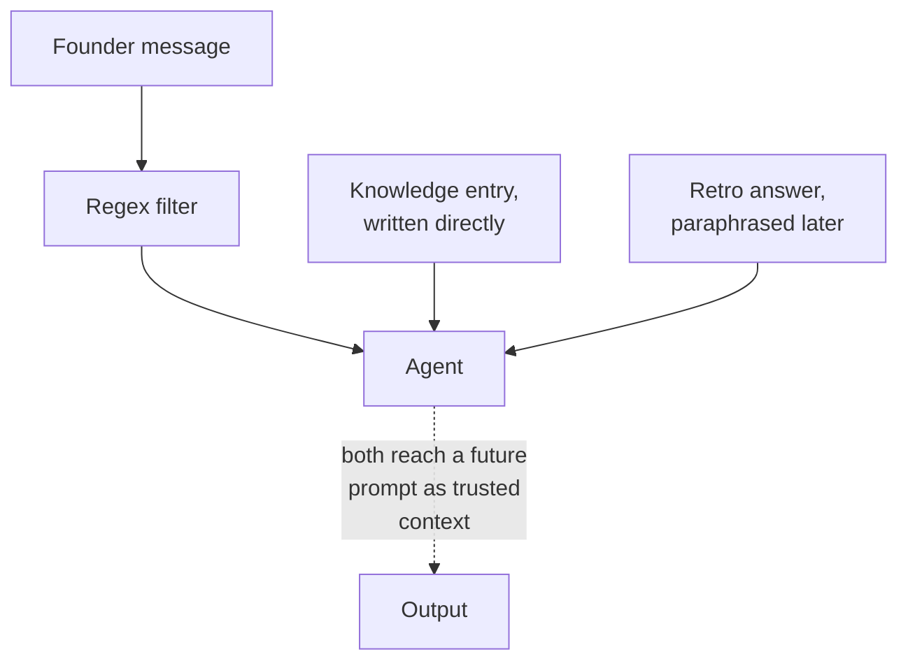
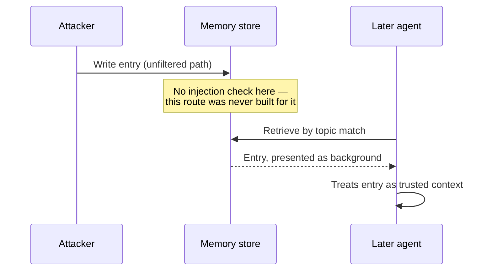

# Failure modes and attack surfaces

This chapter doesn't introduce a new pattern. It overlays a question onto every diagram the last seven chapters already drew: where does untrusted input enter this pipeline, and what can it reach from there? Chapter 2's gates, chapter 3's stored state, chapter 4's judge, chapter 6's routing, chapter 7's memory scope — each one is also a specific point where a defense either exists or doesn't, and a system's real attack surface is the sum of every point where it doesn't.

The single most common mistake in this chapter's subject is treating "the user's message" as the attack surface, defending it well, and stopping there. ProjectOS does exactly this: a regex block-list on the message field, returning a 403 on an obvious injection attempt. It's a real defense, at a real entry point. It's also not the only entry point, and everything past this chapter is about the ones a front-door filter never sees.

## The problem in one diagram

<strong>Figure 8.1</strong> — One entry point is filtered. Two others reach the same agent, and the same future prompt, without passing anything.

A front-door filter checks the field a person types into. It has no reason to check a field a *system* writes into on that person's behalf — a knowledge-store entry, a summarized memory, a tool's return value — because none of those look like user input at the point they're created. They become user input, functionally, the moment they're pasted into a prompt and treated as instructions or trusted background. That gap between "where a filter is applied" and "where untrusted content actually enters the system" is what the rest of this chapter is about.

## The pattern

<strong>Figure 8.2</strong> — Indirect injection. The write and the read happen at different times, through different code paths, and neither one is the message field a filter was built to check.

Direct injection — a crafted instruction in the message a user actually types — is the failure mode most systems defend against first, because it's the most obvious entry point. Indirect injection is what Figure 8.2 shows: content enters through a path nobody thought of as "user input" — a memory write, a document upload, a tool's return value — and reaches a prompt later, through a completely different code path than the one carrying the filter. Chapter 7's memory-scope argument and this chapter's injection argument are the same finding looked at from two angles: an unscoped store is a cross-tenant leak; the same unscoped, unfiltered store is also an injection path. Fixing the scope gap and fixing the filter gap turn out to be the same piece of work.

Runaway loops and error propagation are the other two failure modes this chapter closes out, and both were already earned by earlier chapters rather than introduced here. Chapter 1's iteration cap and chapter 2's retry ceiling are the same defense pointed at the same failure — a process that doesn't know when to stop costs money and takes actions nobody approved, whether the process not-stopping is a model looping or a gate retrying forever. Error propagation is chapter 2's opening arithmetic again: 0.95⁵ isn't a security finding, but a defect that compounds silently across five trusting agents and a defect that's injected deliberately at agent two compound the exact same way once they're past the point where anyone's checking.

## Decision rules

### Treat something as an attack surface when

- It's content a system writes on a user's behalf and later feeds back into a prompt — a memory entry, a summarized turn, a cached tool result. If a person didn't type it and a filter didn't see it, assume it needs its own check.
- It crosses a trust boundary you haven't explicitly drawn — another user's data, another tenant's config, another system's API response.
- It can reach an irreversible action, per chapter 2's Figure 2.4 — the gate placement rules from that chapter are the same rules that tell you where an attack surface actually matters versus where it's just noise.

### You probably don't need a new defense when

- The content never leaves the trust boundary it entered in — a value scoped, checked, and consumed inside one request, touched by nobody else.
- A gate you already built for a different reason happens to cover it. Chapter 2's rule gates and chapter 3's transition table both incidentally block a class of malformed input; check what you already have before adding a parallel defense that does the same job worse.

### The test

Ask: **for every place this system writes content that a future prompt might read, was that write ever checked the way a live user message is?** If the honest answer is "no, because I never thought of that write as user input," you've found an attack surface a front-door filter can't see.

## Failure modes

### The filter that checks one field

A regex or classifier is applied to the message parameter and nowhere else — not to a knowledge-base write, not to a workroom note, not to a tool's return value. Every one of those is a route to the same prompt the filter was built to protect. Fix: enumerate every place content reaches a prompt, not just the one a person types into directly, and check that list against where the filter actually runs.

### Regex evasion

A pattern-matching filter catches literal phrasings and nothing else — paraphrase, translate, add whitespace, and the same instruction passes clean. This gets worse, not better, once content is allowed to pass through a model before it's stored: a summary or a paraphrase of a blocked phrase was never the blocked phrase, so a phrase-matching filter has nothing left to match. Fix: treat a pattern-matching filter as a cheap first layer that catches unsophisticated attempts, never as the actual perimeter — chapter 2's rule-gate-then-judge-gate-then-human-gate layering applies here directly.

### The loop that doesn't know it's expensive

An iteration cap exists, but nothing tracks what each iteration is costing while it runs, so a loop that's technically bounded can still be bounded at a number nobody would have chosen if they'd seen the running total. Chapter 6's routing-to-cost join gap is the same failure mode: a control exists, and it can't be evaluated against real cost because nothing connects the two.

### A gate that trusts its own output

An agent's own structured output is used to authorize an action a person should have approved — chapter 3's example of a model choosing its own next stage is the general case of this. The failure isn't that the model is malicious, it's that a gate meant to check an external decision was quietly repositioned to check the same system's own claim about itself.

## Where it shows up in the teardowns

- **[ProjectOS](../teardowns/projectos)** is where every failure mode in this chapter has a real instance, verified in [How it could be attacked or manipulated](../teardowns/projectos#how-it-could-be-attacked-or-manipulated): the regex filter covers a handful of specific fields and nothing written through the knowledge-entry route; the same route is the indirect-injection path chapter 7 already covered; a founder can request `milestone_retro` or `complete` directly through the transition endpoint from `intake`, skipping every stage in between; a founder can talk the retro agent into writing `advance_stage: complete` early, since that field is trusted the way chapter 3 warned against; and the regex list matches literal phrasings only, so paraphrase or translation passes clean.
- **[Lyceum](../teardowns/lyceum)**, **[Second Brain](../teardowns/second-brain)**, and **[Aible](../teardowns/aible)** each have their own version of "where does untrusted content enter, and what can it reach" once those teardowns are read from source — a course-content pipeline, a personal knowledge wiki, and a multi-phase authoring pipeline all have different shapes of the same question.

:::tip[My take]

Writing this chapter last, after the other seven, changed what I think it's actually for. It isn't a checklist of attack types to bolt onto a finished design — every specific finding in it was already sitting in an earlier chapter's teardown material, just described as a different kind of problem: a scope gap, a trust gap, a cost gap. What this chapter added wasn't new information, it was one question applied uniformly to seven chapters' worth of diagrams: where does untrusted content get in, and does anything downstream know it's untrusted? I'd rather ask that question of a system I'm designing than wait to ask it of one I've already shipped.

:::

## Reference material

- [Prompt Injection](../meta-infrastructure/prompt-injection) — the full attack taxonomy and structural defenses, in reference depth.
- [Guardrails](../meta-infrastructure/guardrails) — input and output filtering as a layered pipeline, not a single check.
- [Access Control for Agents](../meta-infrastructure/access-control) — least-privilege scoping, the structural fix behind several of this chapter's failure modes.
- [Red Teaming](../meta-infrastructure/red-teaming) — adversarial process for finding the attack surfaces a design review misses.
- [Agentic Computer Use](../aspirational/agentic-computer-use) — tool misuse at its widest, once an agent's actions extend past a fixed API surface.
