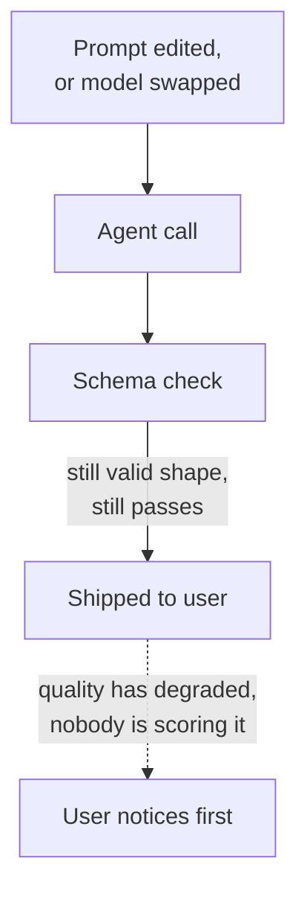
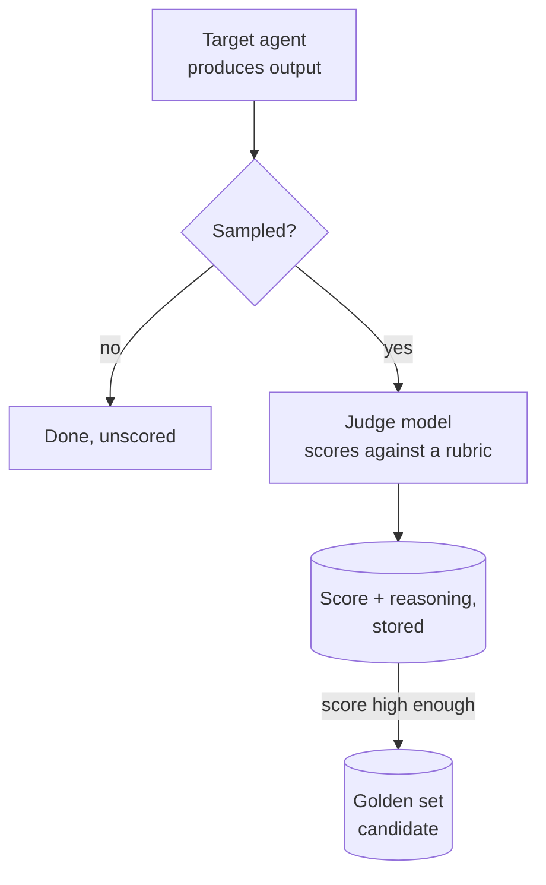

# LLM-as-judge

A schema check tells you an agent's output has the right shape. It cannot tell you the output got worse. A plan with three phases, every task estimated, every field present, passes a schema check as easily whether it's a good plan or a mediocre one — and a prompt edit, a model swap, or a slow drift in how the model interprets an unchanged prompt can degrade quality for weeks before anyone notices, because nothing downstream of the schema check is looking for that.

An LLM-as-judge is a second model call whose only job is to look for it: read the input and the output, score it against a rubric, and produce a number and a reason. It's a gate, in the sense chapter 2 already gave that word — a checker that decides whether output is good enough to pass — but it's the one kind of checker that can catch a defect a rule can't see and a person doesn't have time to read for.

## The problem in one diagram



<p className="fig-caption"><strong>Figure 4.1</strong> — A schema check passes on shape alone. A prompt edit or model swap can degrade quality while every structural check keeps passing, until a user is the one who finds it.</p>

Chapter 2's rule gates and chapter 3's stored state both assume you can write the criterion down as a rule: a field exists, a value is in range, a transition is legal. Quality doesn't reduce to a rule that cleanly. "Did the plan's tasks follow from the brief's success criteria" and "did the agent probe a vague 'done' claim instead of accepting it" are judgments, not checks — a human reading the output can answer them in seconds, a schema validator cannot answer them at all. The gap between "structurally valid" and "actually good" is exactly the gap a judge is for.

## The pattern



<p className="fig-caption"><strong>Figure 4.2</strong> — A judge in the loop. Not every call needs scoring — a sample is enough to catch drift — and a high-scoring sample can become a reusable regression case.</p>

Three design choices carry most of the weight. First, the judge scores named dimensions, not a single vague "quality" number — "did the agent probe the 'done' claim" is a question you can calibrate against; "is this good" is not. Second, the judge is sampled, not run on every call, because it costs a real call itself; running it on 15% of production traffic catches drift within a reasonable window without doubling your bill. Third, the score and the model's reasoning are both stored, so a score drop is something you can investigate, not just a number that changed.

Here's a rubric scorer with those three choices made explicit, plus the calibration step most implementations skip — checking the judge against human judgment before trusting it in production. It asks the judge model to answer in JSON, the structured, machine-readable text format that lets code read a score back out reliably instead of having to parse free-form prose:

```python
def build_rubric_prompt(input_data, output):
    return f"""Rate this output 1-5 on each dimension. Be rigorous —
5 means genuinely excellent, not just acceptable.

Input: {input_data}
Output: {output}

Respond as JSON:
{{
  "probed_vague_claims": {{"score": null, "reason": "..."}},
  "surfaced_real_risks": {{"score": null, "reason": "..."}},
  "overall": {{"score": null, "summary": "..."}}
}}"""

def calibrate_judge(judge_fn, labeled_examples, agreement_threshold=0.8):
    """Run before trusting a judge in production. Needs human-labeled
    examples — score them yourself first, then compare."""
    agreements = 0
    for example in labeled_examples:
        judge_score = judge_fn(example.input, example.output)["overall"]["score"]
        # within 1 point of the human label counts as agreement
        if abs(judge_score - example.human_score) <= 1:
            agreements += 1
    rate = agreements / len(labeled_examples)
    if rate < agreement_threshold:
        raise JudgeNotCalibrated(f"{rate:.0%} agreement, need {agreement_threshold:.0%}")
    return rate
```

The rubric asks about specific failure modes, not general quality — that's the difference between a judge you can act on and one that just produces a vibe with a number attached. The calibration step is the part almost nobody builds, and it's the part that turns "a model scored this" into a signal you can actually trust: score a batch of examples yourself, run the judge on the same batch, and don't ship the judge until it agrees with you often enough. Without that step, you don't know if your judge is measuring quality or measuring something correlated with quality that will eventually diverge from it.

## Decision rules

### Use LLM-as-judge when

- The thing you're checking is a judgment call, not a rule — "did the agent probe this vague claim" isn't expressible as a schema check.
- You've already got a rule gate catching structural problems, and you're worried about a different class of failure: the output that's valid and bad.
- You can afford to be wrong sometimes. A judge is a sampled signal, not a guarantee — treat a low score as "look at this," not as ground truth on its own.

### Do not use LLM-as-judge when

- A rule gate would catch the same defect for free. Don't spend a model call checking something a regex (a pattern-matching rule for text) or a schema validator already covers.
- You haven't calibrated it. An uncalibrated judge is a number that feels like a signal and might not be one — worse than no check, because it creates false confidence.
- You need a hard gate on every single call and can't tolerate sampling. A judge that only scores 15% of traffic can't be the only thing standing between bad output and a user on the 85% it doesn't see.

### The test

Ask: **if I ran this judge against twenty examples I've already scored myself, would it agree with me at least eight times out of ten?** If you don't know the answer, you haven't calibrated it yet, and everything downstream of the score — a golden-set promotion, a CI gate (an automated check that blocks a release if it fails), a dashboard someone checks before shipping — is trusting a number nobody's actually checked.

## Failure modes

### Self-preference

The judge and the model it's scoring are the same model, or the same family. ProjectOS scores Sonnet's output with Sonnet, and the risk here isn't hypothetical — it's the standard finding on LLM-as-judge setups generally, and worth checking for directly rather than assuming your judge is neutral. Fix: judge with a different model or tier than the one you're scoring, and if you can't, at least know that's the trade-off you're carrying.

### The judge sees less than you think

ProjectOS's judge is given the last user message truncated to 600 characters and the first 1,200 characters of the agent's output. A long plan is scored on its opening; whatever's in the last two phases never reaches the judge at all. This isn't a hypothetical risk, it's a design choice already made, likely for cost — a shorter prompt is a cheaper judge call — and it means the score can be confidently wrong about the part of the output it never read. Fix: if you're truncating what the judge sees to control cost, say so explicitly next to the score, so a 4.5 doesn't get read as "the whole plan is excellent" when it might mean "the first third is."

### Judge gaming

Output that names the rubric's own dimensions scores well, whether or not it actually did the thing the dimension is checking for — "I probed the vague claim by asking for concrete output" reads as evidence of probing whether or not real probing happened. Fix: rubrics that ask for the reasoning behind a score, not just the number, and a human periodically reading a sample of the judge's own reasoning, not just its scores.

### Prompt sensitivity

Reword the rubric and the scores move, even though nothing about what's being judged changed. Fix: pin the rubric wording once it's calibrated, and treat any edit to it as a new judge that needs recalibrating, not a tweak to the old one.

### Trusting an uncalibrated threshold

A promotion or CI-gate threshold gets set to a round number — 3.5 is the usual guess — before anyone has run the judge and looked at what real scores actually come back. That threshold is then either too tight, failing on genuinely fine output, or too loose, never catching anything. Fix: run the judge first, look at the distribution of real scores, and set the threshold below what you observe, not at a number that sounded reasonable in the abstract.

## Where it shows up in the teardowns

- **[ProjectOS](../teardowns/projectos)** has the most fully built judge in this book's teardowns. Fifteen percent of production calls are scored by Sonnet against a four-dimension-plus-overall rubric — see [Figure PO.4](../teardowns/projectos#the-judge-and-the-golden-set) — and a self-scoring guard stops the judge from ever grading its own output. High scores feed a golden-candidate table; a person promotes candidates to a golden set from the CLI, and a `golden:run` command re-scores every active case and exits non-zero if any falls below its own threshold. It's also this chapter's clearest cautionary tale: the judge shares a model with most of the agents it scores, and it reads a truncated slice of a long output, both real and both unaddressed as of the commit this book reads from.
- **[Lyceum](../teardowns/lyceum)** runs a multi-reviewer QA pass that chapter 5 covers directly; whether it uses a scored judge in the sense this chapter means, versus a reviewer agent producing free-text feedback, is one of the open questions for that teardown.

:::tip[My take]

The ProjectOS judge is more sophisticated than most solo projects bother to build — a real rubric, real sampling, a real promotion pipeline into a golden set that gates CI — and it still has the two most common judge mistakes sitting right in it: same-model self-scoring, and a context window quietly cut down to save cost. I don't think that's a knock on the design so much as a demonstration of how easy both mistakes are to make even when you clearly know what you're doing everywhere else in the system. If I were fixing one thing first, it'd be the truncation, not the self-preference risk — a judge scoring the wrong slice of the output is wrong in a way you can't even reason your way around, while same-model scoring is at least a bias you can name and discount for.

:::

## Reference material

- [Evals](../meta-infrastructure/evals) — the broader eval-set discipline a judge sits inside: eval types, dimensions, building a set worth trusting.
- [Monitoring](../production-concerns/monitoring) — sampling-based judging in production, alert thresholds, and what "don't monitor everything" means in practice.
- [Confidence Estimation](../production-concerns/confidence-estimation) — self-reported confidence as a weaker, cheaper cousin of a judge score, and why it fails differently.
- [Red Teaming](../meta-infrastructure/red-teaming) — adversarial pressure on a judge specifically, beyond the gaming failure mode above.
- [Synthetic Data](../meta-infrastructure/synthetic-data) — generating the labeled examples a calibration pass needs when you don't have enough real ones yet.
