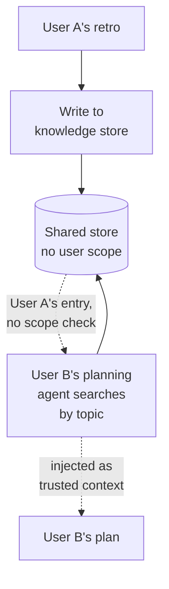
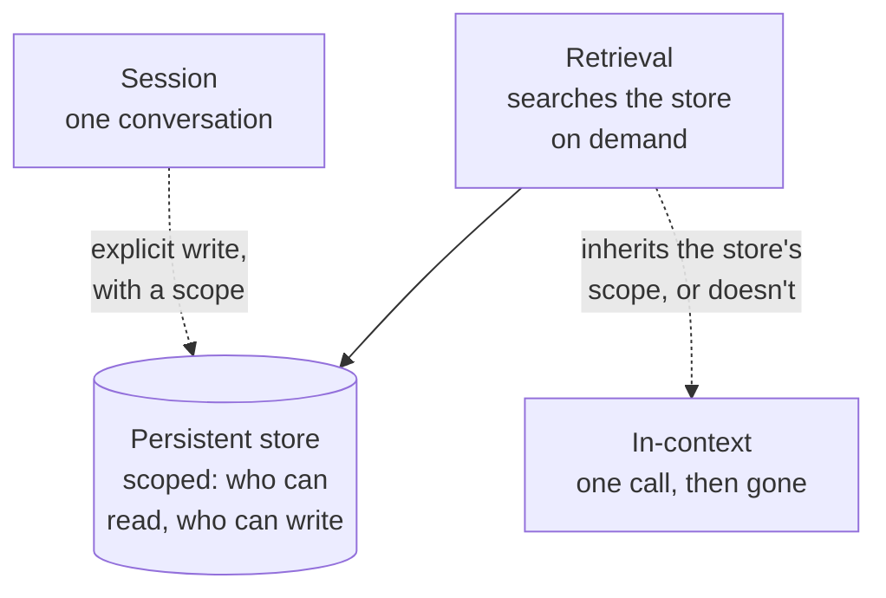

# Memory layers

Every place a system remembers something is also a place something can be planted for a later prompt to read. That's not a reason to avoid memory — a system that forgets everything between calls can't compound what it learns, and most of the value in a multi-agent system comes from the second call knowing something the first one found out. It's a reason to be precise about which layer of memory you're using for a given fact, because the layers differ enormously in who can write to them, how long a write persists, and whose future prompt ends up reading it back.

ProjectOS has a real example of getting this wrong in exactly the way this chapter is about: a knowledge store built to let one project's learnings improve the next one's plan, with no check on whose learnings end up in whose plan.

## The problem in one diagram



<p className="fig-caption"><strong>Figure 7.1</strong> — A store with no scope doesn't know it's crossing users. It searches by topic, finds the closest match, and hands it over as if it belonged there.</p>

This is what ProjectOS's knowledge hub actually does. `searchKnowledge()` filters by entry type, by project, by tags — never by user. A retro from one founder's project writes learnings into the shared store; another founder's planning agent later searches that store by topic and gets whatever matches best, regardless of who wrote it. The design intent was reasonable — completed projects should make future ones better, and the retro agent auto-populates the store so nobody has to curate it by hand. The gap is that "reasonable in principle" and "safe in practice" are different bars, and nothing in the search path checks whether the entry it's about to hand to one user's prompt was ever meant to leave the project it came from.

## The pattern



<p className="fig-caption"><strong>Figure 7.2</strong> — Four layers, different lifetimes. The dangerous step is the arrow from the persistent store back into a fresh call's context — that's where scope either gets enforced or gets lost.</p>

The four layers aren't a hierarchy of better and worse, they're a hierarchy of lifetime and blast radius. In-context memory — the current call's prompt — is the cheapest and the safest, because it disappears the moment the call ends and nothing else can read it. Session memory, a conversation's accumulated turns, lasts longer and is readable by anything that continues that same conversation. A persistent store outlives any single conversation, which is exactly what makes it useful for compounding learning across runs, and exactly what makes its scope the single most important design decision in this chapter: who can write to it, and — separately, and just as important — who's allowed to read a given entry back out. Retrieval is the mechanism that turns a persistent store back into context for a new call, and it only inherits the store's scope if someone built the retrieval query to check it. `searchKnowledge()` doesn't.

Here's the fix, in the shape ProjectOS's own `searchKnowledge()` would need to be scoped:

```python
def search_knowledge(query_text, requesting_user_id, project_id=None, limit=5):
    """Every retrieval call is scoped to who's asking, not just what
    they're asking for. An entry written by user A never reaches a
    prompt being built for user B, no matter how well it matches."""
    results = full_text_search(
        query_text,
        filters={
            "owner_id": requesting_user_id,   # the scope check that was missing
            "project_id": project_id,
            "limit": limit,
        },
    )
    return results
```

The one-line difference between this and the unscoped version is the whole chapter: `owner_id: requesting_user_id` in the filter. Everything else about the search — the ranking, the topic match, the limit — can stay exactly the same. Scope isn't a separate security layer bolted onto retrieval after the fact; it's a filter clause that has to be in the query from the start, because a search that finds the right answer for the wrong user has still failed.

## Decision rules

### Add a persistent store when

- A fact genuinely needs to outlive the conversation that produced it — a retro's lessons, a user's stated preference, a decision that should inform work weeks later.
- You can name, in advance, who's allowed to write to it and who's allowed to read a given entry back. If you can't answer "who else can see this" before you write it, you're not ready to write it.
- You're prepared to treat every entry as untrusted input the next time it's read, the same way you'd treat text from an external API — because that's what it is, once enough time and enough writers have passed through it.

### Keep something in-context or session-only when

- It's only relevant to the current call or the current conversation. Promoting it to a persistent store is pure liability with no compounding benefit.
- You haven't decided its scope yet. Under-scoped and not-yet-persisted is safer than under-scoped and searchable by everyone.

### The test

Ask: **for this piece of memory, who can write to it, and separately, who can read a given entry back out?** If the honest answer to the second question is "anyone who searches for something close enough," you've built retrieval, not a memory layer with a scope — and the fix in ProjectOS's teardown is one filter clause, not a redesign.

## Failure modes

### The store has no scope

Covered above at length because it's the failure mode this chapter is built around: a persistent store that filters by topic, type, or project, but never by who's allowed to see a given entry. Fix: scope every write with an owner, and every read with a check against the requester, not just a relevance score.

### Untrusted content reaches a prompt as if it were trusted

An entry written to a memory store doesn't automatically get treated as user input the next time it's read — it gets pasted into a system prompt as background the model is told to apply. ProjectOS's planning agent does exactly this: knowledge entries are injected under an instruction to use them when building the plan, and those entries aren't run through the same injection check applied to a live user message. Content that entered the store through a retro — which paraphrases a founder's own words into new entries — inherits that same blind spot, because a phrase-matching filter has nothing to match against a paraphrase. Fix: treat retrieved memory as untrusted at the point it's injected, not just at the point it was originally written.

### Memory that never expires

An entry written once stays authoritative forever, even after the situation it described has changed. Nothing in this pattern requires that — it's just what happens by default when nobody builds a way to age entries out or supersede them, and it compounds the scope problem: an old, wrong, unscoped entry is worse than a fresh one.

### Promoting session memory to persistent without a scope decision

The easiest way to end up with an unscoped store is never deciding to build one — a conversation's working notes get saved "in case they're useful later," without anyone explicitly answering who else should be able to search for them. Fix: the decision to persist something and the decision about its scope should be the same decision, made at the same time, not the scope bolted on after the store already has data in it.

## Where it shows up in the teardowns

- **[ProjectOS](../teardowns/projectos)** is this chapter's central and cautionary example. The knowledge hub — a real, working feature that makes completed projects improve future plans — has no per-user scope in `searchKnowledge()`, and the same gap doubles as an indirect prompt-injection path, since entries reach the planning agent's system prompt without passing the injection check applied to live messages.
- **[Second Brain](../teardowns/second-brain)** is a persistent memory layer by design — a personal knowledge wiki maintained by an LLM — and its single-user scope is the natural anchor for what "correctly scoped" looks like once that teardown is written.
- **[Lyceum](../teardowns/lyceum)** and **[Aible](../teardowns/aible)** both accumulate state across a multi-phase process; whether either treats that accumulated state as scoped memory or as an implicit shared blackboard is one of the open questions for those teardowns.

:::tip[My take]

What I keep coming back to with ProjectOS's knowledge hub is that it's not a security feature that was skipped, it's a good feature — completed work making future work better — that was built one filter clause short of safe. Nobody sat down and decided cross-user retrieval was acceptable; the search function just never had a reason to think about "whose entry is this" until I went looking for one. That's the pattern I'd watch for in my own work now: a memory layer is the one place in a system where "it works, and I tested it with my own account" tells you almost nothing about whether it's safe, because the failure only shows up when a second user's data is in the store to leak.

:::

## Reference material

- [Memory Architectures](../core-building-blocks/memory-architectures) — in-context, external semantic, episodic, and parametric memory in reference depth.
- [RAG](../core-building-blocks/rag) — retrieval as a memory layer: chunking, embedding, and the search step this chapter's scoping argument applies directly to.
- [Vector Databases](../meta-infrastructure/vector-databases) — the storage layer underneath a persistent store, and how scoping is expressed at the index level.
- [Prompt Injection](../meta-infrastructure/prompt-injection) — indirect injection specifically, which is what an unscoped or unfiltered memory store becomes a vector for.
- [Access Control for Agents](../meta-infrastructure/access-control) — least-privilege scoping applied to reads and writes, not just to tool calls.
