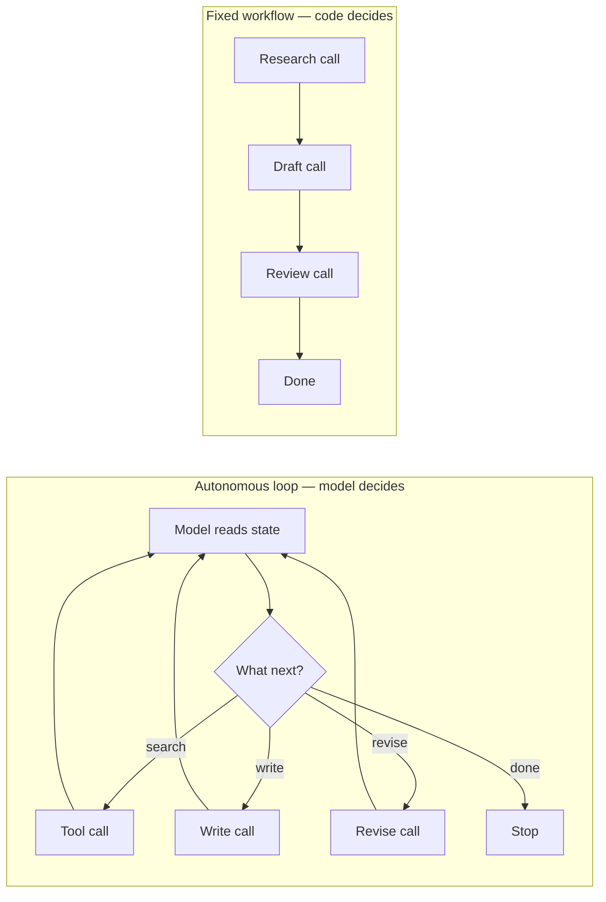
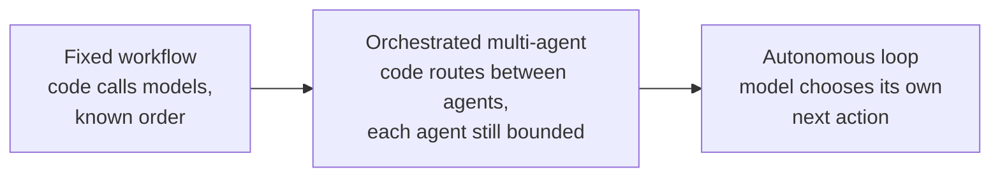

# Orchestration vs. autonomy

Every multi-agent system sits somewhere on a spectrum between two ends. At one end, code decides what happens next: a fixed sequence of steps, each one a model call, wired together the way you'd wire any function pipeline. At the other end, the model decides what happens next: it reads the situation, picks a tool, looks at the result, and picks again, for as many steps as it judges necessary. The first is a workflow. The second is an agent loop. Almost every real system is a mixture, and the mixture is a design decision, not an accident.

## The problem in one diagram



<p className="fig-caption"><strong>Figure 1.1</strong> — Same task, two shapes. The workflow's call count and order are known before it runs. The loop's are not — LD can route back to itself an unbounded number of times.</p>

The workflow costs exactly four calls, every run, and you can say in advance what each one does. The loop might finish in three calls or in thirty; whether it finishes at all depends on the model consistently recognizing "done." Neither shape is better in the abstract. The workflow is worse at handling a task whose structure genuinely can't be known ahead of time — you can't hardcode the order of a debugging session. The loop is worse at a task whose structure is already known, because every extra call is unearned cost and unearned risk with no compensating benefit.

The mistake this chapter is about is picking the loop by default, because it feels more like "an agent" and less like plumbing. Most tasks that reach production have a knowable structure. The loop is for the ones that don't.

## The pattern



<p className="fig-caption"><strong>Figure 1.2</strong> — The spectrum. Moving right, code gives up more decisions to the model. ProjectOS (chapter 9) sits at the left end: a static lookup table, no loop anywhere in the routing path.</p>

The middle point is the one most systems actually want, and it's easy to undersell because it doesn't feel as "agentic" as the right end. **Orchestrated multi-agent** means code still decides which specialist handles a given piece of work — usually from a small, enumerable set of states or intents — but each specialist may itself run a short bounded sequence, or even a small loop with a hard iteration cap. The router doesn't loop. Only the thing it routes to, briefly, might.

Here is the same routing decision built two ways — the difference is not the presence of an `if`, it's whether anything on the right side of that `if` can call itself:

```python
# Orchestrated: a lookup, not a loop. This function cannot run twice
# in the same request no matter what any agent decides.
STAGE_AGENT = {"intake": intake_agent, "planning": planning_agent, ...}
def route(project):
    return STAGE_AGENT[project.stage](project)   # one call, returns

# Autonomous: the model's own output decides whether this runs again.
def agent_loop(state, max_iterations=10):
    for _ in range(max_iterations):
        action = model.decide(state)               # the model picks
        if action.type == "done":
            return action.result
        state = execute_tool(action)                # loop continues
    raise IterationLimitExceeded()
```

The orchestrated version is a dictionary lookup wearing a design pattern's clothes — which is the point. It cannot spend more than one call's worth of money or take more than one call's worth of action per invocation, because nothing in it can call itself. The autonomous version can, up to `max_iterations`, and that cap is doing all the work of keeping it bounded; delete it and the function is unbounded. Chapter 2 is what a gate on that boundary looks like when the check is more than a loop counter.

## Decision rules

### Use a fixed workflow when

- The steps and their order are knowable before the run starts. "Research, then draft, then review" doesn't need a model to decide it's research-then-draft-then-review.
- You need a predictable cost and latency budget. A workflow's call count is a constant; a loop's is a random variable with a long tail.
- Auditability matters. "What did the system do" for a workflow is the code. For a loop, it's whatever the model decided at each of an unknown number of steps.

### Use orchestrated multi-agent when

- Different parts of the task genuinely need different context, tools, or model tiers — not "this feels complex," but a specific reason a specialized agent does that one part better.
- The routing decision itself is enumerable: a stage, an intent category, a task type. If you can draw the lookup table, you can code the lookup table.
- You want the reliability of a workflow with the specialization benefit of separate agents. This is most of Part 2's teardowns.

### Use an autonomous loop when

- The task's structure is discovered during the task, not known before it. Debugging, open-ended research, and multi-step tool use where the next tool depends on what the last one returned are the standard cases.
- You've already tried the workflow and it broke on inputs whose shape you didn't anticipate, repeatedly, in a way a slightly more flexible loop would handle.
- You are prepared to pay for chapter 2 (a gate on the loop's output), chapter 3 (state that survives a crash mid-loop), and chapter 8 (a hard iteration cap and a spend cap) before it reaches production. An autonomous loop without those three is a liability, not a feature.

### The test

Ask: **can I write down, right now, the fixed sequence of calls this task requires — not "roughly," but as a list I'd be willing to hardcode?** If yes, you want a workflow, possibly with orchestrated routing at one point. If you genuinely can't, because the next step depends on information you only have after the current step runs, that's the actual argument for a loop — not that the task sounds complicated.

## Failure modes

### Autonomy by default

The system is built as a loop because that's what "agent" suggested, for a task whose steps were knowable the whole time. Every iteration is unearned latency, unearned cost, and an unearned chance for the model to route somewhere the workflow would never have gone. Fix: write down the fixed sequence first. Only add a loop where the sequence genuinely can't be written down.

### The loop with no exit condition the model reliably recognizes

"Done" is defined by the model's own judgment, and the model is inconsistent about recognizing it — it re-searches after finding the answer, or revises a draft that was already fine. Chapter 8 covers this at length; the short version is that `max_iterations` is a safety net, not a design, and a loop that regularly hits its cap is a loop whose stopping criterion is broken, not just capped.

### Orchestration with a loop hiding inside the router

The router itself is described as "just routing" but contains a retry-until-satisfied path that can call itself. This is an autonomous loop wearing orchestration's reputation. Fix: if any function in the routing path can invoke itself based on a model's output, it's the autonomous end of the spectrum, regardless of what it's called.

### No budget for what autonomy actually costs

A loop is approved because "it'll probably take two or three steps." Nothing enforces that; chapter 6 is the pattern for making the cost of the unbounded end actually bounded in practice, not just in the common case.

## Where it shows up in the teardowns

- **[ProjectOS](../teardowns/projectos)** sits at the orchestrated-workflow end on purpose. `STAGE_AGENT` in `src/lib/agents.js` is a seven-entry lookup table with no loop anywhere in the routing path — see [Figure 9.1](../teardowns/projectos#architecture) and [Figure 9.2](../teardowns/projectos#control-flow). Nothing in the system decides to call itself; the closest thing to autonomy is the retro agent choosing a value for `advance_stage`, and even that write is a single field on a single call, not an iteration.
- **Lyceum** runs a bounded multi-phase pipeline rather than an open loop. Chapter 10 reads the source.
- **Second Brain** and **Aible** are both closer to fixed workflows than to autonomous loops — a retrieval-then-synthesis pipeline and a phased authoring pipeline, respectively. Chapters 11 and 12.

:::tip[My take]

The tell I look for first, in a codebase or in my own draft design, is whether I can point at the one function that would have to call itself for the system to be autonomous. If there isn't one, the system is a workflow no matter how many separate model calls it makes or how many of them are labeled "agent." If there is one, everything downstream — the gate on its output, the state it needs to resume after a crash, the cap on how many times it can go around — stops being optional. Naming that function early is usually the fastest way to find out you didn't need it.

:::

## Reference material

- [Multi-Agent Systems](../core-building-blocks/multi-agent-systems) — topologies (sequential, parallel, hierarchical, router) as concrete shapes for the orchestrated middle of the spectrum.
- [Function Calling](../core-building-blocks/function-calling) — the tool-call loop mechanics that an autonomous agent is built from.
- [Orchestration Frameworks](../meta-infrastructure/orchestration-frameworks) — LangGraph, DSPy, and raw-SDK tradeoffs for building either end of the spectrum.
- [Long-Horizon Agents](../aspirational/long-horizon-agents) — what the autonomous end needs before it's safe to run unattended: checkpointing, human-in-the-loop gates, a dead-man's switch.
- [Access Control for Agents](../meta-infrastructure/access-control) — least-privilege tool scoping, which matters more the further right you sit on the spectrum.
