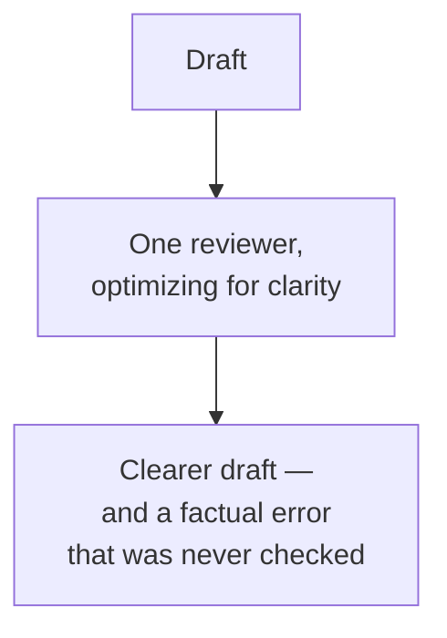
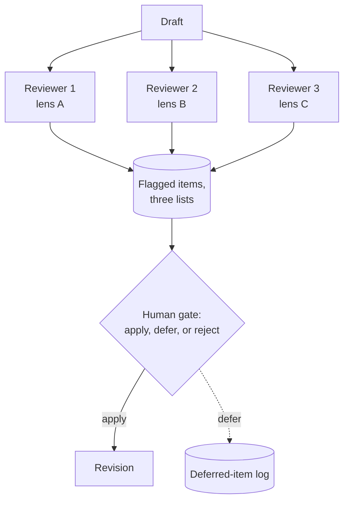

# QA pipelines

I ran a version of this pattern twice while writing this book. Once, months ago, to review the forty-five reference pages this site is built on: three parallel reviewers, one lens each, six phases. And again today, on the two chapters you're reading right now: a pedagogy reviewer and a presentation reviewer, run in parallel, both reporting back inside the same ten minutes. Both times the hard part wasn't getting the reviewers to find things. It was deciding what to do with what they found.

A single reviewer, however good, has blind spots that correlate with what it's paying attention to. A reviewer optimizing for correctness won't notice the surrounding explanation is opaque to a newcomer. A reviewer optimizing for clarity might rewrite a passage into something readable that's quietly wrong. A QA pipeline is the fix: several reviewers with genuinely non-overlapping mandates, running against the same draft, followed by one gate that decides what actually changes.

## The problem in one diagram

<strong>Figure 5.1</strong> — One reviewer catches what its mandate points it at. A clarity pass can make a wrong sentence read better without anyone checking whether it's still wrong.

This isn't a claim that any one reviewer is bad at its job. It's that a reviewer's mandate is also a blind spot, and a single reviewer has exactly one. Ask a model to make a page clearer and it will — and it has no reason to flag that the clearer sentence changed a security-relevant detail, because nobody asked it to look for that. Stack two or three reviewers with different mandates against the same draft and each one's blind spot is a different one's job.

## The pattern

<strong>Figure 5.2</strong> — Three reviewers, one draft, no reviewer sees the others' output. A person reconciles all three lists before anything changes.

Three things make this a pipeline and not just three separate reviews happening near each other. First, the lenses genuinely don't overlap — in the review process this book itself went through, that was a technical-accuracy lens, a pedagogical lens, and a security lens, chosen specifically because a factual error, a comprehension gap, and an injection vector are different kinds of defect that don't show up to the same reader. Second, the reviewers don't see each other's output — each one reads the same draft cold, so their disagreements are real signal, not one reviewer anchoring on another's framing. Third, and this is the part that actually makes the pipeline work rather than just make noise: a person reconciles all three lists into three buckets — apply now, defer, or reject — instead of applying everything a reviewer suggested.

That third part matters more than it sounds like it should. Reviewers, especially the ones optimizing for clarity or completeness, will find an unbounded number of things to improve — every page can always be a little clearer, every example can always have one more caveat. Applying all of it doesn't converge on a better page, it converges on a longer one. The gate isn't there to catch reviewer mistakes; the reviewers are usually right about the specific thing they flagged. It's there because "right about this one thing" and "worth changing right now" are different questions, and only a person weighing the whole draft can answer the second one.

## Decision rules

### Use a multi-reviewer pipeline when

- The kinds of defects you care about genuinely don't overlap — a factual error and a confusing explanation are different failure modes, and a single reviewer prompted to catch everything usually catches whichever one its prompt leans toward.
- You can name the lenses in advance. If you can't say what each reviewer is specifically responsible for catching, you don't have separate lenses, you have the same reviewer run three times with different adjectives in its prompt.
- Someone is going to sit at the gate. A pipeline that auto-applies everything every reviewer flags isn't a QA pipeline, it's a length generator.

### Do not use a multi-reviewer pipeline when

- One good reviewer already catches what you care about. Three lenses for a one-paragraph change is review theater, not quality control.
- Nobody has time to reconcile the output. Three lists of flagged items that nobody triages is worse than one list, because now the unaddressed backlog is three times as long and looks like it was handled.
- The draft changes fast enough that review can't keep up. A pipeline built for a document that's revised once a week doesn't fit a system generating new output every request — that's chapter 4's territory, a sampled judge, not a full review pass.

### The test

Ask: **can I name, for each reviewer, one category of defect the other reviewers would not have caught?** If two of your three reviewers would have flagged the same issue, you don't have three lenses, you have redundancy dressed up as coverage.

## Failure modes

### Reviewer over-flagging

Left unconstrained, a reviewer optimizing for any single quality dimension will find an unbounded number of things to improve, because there's always a next improvement. In the review pass this book's reference pages went through, each phase's three reviewers together produced fifteen to thirty-five flagged items for five to seven pages, and something like a third of that was worth deferring or rejecting outright — not because the reviewers were wrong, but because not every true observation is worth acting on today. Fix: the gate isn't optional, and its job is explicitly to say no to correct feedback, not just incorrect feedback.

### Deferred items disappearing

A long session runs, review happens, some flagged items get deferred rather than applied — and if the deferred list only exists in the conversation, it's gone the moment that conversation is compressed or ends. This book's own authoring process learned this the hard way: writing deferred items to a durable file at review time, not at phase close, is what survives a session ending early. An applied change is recoverable from a diff; a deferred idea that only lived in chat history is not.

### Reviewers with no memory reviewing the same thing twice

Each reviewer agent starts fresh, with no memory of a prior session's review. If you don't tell the new reviewer what was already fixed, it re-flags the same items the last pass already applied, and you spend the gate's attention re-deciding things that were already decided. Fix: brief every reviewer with what's already been addressed, not just the current draft.

### Lenses that quietly converge

Two reviewers with different names but the same underlying instinct — "check for clarity" and "check for readability" are close enough to be the same lens twice — produce agreeing lists that look like confirmation but are really just one opinion counted twice. Fix: the test above. If you can't name what one lens catches that the other wouldn't, merge them.

## Where it shows up in the teardowns

- **This site's reference library** was built through exactly this pattern, though it isn't one of the teardowns below: three parallel reviewers (technical accuracy, pedagogical, security), each reading the same draft with no visibility into the others' output, reconciled by a human gate across six phases. The chapter you're reading went through a smaller version of the same thing today — two reviewers, not three, with different lenses (structure and narrative; presentation and rendering), and the same gate.
- **[Lyceum](../teardowns/lyceum)** runs a nine-agent, four-phase QA pipeline over generated course content — the largest reviewer pipeline in this book's teardowns, and one of the open questions once that teardown is written is whether its phases are genuinely non-overlapping lenses or a longer version of the same check repeated.
- **[ProjectOS](../teardowns/projectos)** doesn't run a multi-reviewer pipeline in this sense — its quality control is the single sampled judge from chapter 4, which is a different pattern solving a related problem at a different cadence.

:::tip[My take]

The thing I didn't expect, running this pattern on my own writing today, is how much the gate is actually the expensive part, not the review. Getting two reviewers to independently find real problems took about ten minutes and no judgment from me at all. Deciding which of their findings to act on, in what order, without either ignoring something true or rewriting half the book on the spot — that took the rest of the session. If you're budgeting time for a QA pipeline, budget it for the gate, not the reviewers. The reviewers are the cheap part.

:::

## Reference material

- [Red Teaming](../meta-infrastructure/red-teaming) — adversarial review as a fourth kind of lens, distinct from correctness or clarity.
- [Evals](../meta-infrastructure/evals) — turning what a reviewer catches into a repeatable check, once you know what you're looking for.
- [Multi-Agent Systems](../core-building-blocks/multi-agent-systems) — the critic-revise loop and validator-agent patterns this chapter's parallel-reviewer shape is a variant of.
- [Structured Outputs](../core-building-blocks/structured-outputs) — typed flagged-item lists, so a gate can triage programmatically instead of re-reading free text.
