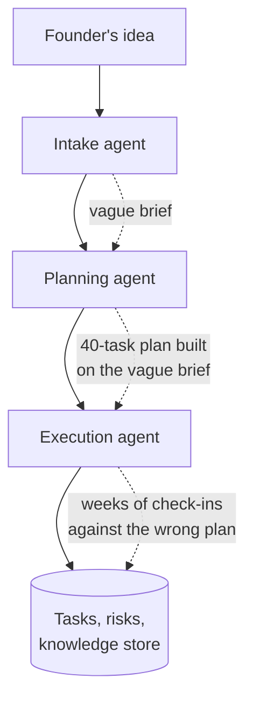
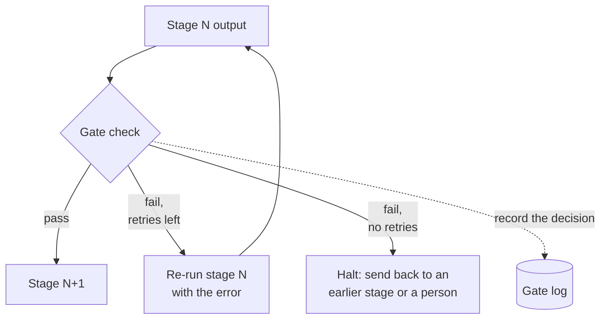
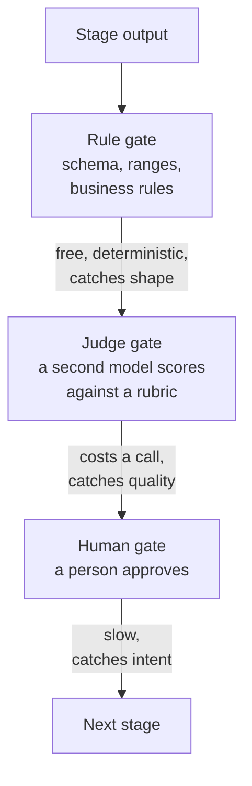
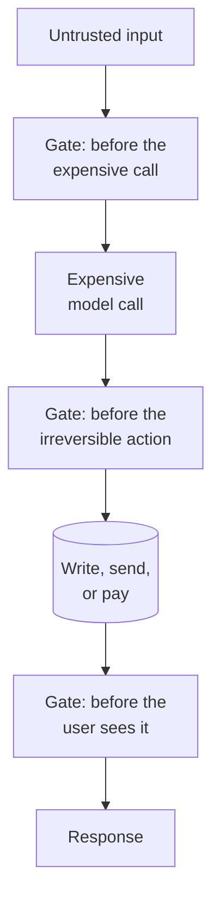

# Stage gates

I designed three gates into ProjectOS. One of them checks anything.

The other two, `gatePlanning` and `gateRetro`, are supposed to check something before letting the next step happen. They don't. Each one reads the project's data — its row, meaning its one record in the database, the stored facts about that particular project — and hands back an empty result without actually checking any of it, the code equivalent of a bouncer who looks at your ID and waves you through without reading it. Their header comments still describe real checks — "blocks planning if the brief's confidence score is below 70," "blocks a new milestone until the previous one has a retro." Neither runs. I didn't find this by reading the file line by line; I found it the way I find most of the dead ends in that codebase, by running the code past a few rounds of AI-assisted review, different models and different prompts, each one told to check whether a function does what its own name and comment claim it does. Read the dispatcher on its own — the piece of code that looks at which stage a project is in and decides which gate function to call — and all three gates look identical: same file, same comment style, same place they get called from. Nothing about the code tells you which one is real. You have to open the function.

A gate is a checkpoint between two phases of a pipeline: work doesn't move on until a check passes. The check can be a rule, a second model, or a person. What makes it worth a chapter isn't the checkpoint itself, it's where it sits — a gate is the last moment before the pipeline spends the next dollar, and the last moment before it does something that can't be undone. Every pipeline reaches both of those moments. Without a gate, it just reaches them without you.

## The problem in one diagram



<p className="fig-caption"><strong>Figure 2.1</strong> — An ungated pipeline. A weak brief becomes a detailed plan, then weeks of tracked work, and finally "lessons" written to memory. Every stage compounds the defect from the stage before.</p>

This is the shape the problem takes with no checks anywhere: a founder's two-line idea becomes a brief, the brief becomes a forty-task plan, the plan becomes three weeks of tracked execution. Nothing in that chain malfunctions. The planning agent doesn't know the brief is thin — nobody asked it to check, they asked it to plan — so it does its job well, on bad input, and hands back something confident and detailed and wrong from the first line. The execution agent inherits that and adds three weeks of tracked progress on top of it. By the time anyone notices, usually mid-execution, when a task stops making sense against the plan, the original mistake has already been amplified twice.

The arithmetic behind that is unforgiving. Chain five agent calls at 95% reliability each and the chain isn't 95% reliable — it's roughly 0.95⁵, about 77%. Chapter 8 works through error propagation properly; the point here is narrower: the cheapest place to catch a defect is the boundary where it was made, and every stage after that boundary is spending real money — tokens, and a person's time if there are human turns in the loop — producing output that has to be regenerated. The last arrow in the diagram is the one that costs the most to get wrong: it writes to a store future runs will read from. A retro built on a bad plan becomes advice for the next plan. You can't un-write that once you know it was wrong; you can only add a correction on top of it.

## The pattern



<p className="fig-caption"><strong>Figure 2.2</strong> — Anatomy of a gate. Output is checked; on pass it moves on; on fail it is retried a bounded number of times, then halted. Either way the decision is written down.</p>

A gate has four parts. Leave any one of them out and what you've built isn't a gate, it just looks like one on a diagram:

1. **A criterion.** What counts as pass — something a colleague could disagree with you about. "The plan has at least one phase, every task has an estimate" is a criterion. "The plan is good" is not.
2. **A checker.** The thing that applies the criterion. Figure 2.3 covers the three kinds.
3. **A fail action.** Retry with the error fed back, halt and route to an earlier stage, or escalate to a person. The retry count is bounded — an unbounded retry is a loop, and chapter 8 is what loops cost.
4. **A record.** The gate writes down what it decided and why. Chapter 3 is about where that record lives; without it you can't tell whether the gate is working, firing too often, or being rubber-stamped.

Here's a minimal rule gate with all four parts labelled. The part most implementations skip isn't the check, it's the retry ceiling and feeding the error back on the next attempt:

```python
def validate_plan(plan: dict) -> str | None:
    """Return None on pass, an error string on fail."""
    if not plan.get("phases"):
        return "plan has no phases"
    for phase in plan["phases"]:
        if not phase.get("tasks"):
            return f"phase {phase['id']} has no tasks"
    return None

def run_gated(build_plan, max_attempts=2):
    error = None
    for attempt in range(max_attempts):
        plan = build_plan(previous_error=error)   # feed the error back on retry
        error = validate_plan(plan)
        log_gate_decision(attempt, error)         # part 4: the record
        if error is None:
            return plan                            # part: pass
    raise GateHalt(f"plan failed validation twice: {error}")  # part: fail action
```

`validate_plan` is the criterion, calling it is the checker, the retry-with-`previous_error`-then-`GateHalt` is the fail action, `log_gate_decision` is the record. Every failure mode later in this chapter is what happens when one of those four goes missing.



<p className="fig-caption"><strong>Figure 2.3</strong> — The three kinds of checker, in the order they should run. Each is more expensive and catches a different class of defect than the one before it.</p>

These three don't compete, they layer. A rule gate is free and deterministic — it always gives the same verdict for the same input, no AI judgment involved — so it goes first and rejects anything malformed before a model or a person ever has to look at it. A judge gate costs a call and catches what a schema (a definition of what fields the data must have, and in what shape) can't — a plan that's correctly formatted but assigns forty hours of work to a ten-hour week. Chapter 4 is about building a judge you can actually trust. A human gate is the slowest of the three, and the only one that catches a mismatch between what the system produced and what the person actually wanted.

The mistake I see most often — and made myself, in the ProjectOS design — is skipping the cheap layers and putting a person on everything. People stop reading what they're shown too often to see, and a human gate that fires on every turn eventually gets approved without being read at all. I don't have a clean number for how fast that happens, only that it does. Chapter 5 is about keeping the human gate rare enough to still mean something.



<p className="fig-caption"><strong>Figure 2.4</strong> — Where gates belong. Before money is spent, before something cannot be undone, and before a person acts on the output.</p>

Three places in any pipeline earn a gate's cost. Before the expensive call: validate input before sending it to the model that costs the most — rate limits, spend caps, input checks. Before the irreversible action: a database write, an email, a payment, a stage transition — this is usually where the human gate belongs, because it's the last point where a wrong answer is still free. Before the user sees it: output validation and safety checks, where a wrong answer is recoverable but costs trust.

## Decision rules

### Add a gate when

- The next stage costs more than the check does. A schema check is free; a planning call that generates six thousand tokens is not.
- The next action is hard to reverse: writes to shared state, sends a message to another person, moves money.
- This stage's output fans out. If three later stages all read from it, a defect here becomes three defects there.
- You can state the criterion as a sentence someone could disagree with.

### Do not add a gate when

- The check would cost more than the stage it protects — gating a one-line summary with a judge call doubles its cost for nothing.
- You can't state the criterion. A gate without one either always passes (decoration) or always fails (a wall).
- The stage is cheap and reversible. Validate the output, log it, move on — a gate is for stopping, validation is for noticing.
- Your only criterion is a proxy for the thing you actually care about. I built exactly this mistake into ProjectOS: a confidence score meant to catch a bad brief that instead tracked how many assumptions the brief admitted to, so the honest briefs failed and the vague ones sailed through. More in the teardown below.

One more rule chapter 3 earns properly: the gate's criterion has to be stored state, not something inferred from a conversation. "The founder approved the plan" is a boolean column — a database field that holds only yes or no — with a timestamp, or it's a guess.

### The test

Ask: **if this gate fails on a real run tomorrow, what happens next, and who finds out?** "Nothing" or "nobody" means you've drawn a gate on a diagram, not built one.

## Failure modes

### The gate that isn't there

A gate gets designed, documented in a header comment, and later disabled with an early return — a line of code that hands back "pass" immediately, before the actual check ever runs — usually because it blocked something it shouldn't have, and the fastest unblock was to stop it checking rather than fix what it checked. The comment doesn't get touched, because the comment isn't wrong about what the gate was supposed to do. Now the file is lying, and every reader of it, human or model, believes the check still runs. This is `gatePlanning` and `gateRetro` in ProjectOS, and I wrote both of them. Fix: a test that fails when the gate is bypassed. If you can't write that test, there was never a gate there to bypass.

### Gate on the wrong proxy

The criterion measures something adjacent to what you actually care about. Fix: gate on the thing you'd argue about with a colleague, not the number that's easiest to compute. The teardown below has the specifics of how this went wrong in ProjectOS.

### Client-side gate

The check is enforced by whether a button is enabled. That button lives in the user's own browser, which the user controls completely — disabling it there stops nothing if they can still send the request directly, and the system accepts the transition from any state, from anyone who owns the project. Fix: the server enforces the criterion; the interface mirrors it for convenience, nothing more.

### Unbounded retry

Gate fails, stage regenerates, gate fails, stage regenerates. ProjectOS's planning agent caps this at two attempts — `maxAttempts = 2`, a literal constant in `planning.agent.js` — and that number isn't derived from measuring failure rates, it's a line I drew to stop the run before it could loop indefinitely. The same instinct shows up elsewhere in the same system in a different shape: the intake agent's prompt is told to ask at most one clarifying question, and a separate override forces it to finalize the brief once the founder confirms, so a conversation that would otherwise keep probing every open unknown gets cut off on purpose instead of left to the model's judgment. Neither cap came from data. Both exist because "let it keep going until it's satisfied" turned out to mean, in practice, that it doesn't stop. Fix: a retry ceiling with the error fed back on each attempt, and a distinct halt path when the ceiling is hit.

### The unrecorded gate

Pass and fail aren't written anywhere. You can't tell whether the gate fires, how often, or whether it catches anything. Fix: every gate decision is a row — criterion, outcome, reason.

### The rubber stamp

The human gate fires so often, or shows so much, that the person stops reading it. ProjectOS avoids this one at its single human gate: the part of the system that handles an approval request (its "endpoint") returns a plan summary instead of silently succeeding when the request arrives without an explicit `confirmed: true`, so approving requires looking at something, not just clicking through a default. Fix, generally: fire rarely, show a summary that fits on one screen, require an explicit value rather than defaulting to yes.

## Where it shows up in the teardowns

- **[ProjectOS](../teardowns/projectos)** is this chapter's whole argument in one codebase. The live gate — plan approval — is a human gate done right: the approval either fully commits or doesn't happen at all, nothing half-done (a "transactional" flip of a stored yes/no value), guarded so two people approving at the same instant can't both succeed and corrupt the record, with a decision log, see [The gates](../teardowns/projectos#the-gates). The other two are the failure mode above, [The gate that isn't there](#the-gate-that-isnt-there), sitting in the same file under the same dispatcher. The milestone-completion check that should be a third gate lives entirely in a UI button — [Client-side gate](#client-side-gate).
- **[Lyceum](../teardowns/lyceum)** runs generated course content through a four-phase QA pipeline where each phase gates the next before it reaches a student.
- **[Second Brain](../teardowns/second-brain)** gates at ingest: existing articles are shown as a diff — the old and new text side by side, with the changes highlighted — before they're updated, and nothing lands in the wiki without a person looking at that diff.
- **This site** is written through a human gate too, though it isn't one of the teardowns — three reviewer agents run in parallel over each chapter, and I decide what to apply. They over-flag, badly, and if I applied even half of what came back these pages would be twice as long and worse. The gate is me, sitting there rejecting things.

:::tip[My take]

What surprised me most, going back through this file, wasn't that two gates were dead — it's that I couldn't tell which two just by reading the dispatcher. All three gates are called the same way, described the same way, sitting in the same file. The only thing that told them apart was opening each function and reading past the comment to the return statement, and I only did that systematically after running the code through a few rounds of AI-assisted review pointed specifically at "does this function do what its name claims." A gate's presence in the code that calls it tells you nothing about whether it checks anything. If I take one habit from writing this chapter, it's to stop trusting a dispatcher's shape and start reading every gate's body before I ship it.

:::

## Reference material

- [Output Validation](../meta-infrastructure/output-validation) — building rule gates: schema enforcement, retries with error feedback, and where the retry ceiling should be.
- [Confidence Estimation](../production-concerns/confidence-estimation) — what a confidence score can and cannot tell you, and why verbalized confidence is a weak gate criterion.
- [Guardrails](../meta-infrastructure/guardrails) — input and output gates for safety, and when input guards are enough.
- [Long-Horizon Agents](../aspirational/long-horizon-agents) — human-in-the-loop gates, checkpointing, and the dead-man's switch as a gate on time.
- [Evals](../meta-infrastructure/evals) — turning a criterion into a check you can run repeatedly.
- [Multi-Agent Systems](../core-building-blocks/multi-agent-systems) — validator agents and critic-revise loops as gates between agents.
