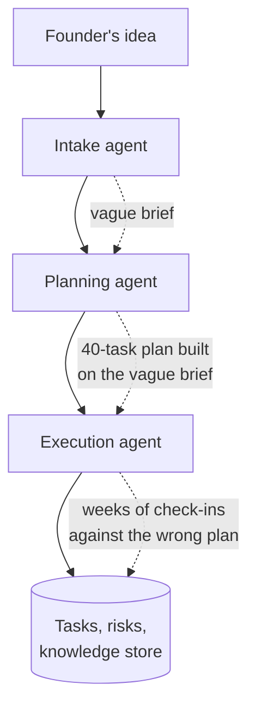
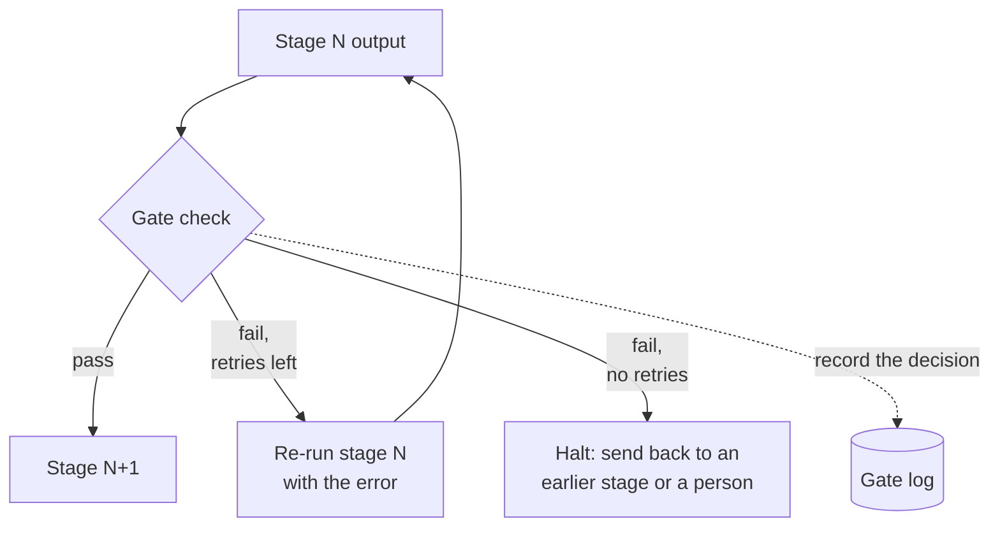
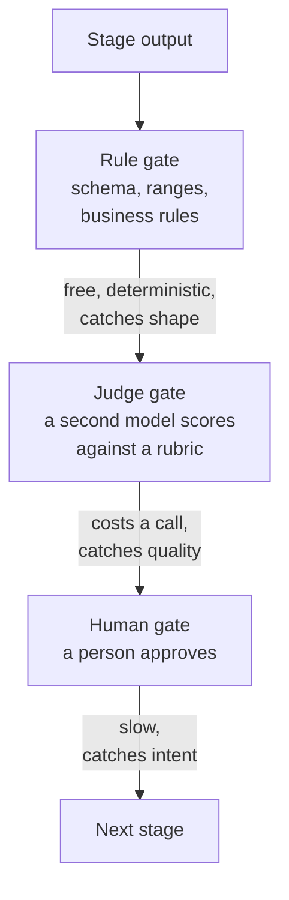
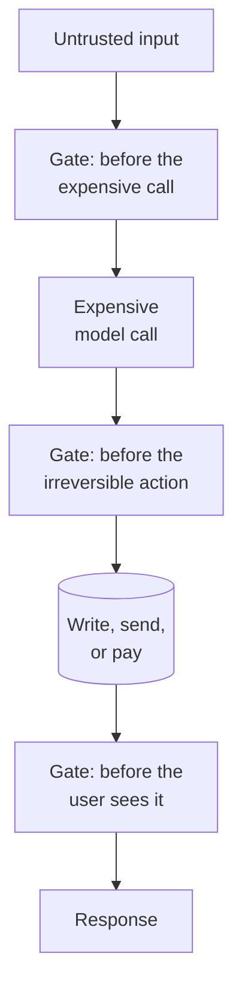

# Stage gates

A stage gate is a checkpoint between two phases of a pipeline. Work does not pass from one phase to the next until a check passes. The check can be a rule, a second model, or a person. In an agentic system the gate is the one place where you get to decide two things before they happen: whether to spend the next dollar, and whether to take the next step that cannot be undone.

## The problem in one diagram



<p className="fig-caption"><strong>Figure 2.1</strong> — An ungated pipeline. A weak brief becomes a detailed plan, then weeks of tracked work, and finally "lessons" written to memory. Every stage compounds the defect from the stage before.</p>

Figure 2.1 shows three things going wrong at once, and all three are the same mistake.

**Errors compound.** The planning agent does not know the brief is vague. It does what it was told and produces a confident, detailed plan. The execution agent then tracks progress against that plan. By the time a person notices, the defect has been amplified twice. If a chain of five agent calls is each individually 95% reliable, the chain as a whole is not 95% reliable — it's roughly 0.95⁵, about 77%. Chapter 8 covers error propagation in detail; the short version is that the cheapest place to catch a defect is the boundary where it was made.

**Money is spent on work that will be thrown away.** Each stage after the defect burns tokens producing output that has to be regenerated. In a system with human turns between stages, it also burns the person's time.

**Irreversible things happen on unverified state.** The last arrow in the diagram writes to a knowledge store that future projects will read. A retro derived from a wrong plan becomes advice for the next plan. The write cannot be un-taken without knowing it was wrong.

## The pattern



<p className="fig-caption"><strong>Figure 2.2</strong> — Anatomy of a gate. Output is checked; on pass it moves on; on fail it is retried a bounded number of times, then halted. Either way the decision is written down.</p>

Figure 2.2 is the whole pattern. A gate has four parts, and something that is missing any one of them is not a gate:

1. **A criterion.** What counts as pass. It has to be something a colleague could disagree with you about. "The plan has at least one phase, every task has an estimate" is a criterion. "The plan is good" is not.
2. **A checker.** The thing that applies the criterion. Figure 2.3 shows the three kinds.
3. **A fail action.** Retry with the error fed back, halt and route to an earlier stage, or escalate to a person. The retry count is bounded. An unbounded retry is a loop, and chapter 8 is about what loops cost.
4. **A record.** The gate writes down what it decided and why. Without the record you cannot tell whether the gate is working, whether it fires too often, or whether anyone is rubber-stamping it. Chapter 3 is about where that record lives.

A minimal rule gate, in full — the part that most implementations skip is the retry ceiling and the error being fed back on the next attempt, not the check itself:

```python
def validate_plan(plan: dict) -> str | None:
    """Return None on pass, an error string on fail."""
    if not plan.get("phases"):
        return "plan has no phases"
    for phase in plan["phases"]:
        if not phase.get("tasks"):
            return f"phase {phase['id']} has no tasks"
    return None

def run_gated(build_plan, max_attempts=2):
    error = None
    for attempt in range(max_attempts):
        plan = build_plan(previous_error=error)   # feed the error back on retry
        error = validate_plan(plan)
        log_gate_decision(attempt, error)         # part 4: the record
        if error is None:
            return plan                            # part: pass
    raise GateHalt(f"plan failed validation twice: {error}")  # part: fail action
```

That is the whole pattern: a criterion (`validate_plan`), a checker (calling it), a fail action (retry with `previous_error`, then `GateHalt`), and a record (`log_gate_decision`). Everything else in this chapter is what happens when one of those four is missing.



<p className="fig-caption"><strong>Figure 2.3</strong> — The three kinds of checker, in the order they should run. Each is more expensive and catches a different class of defect than the one before it.</p>

The three checkers in Figure 2.3 are not alternatives. They layer. A rule gate is free and deterministic, so it runs first and rejects anything malformed before a model or a person ever sees it. A judge gate costs a model call and catches things a schema cannot: a plan that is valid JSON but assigns forty hours of work to a ten-hour week. Chapter 4 is about how to build one that you can trust. A human gate is the slowest and the only one that can catch a mismatch between what the system produced and what the person actually wanted.

The mistake is to skip the cheap layers and put a person on everything. People approve what they are shown too often to see, so a human gate that fires on every turn becomes a rubber stamp within a week. Chapter 5 is about keeping the human gate rare enough to mean something.



<p className="fig-caption"><strong>Figure 2.4</strong> — Where gates belong. Before money is spent, before something cannot be undone, and before a person acts on the output.</p>

Figure 2.4 answers the placement question. There are three places in any pipeline where a gate earns its cost:

- **Before the expensive call.** Validate input before sending it to the model that costs the most. Rate limits, spend caps, and input checks all live here.
- **Before the irreversible action.** A database write, an email, a payment, a stage transition. This is where the human gate usually belongs, because it is the last point at which a wrong answer costs nothing.
- **Before the user sees it.** Output validation and safety checks. A wrong answer here is recoverable but expensive in trust.

## Decision rules

### Add a gate when

- The next stage costs more than the check does. A schema check is free; a planning call that generates six thousand tokens is not.
- The next action is hard to reverse. Anything that writes to shared state, sends a message to another person, or moves money.
- This stage's output fans out. If three later stages all read from it, a defect here becomes three defects there.
- You can state the criterion as a sentence someone could disagree with.

### Do not add a gate when

- The check would cost more than the stage it protects. Gating a one-line summary with a judge call doubles its cost for nothing.
- You cannot state the criterion. A gate without a criterion either always passes, which is decoration, or always fails, which is a wall.
- The stage is cheap and reversible. Validate the output, log it, and move on. A gate is for stopping; validation is for noticing.
- The only criterion you have is a proxy for the thing you care about. A "confidence score" that actually measures how many assumptions were logged will block honest outputs and pass evasive ones. The ProjectOS teardown has exactly this case.

One more rule that chapter 3 will earn properly: the gate's criterion has to be stored state, not something inferred from the conversation. "The founder approved the plan" is a boolean column with a timestamp, or it is a guess.

### The test

Ask: **if this gate fails on a real run tomorrow, what happens next, and who finds out?** If the answer is "nothing" or "nobody," you have drawn a gate on a diagram and not built one.

## Failure modes

### The gate that isn't there

A gate is designed, documented in a header comment, and later disabled with an early return. The documentation outlives the code. Every reader of the file, human or model, believes the check exists. Fix: every gate has a test that fails when the gate is bypassed. If you cannot write that test, you do not have a gate.

### Gate on the wrong proxy

The criterion measures something adjacent to what you care about. ProjectOS gated planning on a confidence score that turned out to measure assumption density, so honest briefs that logged their unknowns failed and vague briefs that logged nothing passed. The gate was removed, which was the right call. Fix: gate on the thing you would argue about with a colleague, not the number that is easiest to compute.

### Client-side gate

The check is enforced by whether a button is enabled. The API accepts the transition from any state. Fix: the server enforces the criterion; the UI mirrors it for the person's convenience.

### Unbounded retry

Gate fails, stage regenerates, gate fails, stage regenerates. Fix: a retry ceiling, with the validation error fed back to the model on each attempt, and a distinct halt path when the ceiling is hit. Two attempts is usually enough. If the third attempt would help, the criterion is unclear.

### The unrecorded gate

Pass and fail are not written anywhere. You cannot tell whether the gate fires, how often, or whether it catches anything. Fix: every gate decision is a row, with the criterion, the outcome, and the reason.

### The rubber stamp

The human gate fires so often, or shows so much, that the person stops reading. Fix: fire rarely, show a summary that fits on one screen, and make the approve action require an explicit value rather than a default. ProjectOS returns a plan summary when the approval request arrives without an explicit confirmation, which is the right shape.

## Where it shows up in the teardowns

- **[ProjectOS](../teardowns/projectos)** designed three gates and shipped one. The live gate is a human approval that flips a boolean inside a transaction and writes a decision log — see [The gates](../teardowns/projectos#the-gates). The other two are functions that return without checking anything, while the file header still describes them as active: see [The gate that isn't there](#the-gate-that-isnt-there) above. The milestone-completion check that should be a gate lives in a UI button — [Client-side gate](#client-side-gate). This is the chapter's cautionary example and its best example in the same codebase.
- **Lyceum** runs generated course content through a four-phase QA pipeline where each phase gates the next. Chapter 10 reads the source.
- **Second Brain** has a human gate at ingest: existing articles are shown as a diff before they are updated, and nothing enters the wiki without that view. Chapter 11.
- **Aible** itself was written through a human gate between three parallel reviewers and the fix pass. The gate existed because the reviewers over-flagged, and the person deciding what to apply was the only thing keeping the pages from doubling in length. Chapter 12.

:::tip[My take]

The gate people skip is never the expensive one — nobody forgets to check a plan before spending six thousand tokens generating tasks from it. The gate people skip is the cheap one that "obviously" won't fail: the milestone-completion check, the stage-transition guard, the thing that's surely fine because a person would never click the button at the wrong time. ProjectOS is the case study: the one gate that got built is the one guarding the most expensive step (plan approval), and the two that got skipped guard steps that felt too obvious to check. They weren't. A gate you didn't think you needed is the one worth writing the failing test for first.

:::

## Reference material

- [Output Validation](../meta-infrastructure/output-validation) — building rule gates: schema enforcement, retries with error feedback, and where the retry ceiling should be.
- [Confidence Estimation](../production-concerns/confidence-estimation) — what a confidence score can and cannot tell you, and why verbalized confidence is a weak gate criterion.
- [Guardrails](../meta-infrastructure/guardrails) — input and output gates for safety, and when input guards are enough.
- [Long-Horizon Agents](../aspirational/long-horizon-agents) — human-in-the-loop gates, checkpointing, and the dead-man's switch as a gate on time.
- [Evals](../meta-infrastructure/evals) — turning a criterion into a check you can run repeatedly.
- [Multi-Agent Systems](../core-building-blocks/multi-agent-systems) — validator agents and critic-revise loops as gates between agents.
