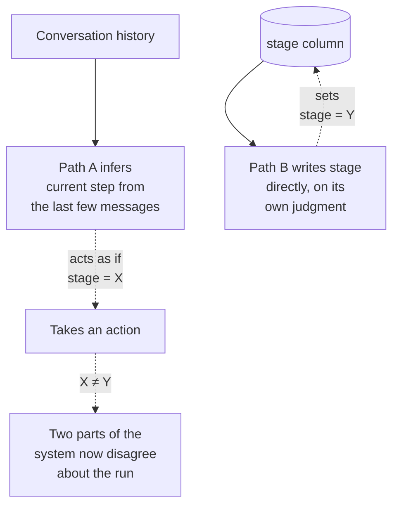
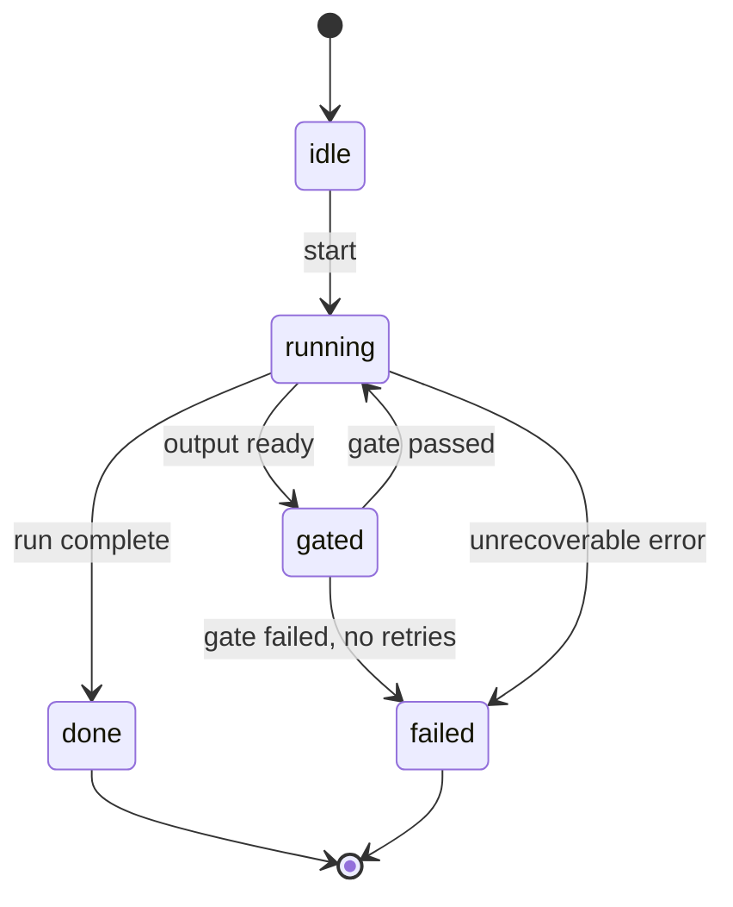

# State machines

Every multi-stage system has to answer one question before it can do anything else: where are we right now? A state machine is the discipline of making that question have exactly one answer, stored in exactly one place, changeable only by a rule you wrote down in advance. Skip the discipline and the answer becomes whatever the last piece of code that looked decided it was — and different pieces of code, looking at the same run, can decide differently.

ProjectOS gets the storage half of this right and the writing half wrong, in the same column, and it's worth understanding both halves before you build your own.

## The problem in one diagram



<p className="fig-caption"><strong>Figure 3.1</strong> — Two ways to answer "where are we," disagreeing. One infers from conversation; one writes to a column. Neither checks the other, so nothing forces them to agree.</p>

This is a milder version of a problem you already know from chapter 2: an ungated pipeline lets a defect through because nothing checks it. Here the defect isn't in the output, it's in the run's own idea of what stage it's in. A stage stored in a column and a stage inferred from the last few messages of a conversation are not the same kind of fact. The column is either right or wrong and you can query it. The inference is a guess that happens to usually be right, until a message gets summarized out of context, a retry replays an old turn, or two requests for the same run land close enough together that each one infers a different answer. None of that shows up as an error. It shows up as two parts of the system quietly acting on different beliefs about the same run.

ProjectOS avoids the worse version of this — it stores `stage` as an actual enum column on the `projects` table, not something inferred from chat history. That's the correct instinct, and most of this chapter is really about what you still have to get right once you've had it. The problem ProjectOS has instead is narrower and, I'd argue, more common: the column is real, but four different things are allowed to write to it, and nothing checks that a given write is a legal move from the stage the project was actually in.

## The pattern



<p className="fig-caption"><strong>Figure 3.2</strong> — A generic run state machine. Every arrow is a named transition, not a value some caller decided to write.</p>

Figure 3.2 has five states and six labelled transitions, and the diagram is not really the point — you could draw a different set of states for your own system and the pattern would still hold. What matters is that the diagram is checkable code, not documentation of what the code happens to do. The states are an enum. The transitions are a table: `{from_state: [allowed_to_states]}`. And every write to the state column goes through one function that consults that table before it writes anything.

```python
TRANSITIONS = {
    "idle":    ["running"],
    "running": ["gated", "done", "failed"],
    "gated":   ["running", "failed"],
    "done":    [],
    "failed":  [],
}

def transition(run, to_state: str, actor: str):
    """The only function in the codebase allowed to write run.state."""
    if to_state not in TRANSITIONS.get(run.state, []):
        raise IllegalTransition(
            f"{actor} tried {run.state} -> {to_state}, not a legal move"
        )
    log_transition(run.id, run.state, to_state, actor)  # the audit trail
    run.state = to_state
    run.save()
```

Three things make this a state machine instead of just a column with a name on it. First, `TRANSITIONS` is the one place the legal moves are written down — not scattered across every caller's judgment about what seems reasonable. Second, `transition()` is the only path that writes `run.state`; nothing else touches the column directly, the way `gates.js` and the route handler and the retro agent's JSON output all independently write to ProjectOS's `stage`. Third, every write is logged with who asked for it, which is what makes a run's history something you can actually read back later instead of something you have to reconstruct from a conversation transcript.

## Decision rules

### Model state explicitly when

- More than one thing in the codebase needs to know or change "where this run is." If it's genuinely one function's private business, a local variable is fine.
- A run can be resumed, retried, or inspected after the process that started it has ended. If you can't restart a crashed run from its last known state, you don't have state, you have a runtime variable that happened to survive a moment longer than usual.
- You need to answer "what happened to run X" without replaying its full history. The state and the transition log are that answer; the conversation is not.

### A stored value is not yet a state machine when

- Anything other than one transition function writes to it. A column with four writers is a shared mutable variable with an enum type, not a state machine — the type just tells you the value is always spelled correctly, not that it got there legally.
- There's no table of legal transitions, only implicit agreement that everyone will behave. ProjectOS's `stage` enum has this exact shape: a valid value, written by code, by a person, or by a model's own JSON, with no shared check that the move being made was allowed from where the project actually was.
- The set of valid values and the code that checks them can drift independently. That's not hypothetical here — see the failure mode below.

### The test

Ask: **if I grep the codebase for every place this state gets written, do they all call the same function?** If the answer is a list of call sites instead of one name, you have a value, not a state machine, no matter how good the enum looks in the schema.

## Failure modes

### Multiple writers, no shared table

Four different things write to ProjectOS's `stage` column: the intake and planning agents write it inside their own transactions when their JSON validates; a founder writes it through `PUT /projects/:id/approve`; the retro agent writes whatever value it decided belonged in its own JSON's `advance_stage` field; and a UI button writes it through `POST /projects/:id/transition`. Each of the four is individually reasonable. None of them consults the other three, and there's no single table anywhere that says which of the six stage values a project in `execution` is allowed to move to next. The column is well-typed and badly governed. Fix: one `transition()` function, one table, every writer goes through it — which is the ProjectOS teardown's own first item under "What I'd change."

### The stored enum and the code that checks it drift apart

`TRANSITION_STAGES` in ProjectOS is a four-value list of the stages a founder can request through the transition endpoint. The test that pins it, `test/api/transitions.test.js`, still expects three. I ran that test myself rather than trust the source reading, and it fails: the constant gained a fourth value — `complete`, for the close-project button — sometime after the test was written, and nobody updated the test, or the test has been failing quietly and nobody's been watching it fail. Either way, the state machine's own contract test is currently red. Fix: this is what a failing test is for. Treat a red state-machine test as a stop-the-line signal, not a known issue to work around.

### State inferred instead of stored

"What step is this conversation on" gets answered by re-reading recent messages instead of by a column. It usually works, because most conversations don't hit the edge cases — a summarized turn, a retried request, two updates racing each other. Fix: if you can answer "what state is this run in" with a database query, you have state. If you can only answer it by reading the transcript, you have a guess that hasn't been wrong yet.

### A state with no way back

Every transition table has states you can enter and never leave except forward — `done` and `failed` in Figure 3.2 have no outgoing edges on purpose. The failure mode is the opposite: a state that should be terminal but has an undocumented back door, usually a debug endpoint or an admin override that writes the column directly and skips the transition function. It's the client-side gate problem from chapter 2, worn as a state machine: the enforcement lives somewhere the main system doesn't check.

## Where it shows up in the teardowns

- **[ProjectOS](../teardowns/projectos)** is this chapter's central example, in both directions. [Figure PO.2](../teardowns/projectos#control-flow) shows the stage machine labelled by who's allowed to move it — four different authorities, no shared table between them. The `TRANSITION_STAGES` drift is a live, currently-failing example of a stored contract disagreeing with the code that's supposed to honor it.
- **[Lyceum](../teardowns/lyceum)** tracks a student's position through a four-phase pipeline; whether that position is a single governed state or several independent flags is one of the open questions for that teardown.
- **[Second Brain](../teardowns/second-brain)** and **[Aible](../teardowns/aible)** both run phased processes (ingest, and multi-phase authoring) where "what phase is this in" is exactly the kind of fact this chapter is about.

:::tip[My take]

I found the `TRANSITION_STAGES` drift by accident, writing the ProjectOS teardown for this book — I ran the test suite to confirm a different claim, and that one came back red on its own. What strikes me about it now is that the bug is almost the platonic example of what this chapter is arguing: a state machine's contract (which values are legal) and its enforcement (the test that checks the contract) are two different artifacts, and nothing forces them to stay in sync except someone noticing. The four-writer problem is the same shape at a larger scale — the column has one type but four independent ideas about what's allowed to change it, and the only reason it hasn't caused a visible bug yet is that nobody's tried the combination that would expose it. I'd rather find that combination by reading the code than by a founder finding it in production.

:::

## Reference material

- [Observability](../meta-infrastructure/observability) — you can only observe state you modelled explicitly; this is the instrumentation half of what this chapter argues for.
- [Audit Logs](../meta-infrastructure/audit-logs) — the transition log as a durable record: what to log, retention, and immutability.
- [Structured Outputs](../core-building-blocks/structured-outputs) — typed handoffs between agents, which is how a state stays a fact instead of becoming a string someone has to parse.
- [Reliability](../production-concerns/reliability) — retries and idempotency, which only work cleanly against state you can actually read back.
- [Long-Horizon Agents](../aspirational/long-horizon-agents) — checkpointing a run's state so it can resume after a crash, the sharpest version of "state has to be a stored fact."
