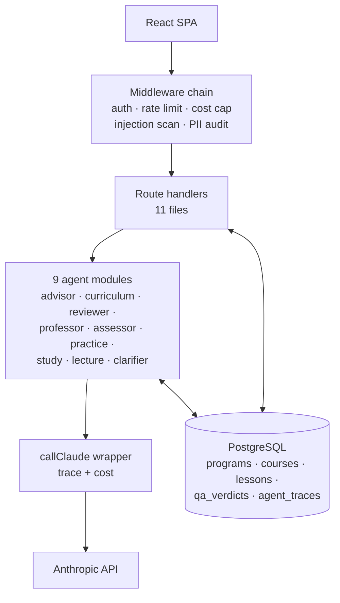
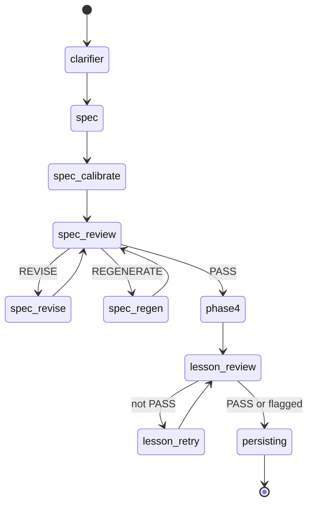
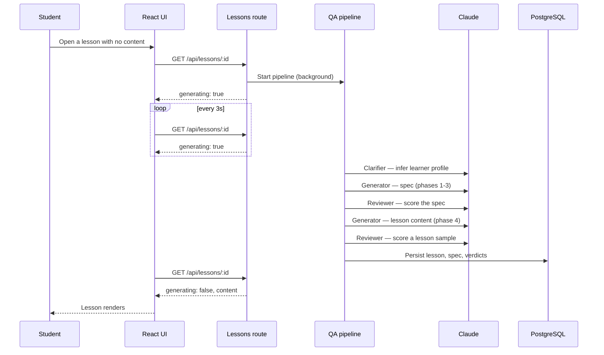
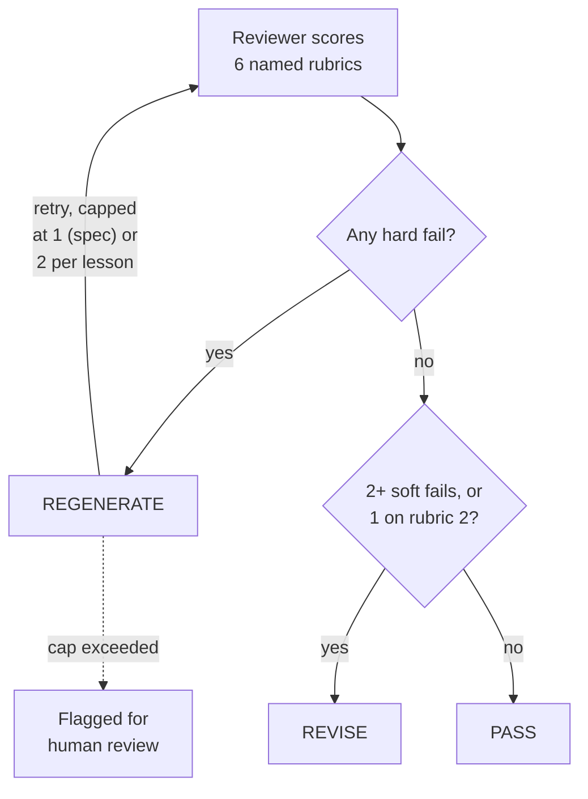
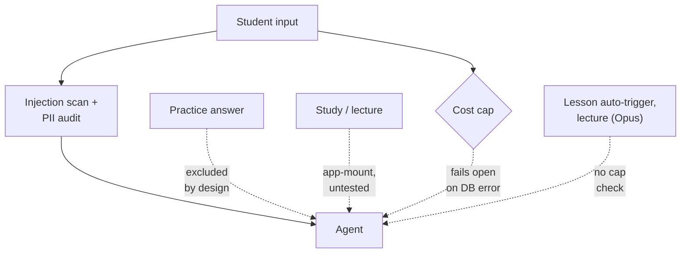

# Teardown: Lyceum

Lyceum is an AI-powered university simulator. A student describes what they want to learn; an advisor agent turns that into a program; a curriculum pipeline writes semesters, courses, and lessons on demand, checked by a second AI reviewer before a student ever sees them; and a professor agent tutors, grades, and nudges the student through it.

:::note[What was read]
`homeuni-api` and `homeuni-ui` are two folders inside one git repository at `D:\AI_Projects\HomeUni`, both at commit `07e11b0` (2026-05-09). Read: all of `homeuni-api/src` (61 files) — routes, the nine `*.agent.js` modules, the QA pipeline, middleware, background jobs, and the database layer — the 17 migration files, `homeuni-api/README.md`, `homeuni-api/PATTERNS.md`, `docker-compose.yml`, and the relevant parts of `homeuni-ui/src` (the lesson-polling hook and the API client). I read the test files named below for what they assert and which routes they mount; I didn't run them myself the way I ran ProjectOS's `TRANSITION_STAGES` test, so treat "this is tested" claims below as read-from-source, not executed-and-watched.
:::

## What it does

1. **Onboarding.** A free-text chat with the Advisor agent (`src/lib/advisor.agent.js`) ends when the advisor has enough to propose a program — a structured block it emits inline in its reply once the conversation has covered goals, background, and pace.
2. **Program creation.** A `programs` row is written with `status = 'onboarding'`, which is the first value of a five-value database column — the actual, stored answer to "what stage is this program in."
3. **Curriculum skeleton.** A background job writes the semester and course shells, then immediately flips the program to `active` — a student can browse the shape of their degree before a single lesson has been written.
4. **Opening a course** triggers a cheap background call that writes ten lesson titles (no content yet) and speculatively starts writing the first lesson's content in the background, so it's often ready before the student clicks into it.
5. **Opening a lesson** with no content yet triggers the QA pipeline — described in full below — which is where most of this chapter's interesting material lives.
6. **Live tutoring.** The Professor agent answers questions about the open lesson, streamed back a token at a time over a persistent connection the browser keeps open for the reply (server-sent events), informed by the lesson's own spec and by what the system has learned about this student from earlier turns.
7. **Practice, assignments, exams.** Practice problems are graded by a cheap model call; assignments are graded with a slower, more deliberate mode Claude supports called extended thinking, where the model is given an explicit token budget to reason before answering; exams auto-grade multiple choice and use AI grading for short answers.
8. **Progress and graduation.** Passive signals (a wrong answer, a slow response, a repeated question) accumulate into advisor "nudges." A knowledge graph and a transcript are both derived views over the same underlying tables. Graduation checks that every core course is complete and issues a certificate with a publicly verifiable code.

## Architecture

<strong>Figure L.1</strong> — One path to the model, the same shape as ProjectOS's. What's different is how the middleware chain in front of it gets wired — the next paragraph is why that matters.

Every LLM call funnels through `callClaude`, `callClaudeJSON`, and `streamClaude` in `src/lib/anthropic.js` — a search for direct SDK use anywhere else in the codebase turns up nothing, which is the same one-gateway property ProjectOS has. Where the two systems diverge is the middleware chain in Figure L.1. Most routers — `lessons.js`, `programs.js`, `assignments.js`, `exams.js` — attach auth, the rate limit, the cost cap, injection scanning, and PII auditing per route, as an explicit list of functions on each endpoint. Two routers, `lectures.js` and `study.js`, get the same five checks applied a different way: not per route, but once, where the whole router is mounted in `src/index.js`, wrapping every endpoint underneath it in one shared block. Functionally the two patterns do the same job. Structurally, they're two different pieces of code that both have to keep working, which is exactly the kind of quiet duplication that drifts — and the drift already happened, in the test suite (see Weaknesses).

The other components, with their files:

- **Nine agent modules** (`src/lib/*.agent.js`): advisor, clarifier, curriculum, reviewer, professor, assessor, practice, study, lecture. A tenth file, `src/lib/agents.js`, is a stage-based dispatcher — it routes a program to the right agent by its status — not itself an agent.
- **QA pipeline** (`src/lib/qa.pipeline.js`, `src/lib/course.generator.js`, `src/lib/reviewer.agent.js`). Covered in full below.
- **Background jobs** (`src/jobs/`). An in-process job queue — not Redis-backed, despite Redis being provisioned in `docker-compose.yml` and never consumed by any code — plus a startup recovery scan that re-queues programs and courses left mid-generation by a crash.
- **Database layer** (`src/db/pool.js`, `src/db/migrate.js`). Raw parameterized SQL, no ORM, 17 versioned migration files — text files that each make one incremental, ordered change to the database's structure.
- **Frontend** (`homeuni-ui/src/`). 15 route-mapped views, a typed fetch wrapper for the API, and a lesson hook that polls every three seconds while a lesson is still being generated.

## Control flow

<strong>Figure L.2</strong> — Nine labels, one writer. Unlike ProjectOS's <code>stage</code> column, this one has a single function setting it — but it's a free-text column, not an enum, so the database itself enforces nothing about which labels are legal.

`courses.generation_phase` is the literal, stored answer to "where is this course's content generation right now" — it's a `TEXT` column, not a constrained list of allowed values, and it's set exclusively by one function, `setPhase()`. That's the opposite trade-off from ProjectOS's `stage` column: ProjectOS has a real enum — a column restricted to a fixed, named list of values — with four independent writers and no shared table of legal moves between them; Lyceum has one writer and no enum at all. Single-writer discipline closes the governance gap ProjectOS has. It doesn't close the type-safety gap: nothing stops `setPhase()` itself from writing a value nobody else's code recognizes, and nothing would flag it if it did.

A level up from that, `programs.status` is a real, five-value database enum (`onboarding`, `generating`, `active`, `graduated`, `paused`) — the program's own macro-level lifecycle, separate from any one course's generation progress. But the dispatcher that routes a program to its next agent, `PROGRAM_STAGES` in `src/lib/agents.js`, defines six values, including `program_design` and `semester_review`, neither of which exists in the database's own enum. The dispatcher can reference a stage the database is structurally incapable of ever storing — the same shape of bug as ProjectOS's `TRANSITION_STAGES` drifting past its own test, found the same way: by reading the schema and the code that's supposed to agree with it side by side, not by trusting either one on its own.

## Data flow

<strong>Figure L.3</strong> — One request, six model calls, no response until the last one lands. The student's browser is polling the whole time; nothing pushes the finished lesson to them.

The "phase" numbering in Figure L.3 belongs to two different things at two different layers, worth untangling once rather than leaving implicit: `course.generator.js` calls its own internal structure "Phase 1" through "Phase 4" — phases 1 through 3 are one Opus call that writes a learner-and-outcome spec, a set of calibration anchors (real reference texts the content is checked against), and a full curriculum architecture, capped at ten lessons by the prompt itself; phase 4 is a separate, per-lesson Sonnet call, up to three running at once. The QA *pipeline* wrapping all of that has its own, coarser stage list — clarifier, spec generation and review, lesson generation and review, persist — which is what Figure L.2's `generation_phase` labels actually track. The two numbering schemes aren't the same thing, and nothing in the code names that explicitly; I'm naming it here so the rest of this chapter doesn't quietly conflate them.

### The reviewer and the retry caps

<strong>Figure L.4</strong> — Six rubrics — structural integrity, accuracy, depth, level calibration, assessment validity, pedagogical scaffolding — collapse to one of three verdicts. Running out of retries stops the loop and hands the case to a person instead of looping forever.

Every reviewer run writes a row to `qa_verdicts` — scope (spec or lesson), which rubric set fired, the verdict, the critique, and the reviewer's full raw output — which is the durable audit trail behind "accumulates state across a multi-phase process": every retry, not just the final result, is a row you can query later. Model routing, the other half of this chapter's brief, is simpler than it sounds once you read the code: there's no rule table, no config file, no named routing decision anywhere. `src/lib/anthropic.js` defines three model constants — `HAIKU`, `FAST` (Sonnet), `DEEP` (Opus) — and each function in each agent file passes whichever one it was written to pass. Routing is a property of which literal a call site happens to use, not data a system consults. That's cheaper to build than ProjectOS's named-rule router and harder to audit: there's no log line anywhere that says why a given call used Opus, only the fact that it did.

## Design decisions and trade-offs

### Lazy generation, in three tiers

Skeleton, then stubs, then full content — each tier written only when a student is about to look at it, rather than generating a whole curriculum synchronously at signup. The trade-off is the one this chapter opened with: a student can be looking at a course whose lessons don't exist yet, and the first real content they see is gated behind the QA pipeline's six model calls.

### Spec before prose

The generator is required to commit to misconceptions, worked examples, and practice problems as structured fields before it writes any lesson prose — modeled, per the repo's own description, on how a curriculum design team works: outline and calibrate first, draft second. This is the same instinct as chapter 3's argument for typed handoffs between agents, applied to content generation rather than pipeline state.

### Retry, then flag — never loop forever

One retry on a spec `REGENERATE`, two retries per lesson on a lesson `REGENERATE`, and a case that still fails after that is marked `needs_review` and the pipeline stops. This is chapter 2's confidence-gate lesson from the other direction: a check that keeps retrying without a ceiling isn't more careful, it's just a more expensive way of not shipping.

### Memory extraction is turn-cadenced, not per-message

The system extracts what it's learned about a student from the conversation every fourth professor turn, not every turn — an explicit cost trade-off, and paired with an equally explicit prompt instruction never to make the student feel profiled when that memory gets used later. Both are the kind of design choice a comment explains rather than a schema enforces.

### Price is snapshotted at write time

`agent_traces` stores the price per token that was in effect when a call happened, not a price looked up later — so a provider price change doesn't retroactively rewrite what last month's calls are shown to have cost.

## Strengths

1. **One call gateway**, same property as ProjectOS: every agent, without exception, goes through `callClaude`, so trace and cost recording can't be skipped by a new code path.
2. **A durable audit trail for every reviewer verdict.** `qa_verdicts` keeps the critique and the full raw reviewer output per attempt, not just a final pass/fail — you can reconstruct why a piece of content was regenerated, not just that it was.
3. **Retry-with-correction, not retry-blind.** When the model returns malformed JSON, the wrapper re-sends the bad output alongside an explicit instruction on what was wrong with it, rather than silently retrying the same prompt and hoping.
4. **A real recovery path for interrupted work.** A startup scan re-queues programs and courses left mid-generation by a crash, across five distinct stuck-state cases — this is chapter 3's "state has to be a stored fact" argument paying for itself: the recovery scan only works because `generation_phase` and `status` are readable from the database, not reconstructed from a conversation.
5. **Cross-tenant isolation is tested, not just assumed.** A dedicated test file asserts that one user's programs, courses, and lessons aren't reachable by another user's credentials, across several endpoints.
6. **The retry-then-flag pattern is named in the repo's own documentation** as a deliberate choice, not a limitation nobody noticed — "graceful flagging over looping."

## Weaknesses

I read every one of these against the source at the commit named above.

1. **Two different lists both claim to be the program's stage machine, and they disagree.** `PROGRAM_STAGES` in `src/lib/agents.js` has six values, including `program_design` and `semester_review`. The database's `program_status` enum has five, and has neither. The dispatcher can hand a program a stage the database has no way to store.
2. **A free-text column stands in for an enum.** `courses.generation_phase` tracks the QA pipeline's progress through nine labels, but it's a plain text column — nothing at the database level stops a typo from being written and accepted as if it were a real stage.
3. **The per-user cost cap fails open.** A database error during the cost-cap check lets the request through rather than blocking it — the same failure mode I built into ProjectOS's own spend cap, in a different codebase, independently.
4. **The cost cap isn't checked on every path that spends money.** Assignment and exam generation triggered automatically when a student completes a lesson has no cost-cap check at all — only the manual "generate another assignment" button does. A student who's hit the monthly ceiling can still trigger new spend just by finishing lessons.
5. **Voice-lecture generation has no cost cap at all**, on the single most expensive model tier in the system (Opus) — the only guard against runaway spend there is a check that prevents regenerating the *same* lesson's lecture twice at once, which does nothing to cap total spend across many different lessons.
6. **The middleware-wiring split from Figure L.1 has an untested half.** The per-route security pattern used by most routers is covered by an automated test; the app-mount pattern used by the study and lecture routers is real but has no automated test confirming it actually fires.
7. **The README's own agent count doesn't match its own list.** It states "eight specialised agents," then lists nine — and that list of nine both omits the lecture agent (which exists and uses the most expensive model) and includes memory extraction as if it were a peer agent, when it's a function inside a different file, not its own `*.agent.js` module.
8. **A documented graduation bug is fixed in one place and not the other.** The README claims a "vacuous truth" bug was fixed — a program with zero core courses shouldn't be able to graduate. The fix exists on the endpoint that issues a certificate. It's absent from the endpoint the UI actually reads to decide whether to show the graduate button in the first place, which still has no such guard.
9. **In-memory concurrency guards and rate limits are single-process.** Several routes track "is this already generating" in an in-memory set, and the rate limiter is an in-memory map — both silently stop working correctly the moment the API runs as more than one process, a risk the repo's own pattern documentation names directly rather than hiding.
10. **Two migrations exist specifically to admit code shipped ahead of its own schema** — one adds columns a service file had already been referencing, the other adds a table a route had already been querying. Both migrations say so in their own header comment.

## How it could be attacked or manipulated

<strong>Figure L.5</strong> — Most input passes two real checks. Four paths around them are all documented above as design choices or gaps — this diagram is where they add up.

**A student can inject through a field the filter is told to ignore.** `body.answer` on the practice-grading endpoint is deliberately excluded from injection scanning — a comment explains that students legitimately write academic text containing phrases that would otherwise trip the filter, like "original instructions." That's a defensible reason, but the field still reaches the grading model completely unscreened; the exclusion is intentional, the bypass it opens is real regardless.

**Cost-cap gaps compound with the two agents that aren't behind it.** The fail-open cap plus the two unmetered spend paths from Weaknesses #3–5 mean the actual ceiling on one student's monthly spend is lower in the documentation than it is in practice.

**Auth has no rate limit.** Login and registration aren't behind the rate-limiting middleware every other endpoint gets — password hashing adds some inherent slowness, but nothing stops a sustained guessing attempt at the application layer.

**Injection scanning is a fixed list of seven phrasings.** Rephrase, translate, or space the words differently and the same pattern-matching filter — a text-pattern matcher, the same one ProjectOS uses — has nothing to match. This is the identical limitation chapter 8 covers for ProjectOS's own regex, in a different codebase built by the same person.

**Cross-tenant isolation is enforced by hand, in every query.** Every route that scopes data to the current user does it by adding the same join-and-filter clause itself; there's no database-level backstop like row-level security — a permission rule enforced by the database itself, not by application code remembering to check — behind it. It's tested, which is real protection, but it depends on every future query remembering the same clause.

## What I'd change

1. **Make one stage list the source of truth.** Either the dispatcher's `PROGRAM_STAGES` matches the database's `program_status` enum exactly, or one of them is deleted. Right now there are two answers to "what stages exist," and they disagree.
2. **Turn `generation_phase` into a real enum**, the way `program_status` already is, so a typo in `setPhase()` fails loudly instead of writing silently.
3. **Apply the cost cap on every path that calls Claude**, not just the ones with a manual trigger — lesson-completion-triggered assignment and exam generation, and lecture generation, both need the same check the manual endpoints already have.
4. **Fail closed on the cost cap, or cache the last known spend.** A database hiccup should not be the one moment spending goes unmetered — I'd make this same fix in ProjectOS first, since it's the identical bug in the older codebase.
5. **Extend the automated security test to the app-mount pattern.** If study and lecture routes are going to be wired differently from everything else, there should be a test proving the difference doesn't matter, not just documentation asserting it.
6. **Fix the graduation-eligibility endpoint to match its own certificate endpoint's guard**, so the "you can graduate" check and the "issue the certificate" check agree about programs with zero core courses.
7. **Rate-limit `/api/auth/login` and `/api/auth/register`** the same way every other endpoint already is.
8. **Reconcile the README's agent count and routing table with the code** — name all nine agents including lecture, and note that curriculum-spec generation and lecture-script generation both use Opus, since the current table only mentions Sonnet.

:::tip[My take]

The cost-cap failing open, here and in ProjectOS, is the finding from this chapter I keep coming back to. I didn't copy the bug from one project to the other — they're different codebases, written months apart, and I read them fresh for this book rather than remembering what I'd built. Finding the same fail-open default twice, independently, says less about either specific line of code and more about a habit: when I'm deciding what a safety check should do if it can't check anything, "let it through" is apparently my instinct, and I've now shipped that instinct twice without noticing it was a pattern until I wrote both teardowns back to back. That's a more useful thing to have found than either individual bug.

:::

## Reference material

- [Multi-Agent Systems](../core-building-blocks/multi-agent-systems) — the coordination and topology vocabulary behind a nine-agent pipeline like this one.
- [Structured Outputs](../core-building-blocks/structured-outputs) — the typed spec-before-prose handoff between the generator and the reviewer.
- [Evals](../meta-infrastructure/evals) — the six-rubric reviewer as a hand-built eval, and what a more systematic version would add.
- [Model Routing](../meta-infrastructure/model-routing) — what a rule-based router would look like layered on top of Lyceum's hardcoded per-call-site tiers.
- [Reliability](../production-concerns/reliability) — the startup recovery scan as a checkpoint-and-resume pattern.
