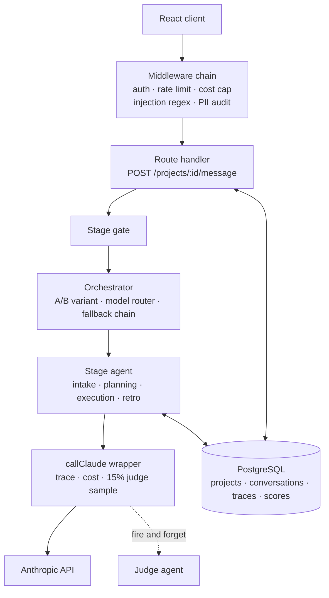
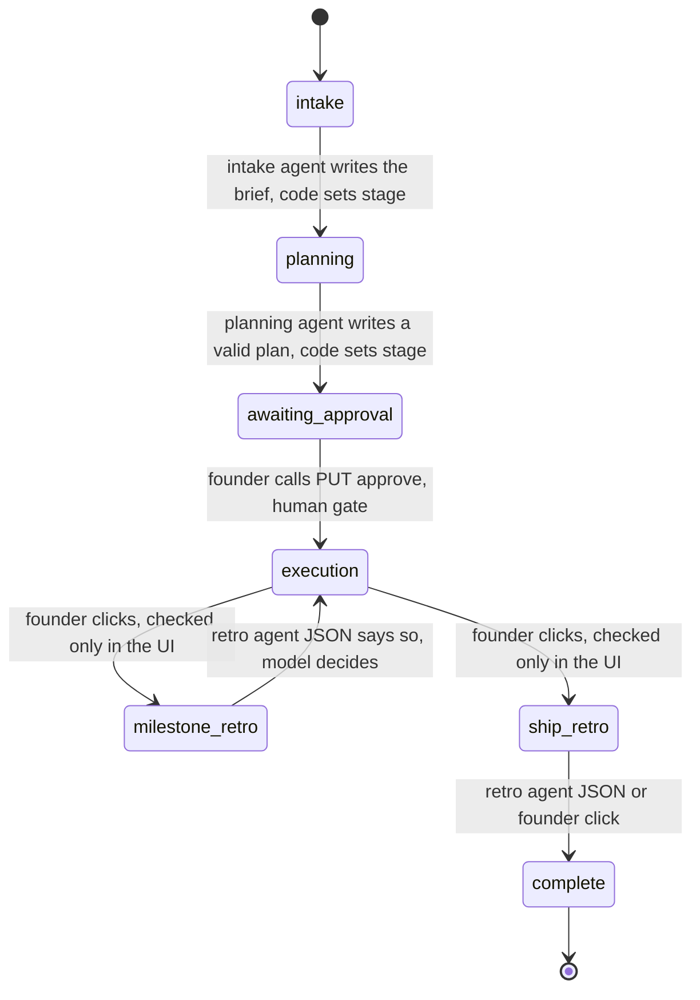
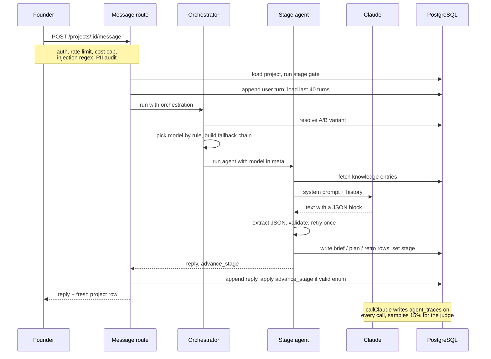
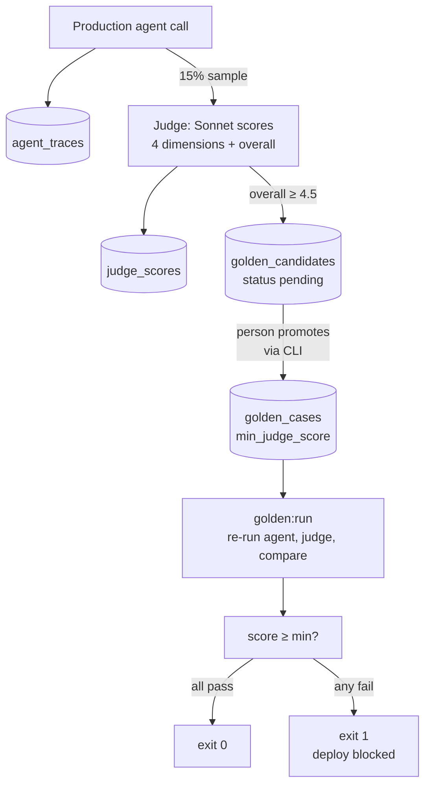
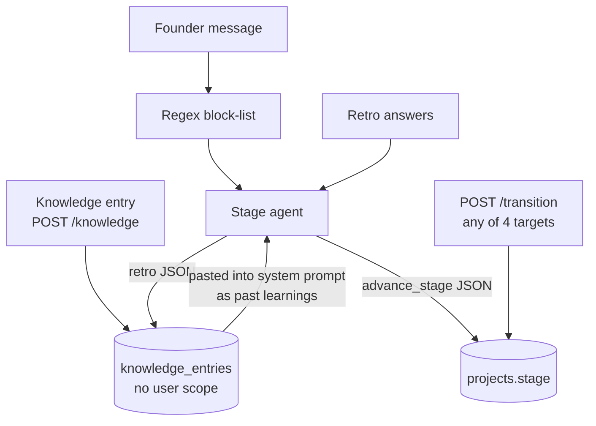

# Teardown: ProjectOS

ProjectOS is an AI project manager for solo founders. A founder describes an idea in chat; four Claude agents take it through a brief, a plan, daily execution check-ins, and retrospectives. It runs on Node.js, Express, PostgreSQL, and React, and is deployed on Railway.

:::note[What was read]
Backend source at commit `827bda2` (2026-05-20): all 51 files under `src/`, the 22 migrations, the `eval/` harness, and the API tests. Frontend: the dashboard view and the project hook, for stage-transition logic only. Repo docs: `README.md`, `PATTERNS.md`, `docs/DECISIONS.md`. One test was executed to confirm a finding. Nothing below is inferred from the repo's own descriptions where the code says otherwise.
:::

## What it does

A project moves through six stages. Each stage has exactly one agent, chosen by a static lookup on the project's `stage` column.

| Stage | Agent | Output |
|---|---|---|
| `intake` | Intake | A structured brief: problem, target user, success criteria, scope, risks, confidence score |
| `planning` | Planning | A phased plan: phases, milestones, tasks with hour estimates, scope warning |
| `awaiting_approval` | Planning | Holds for the founder's explicit approval |
| `execution` | Execution | Daily check-ins: task status updates, risks, change requests, a momentum score |
| `milestone_retro`, `ship_retro` | Retro | A retrospective, written to a knowledge hub that future plans read |
| `complete` | Retro | Archived |

Around that core: specialist agents (coding, research, content, QA) that can be delegated a task; a fire-and-forget analysis that suggests which specialist should take each open task; a per-project "workroom" chat; and generated milestone and close-out reports.

## Architecture

<strong>Figure PO.1</strong> — One path to the model. Every message passes a fixed middleware chain, one gate, and one orchestrator before reaching the agent for the current stage.

Figure PO.1 has one property worth naming first: there is exactly one path to the model. Every agent, the judge, the specialist agents, and the report generator call `callClaude()` in `src/lib/anthropic.js`. That function writes a trace row with tokens, latency, model, and USD cost, and with a 15% probability spawns a judge call on the response. Because there is one gateway, there is one place where telemetry, cost, and quality sampling are guaranteed to happen.

The other components, with their files:

- **Middleware chain** (`src/app.js`, `src/middleware/`). JWT auth on everything below `/auth`. On the message route: a per-user rate limit (20 per hour, 200 per day, in-process map), a per-user monthly spend cap ($2 by default, read from `agent_traces`), a regex block-list for injection phrases that returns 403, and a PII detector that logs but does not block.
- **Stage gate** (`src/middleware/gates.js`). Runs before the agent. Discussed below, because it is not what its header says.
- **Orchestrator** (`src/lib/orchestrator.js`). Resolves an A/B variant if an experiment is active for this agent, else asks a rule-based router which model to use, then runs the agent through a fallback chain on 429, 502, or 503.
- **Stage agents** (`src/lib/*.agent.js`). Each builds a system prompt from the project row, sends the last 40 turns, extracts a JSON block from the reply, validates it, and writes rows itself inside a transaction.
- **Knowledge hub** (`src/lib/knowledge.js`). A PostgreSQL full-text index over entries written by retros, by decision logging, and by users. The planning agent injects the top five matches into its system prompt; the execution agent injects the top four on the first turn of a session.
- **Judge and golden set** (`src/lib/judge.js`, `eval/`). Covered in the data-flow section.

## Control flow

<strong>Figure PO.2</strong> — The stage machine, labeled by who decides each transition. Four different authorities move the project: code, a person, a model, and a UI button.

Figure PO.2 is the most important diagram in this chapter. The stage column is the system's state machine, and it is well designed: one column, an enum type, a single lookup from stage to agent. But four different authorities are allowed to change it.

- **Code** moves the project from `intake` to `planning`, and from `planning` to `awaiting_approval`. The agent module validates the model's JSON and then writes the new stage in the same transaction as the brief or plan. This is the right shape.
- **A person** moves the project from `awaiting_approval` to `execution` through `PUT /projects/:id/approve`. The handler requires `confirmed` to be exactly `true`, updates the stage with a `WHERE stage = 'awaiting_approval'` guard so a concurrent approval fails cleanly, and writes a decision-log row in the same transaction. If `confirmed` is absent it returns a plan summary instead. This is a textbook human gate.
- **The model** moves the project from `milestone_retro` to `execution`, and from `ship_retro` to `complete`. The retro agent's JSON template includes an `advance_stage` field, the model fills it in, and `writeRetroToDB()` writes whatever value came back straight into `projects.stage`. The enum cast rejects non-stage strings; it does not reject a valid stage that is wrong for this moment.
- **A UI button** moves the project from `execution` to `milestone_retro`, and from `execution` to `ship_retro`. The dashboard shows the button only when every task in the milestone is done. The endpoint it calls, `POST /projects/:id/transition`, checks that the target is one of four allowed strings and that the caller owns the project. It does not check the current stage or whether any task is done. The comment in the retro gate says this check "is enforced by the transition endpoint." It is not.

### The gates

`src/middleware/gates.js` opens with a map of three gates. Reading the functions:

| Gate | Header says | Code does |
|---|---|---|
| `gatePlanning` | Blocks planning if the brief's confidence score is below 70 | Returns without checking. A comment explains the score reflects assumption density, not brief quality, so the gate was removed |
| `gateExecution` | Blocks execution until the plan is approved | Throws a 422 with a stable code and a redirect stage if `plan_approved` is false. **Live** |
| `gateRetro` | Blocks a new milestone until the previous one has a retro | Returns without checking. A comment defers the check to the transition endpoint, which does not perform it |

One of three gates is real. The one that is real is good: it returns a machine-readable error code, the stage the client should fall back to, and a 422 rather than a 400, so the frontend can switch on it. The other two are the failure mode [chapter 2 calls "the gate that isn't there"](../patterns/stage-gates#the-gate-that-isnt-there).

## Data flow

<strong>Figure PO.3</strong> — One message, end to end. Note that both the agent and the route can set the stage, and that the knowledge fetch happens before the prompt is built.

Two things in Figure PO.3 matter for the rest of the chapter. First, the stage is written in two places: the agent writes it inside its transaction, and the route writes it again afterwards if the agent's `advance_stage` is a valid enum value. Second, knowledge entries are fetched by full-text match against the project title and problem statement and pasted into the system prompt under the heading "PAST LEARNINGS FROM THIS ORG — apply these when building the plan."

### The judge and the golden set

<strong>Figure PO.4</strong> — The golden-set loop. Production traffic feeds the golden dataset: high-scoring live responses become candidates, a person promotes them, and the golden run gates CI on them.

Figure PO.4 is the system's most distinctive design. There are three eval layers:

1. **Structural assertions** (`eval/run.js`). Fixtures end with a confirmation message so the agent always emits JSON. Assertions check shape and business rules: tasks between one and three hours, at least three success criteria, a scope-creep fixture must produce a change request. No judge cost.
2. **Production judge** (`src/lib/judge.js`). Fifteen percent of live calls are scored by a second Claude call against a per-agent rubric of four named dimensions plus an overall score. The rubric asks about specific failure modes ("did the agent probe 'done' claims or accept them?") rather than general quality. Scores, breakdown, cost, and rubric version are stored per trace. The judge is excluded from being judged by a guard on its own agent name.
3. **Golden gate** (`eval/golden/run.js`). Responses scoring 4.5 or higher become candidates. A person promotes or rejects them from the CLI. `golden:run` re-runs every active case, scores it, and exits non-zero if any case falls below its own minimum score.

## Design decisions and trade-offs

### Route by stage, not by intent

`STAGE_AGENT` in `src/lib/agents.js` is a seven-entry object. There is no classifier and no way to route to the wrong agent. The cost is that a question about the plan during execution is answered by the execution agent, whose prompt is about check-ins. The repo's own wiki notes this open question.

### Agents write their own rows

The intake, planning, and retro agents validate the model's JSON and write phases, tasks, risks, and the new stage inside one transaction. The alternative, returning JSON to the route and letting it write, would centralize the state change. The chosen design keeps validation and write together, at the cost of the double-write of `stage` seen in Figure PO.3.

### Remove the confidence gate

The intake agent produces a confidence score, and the original design blocked planning below 70. In use, a brief that honestly logged four assumptions scored 50 and was blocked, while a brief that logged nothing sailed through. The gate measured the wrong thing and was removed. The intake prompt now says the score is informational three separate times. The trade-off: the dead function and its header remained.

### One hard gate, at the expensive boundary

Plan approval is the only transition that requires a person, and it sits exactly where [Figure 2.4 in the stage-gates chapter](../patterns/stage-gates) says a human gate belongs: before execution, which is where weeks of the founder's time and the bulk of the token spend go.

### Cheap security, honest about it

Injection detection is seven regular expressions and a 403. PII detection is audit-only. Both are wired on the message, workroom, and specialist routes. The design bets that a solo-founder tool needs telemetry more than it needs a classifier, and the tests cover the wiring rather than the regex quality.

### Cost controls in layers

Rate limit per user, monthly cap per user, model routing by rule (retro to Haiku, contexts over roughly 8,000 tokens to Opus, execution with fifteen or more tasks to Sonnet, default Sonnet), and a fallback chain that steps up a tier on transient errors. Each routing decision is logged with the rule that fired.

### Full-text search, not embeddings

(`docs/DECISIONS.md`, D-007.) The knowledge hub uses `tsvector` and a GIN index. The corpus is small and the retrieval is keyword-shaped, so no vector infrastructure. The known limitation is stemming mismatches.

### Mock at the network boundary

Tests replace `fetch`, not `callClaude`. The wrapper, the trace write, and the judge sampling all execute for real in tests, so a test can assert on `agent_traces` rows.

## Strengths

1. **One call gateway.** Trace, cost, and quality sampling cannot be skipped by a new code path, because there is only one code path.
2. **The live gate is well built.** Stable error codes, a redirect stage, a 422, a transactional flip with a concurrency guard, and a decision-log row. The approve endpoint returns a summary when called without confirmation, which is the right shape for a human gate.
3. **Bounded, informative retry.** The planning agent retries once, and the retry message includes the exact validation error. After two attempts it returns a conversational failure instead of looping.
4. **Judge rubrics name failure modes.** Each dimension asks about a specific thing that goes wrong for that agent. Scores are stored with a rubric version, so a rubric change is visible in the data.
5. **The golden set grows from production, through a person.** Promotion is a manual CLI step. A high judge score alone does not lower the CI bar.
6. **Routing is observable.** Every routing decision records the rule name and the fallback chain, so "why did this call go to Opus" has an answer.
7. **Cold-start handled.** Every stage transition generates an agent-authored opening message, so the chat is never blank when a stage opens.

## Weaknesses

All of the following were confirmed in the source at the commit named above.

1. **Two of three gates are no-ops.** `gatePlanning` and `gateRetro` return without checking anything. The file header and the dispatcher still describe them as active checks.
2. **Milestone completion is enforced only in the browser.** `POST /projects/:id/transition` accepts any of `execution`, `milestone_retro`, `ship_retro`, or `complete` from any current stage, as long as the caller owns the project. The all-tasks-done condition lives in `DashboardView.jsx`.
3. **A constant drifted past its test.** `TRANSITION_STAGES` gained `complete` when the close-project button was added. The test that pins the constant still expects three values. Running that single test fails. This is documented drift that CI would catch if it ran.
4. **The model decides two stage transitions.** The retro agent's `advance_stage` value is written to `projects.stage` as returned. The template tells the model what to put there, but nothing checks the value against the current stage.
5. **A/B variants apply only the model.** `resolveVariant()` returns a system prompt and temperature per variant. The orchestrator uses only the model. An experiment that varies the prompt runs two identical arms.
6. **Routing decisions cannot be joined to cost.** `logRoutingDecision()` is always called with a null trace id, so the `routing_decisions` table cannot be linked to `agent_traces`.
7. **Agent budgets are stored, not enforced.** Migration 016 adds per-project, per-agent daily and monthly limits and a kill switch. There are CRUD routes for both. Nothing on any call path reads them.
8. **The judge shares a model with the default agent.** Sonnet judges Sonnet. The repo's own wiki names self-preference as a risk. The judge also sees only the last user message, truncated to 600 characters, and the first 1,200 characters of the output, so a long plan is scored on its opening.
9. **Every non-429 API error is treated as retryable.** `callClaude()` maps all non-429 failures to status 502, and the orchestrator retries 502 on the next model in the chain. A malformed request that fails on Sonnet is retried on Opus and fails again.
10. **The spend cap fails open, and the rate limiter is per process.** A database error during the cap check allows the request. The rate limiter is an in-memory map, so a multi-process deployment gives each process its own limit. `PATTERNS.md` already lists the second of these.
11. **The knowledge hub is not scoped by user.** `searchKnowledge()` filters by type, project, and tags, never by user. Entries written by any user, or by any user's retro, can be retrieved into any other user's planning prompt.

## How it could be attacked or manipulated

<strong>Figure PO.5</strong> — Attack surface. The regex guards one input path. Two others reach the system prompt or the stage column without passing it.

Figure PO.5 shows why a regex on the user's message is not the perimeter.

**Indirect injection through the knowledge hub.** An entry posted to `/knowledge` is not run through the injection regex; only `message`, `content`, `brief`, and `additional_brief` fields on specific routes are. The entry's content is later pasted into the planning agent's system prompt under an instruction to apply it. Because the hub is not scoped by user, this crosses tenants: one user's entry can shape another user's plan. The same path exists second-hand through retros, where the model paraphrases the founder's answers into hub entries, which defeats a phrase-matching filter by construction.

**Stage skipping.** From `intake`, a request to `/transition` with `to_stage: milestone_retro` puts a project with no plan into a retro. With `to_stage: complete` it archives the project. Both are confined to the caller's own project, so the harm is to the system's invariants rather than to other users: retros and knowledge entries derived from a project that never had a plan.

**Talking the retro agent into closing the project.** During a milestone retro, a founder who says the project is finished may get `advance_stage: complete` in the JSON, which is written as-is. The remaining milestones are skipped.

**Regex evasion.** The seven patterns match literal phrasings. Paraphrase, spacing, or another language passes. The block-list is useful as a signal in the logs; it is not a gate on adversarial input.

**Judge gaming.** Output that names the rubric's dimensions ("I probed the 'done' claim by asking for concrete output") scores well. A high score creates a golden candidate. The manual promotion step is the defense, and it is a real one, but it depends on the person reading the candidate rather than the score.

**Runaway cost.** The cap is $2 per user per month and the rate limit is 20 messages per hour, so a single user's ceiling is low. The gaps are the fail-open cap and the per-process limiter, both of which are cheap to close.

## What I'd change

1. **One transition table, enforced in one place.** An `ALLOWED` map from current stage to permitted next stages, checked by the transition route, by the message route when an agent returns `advance_stage`, and by the retro writer. The UI keeps its button logic as a mirror. Then delete `gatePlanning` and `gateRetro` or make them real, and fix the test.
2. **Treat hub entries as data.** Wrap injected entries in delimiters, tell the model they are records and not instructions, scope retrieval by user, and run the injection scan on the write path as well as the message path.
3. **Judge with a different model, and show it everything.** Use a different tier or family from the agent being scored, pass the full output, and calibrate against a small set of human labels before trusting the 4.5 promotion threshold. Chapter 4 covers the method.
4. **Make A/B variants do what their table says.** Apply system prompt and temperature, or drop the columns.
5. **Pass the trace id into routing decisions**, so cost per routing rule is a query.
6. **Enforce budgets where the money is spent.** Read `project_agent_budgets` and the kill switch inside the cost-cap middleware or the call wrapper.
7. **Fail closed on the cap for LLM routes**, or cache the last known spend so a database blip does not open the door.
8. **Retry only on retryable errors.** Preserve the original status in the wrapper and let the orchestrator fall back on 429, 500, 502, 503, and 529 only.

:::tip[My take]

The most striking thing about this codebase is not any single bug — it's that the one gate the team built well (plan approval) and the two they skipped (planning, retro) sit in the same file, under the same dispatcher, described by the same style of header comment. Reading the file alone, all three look equally real. That's the actual lesson: a gate's presence in the code that calls it tells you nothing about whether it checks anything. The only way to know is to open the function. If I took one thing from this teardown into my own review habits, it would be that — grep for the gate, then read past the name to the return statement.

:::
