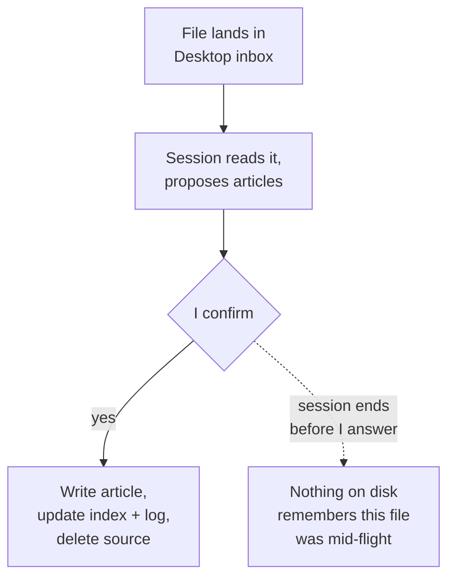

# Case study: Second Brain

Second Brain is my own persistent knowledge wiki — 174 markdown articles, one concept per file, that Claude reads from and writes to across every project I work on. It's not a full teardown like ProjectOS and Lyceum: there's very little application code in it to take apart. What's interesting about it for this book isn't its engineering, it's what it reveals when you hold it up against chapters 3 and 7 — one pattern it skips entirely, and one it gets right by construction rather than by design.

:::note[What was read]
The second-brain project root isn't a git repository — there's no commit hash to cite. Read directly from disk on 2026-09-02: `wiki/` (174 articles, `index.md` at 221 lines, `log.md` at 2,276 lines), the project's own `CLAUDE.md`, and the global skill and rule files that actually define its behavior, which live outside the project entirely at `C:\Users\DELL\.claude\skills\` and `C:\Users\DELL\.claude\rules\` — nine skill files and three rule files, shared across every project I work on, not copies checked into this one. The one piece of real application code, a 772-line Gradio RAG chatbot under `space/`, is its own separate git repo; its HEAD is `a800094`, dated 2026-05-09.
:::

## What it is

A wiki article is a markdown file with a fixed shape: a title, a one-paragraph summary, "Core Ideas," "Key Details," "Applications / Examples," "Open Questions," and a "Related" section of `[[WikiLink]]` cross-references to other articles. `wiki/index.md` is a hand-maintained map of content, organized by domain, one line per article. `wiki/log.md` is an append-only activity log of every ingest, capture, and weekly review.

None of that is code. The thing that turns a folder of markdown into a system is a set of instructions Claude re-reads and follows every time I ask it to file something away — a skill file, in this project's own vocabulary, which is a packaged set of instructions for a recurring kind of task. `process-inbox.md`, the one I use most, is six steps: scan a Desktop folder for dropped files, read each one, propose new or updated articles and wait for me to say yes, write the confirmed articles plus update the index and the log, delete the source files, and report what happened. There's no script that does this. Every step is a live tool call — a `Read`, a `Write`, a `Bash rm` — issued by whichever Claude session is running the skill at the time.

## The pipeline has no stored state

Chapter 3 argues that a multi-stage system should be able to answer "where are we right now" from a stored fact, not from inference. The ingest pipeline above never answers that question at all, because nothing writes it down.

<strong>Figure SB.1</strong> — Six steps, re-read from a skill file every session that runs them. No status column, no lock file. If a session ends between the proposal and my confirmation, the next one starts cold — it re-scans the inbox and has no way to know a file was already halfway through.

In practice this hasn't cost me anything, because the inbox is small and I run it myself, in one sitting, almost every time. But it's a real gap against the book's own argument, and it's worth naming rather than skipping past: I can query the wiki about `TRANSITION_STAGES` drifting past its test in ProjectOS, or read my own `wiki/Auto-Save-Phase-State-Machine.md` and `wiki/Stage-Driven-Agent-Routing.md` articles about *other* projects' state machines, from a system that has never applied that pattern to its own ingest pipeline. A file dropped, half-proposed, and then abandoned mid-session doesn't fail loudly — it just sits in the inbox folder, indistinguishable from a file nobody has looked at yet, until the next `/process-inbox` run picks it up again from scratch.

## Scoped correctly, but by circumstance

Chapter 7's cautionary example is ProjectOS's knowledge hub: a shared store with no per-user check, because it was built for one founder's workflow and never had to think about a second one. Second Brain never has that problem, but not because anyone designed a scope check — there's no auth code, no user table, no access-control language anywhere in its `CLAUDE.md`, its skills, or its rules. The scoping is implicit: the inbox path is a literal folder under one Windows account, `C:\Users\DELL\Desktop\brain_inbox`, and every read or write happens through direct filesystem tool calls with no login or tenant concept to get wrong. It's correctly scoped the way a single-player game has no cheating-in-multiplayer bug — the failure mode chapter 7 warns about needs a second user to exist before it can happen.

The one component that does face outward is `space/`, a Gradio chat app deployed to a Hugging Face Space that answers questions over a curated, read-only slice of the wiki using retrieval — the search step that finds the handful of articles most relevant to a question and pastes them into the model's prompt before it answers. It has no write path back into the wiki and no state kept per visitor. It's a broadcast layer, not a second door into the same memory store, which is exactly the shape you'd want if you were going to expose a personal knowledge base publicly at all.

:::tip[My take]

Writing this case study, right after arguing in chapter 3 that state has to be a stored fact and in chapter 7 that scope has to be a decision you can name, was a useful discomfort. My own most personal system does neither on purpose — it does one by accident (there's only ever been one user) and skips the other because I've never hit the cost of skipping it. I don't think that means the argument is wrong; a system this small, run by the one person who built it, in one sitting almost every time, is close to the actual boundary condition where the pattern stops paying for itself. But it's a boundary I found by writing this chapter, not one I'd drawn on purpose beforehand, and that's worth being honest about rather than retrofitting a justification for.

:::

## Reference material

- [Memory Architectures](../core-building-blocks/memory-architectures) — in-context, external semantic, episodic, and parametric memory in reference depth.
- [RAG](../core-building-blocks/rag) — the retrieval mechanism behind the `space/` chat demo, in full.
- [Access Control for Agents](../meta-infrastructure/access-control) — what a real scope check looks like once a second user is possible.
